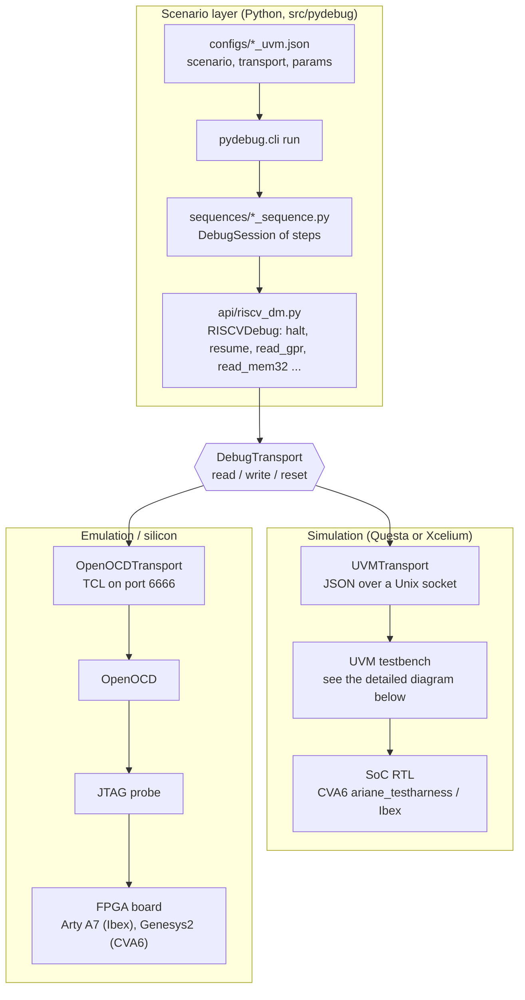
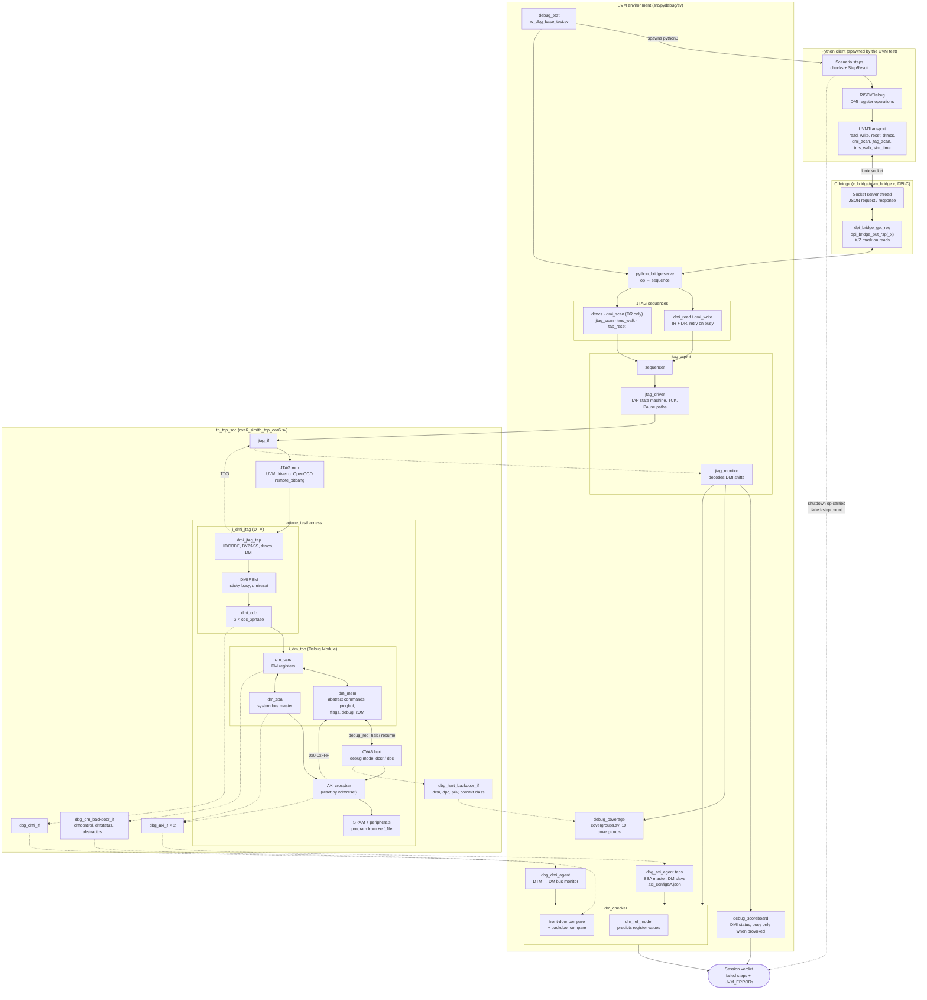
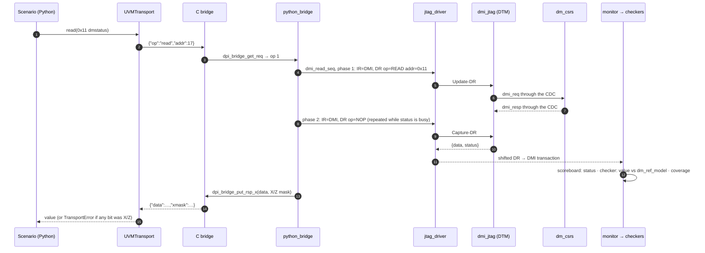
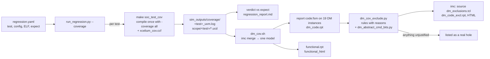

# pydebug — RISC-V Debug Compliance Framework

A Python-based RISC-V Debug Module (DM) verification framework. The same
Python-driven debug scenarios run unchanged against **UVM simulation** (via a
C DPI-C Unix/TCP socket bridge) and **real hardware / FPGA emulation** (via
OpenOCD and JTAG) — one stimulus, no rewrite, only the transport config
changes. See `INTEGRATION_GUIDE.md` for the full integration/simulation/
emulation walkthrough, and `CVA6-fork`/`ibex-demo-system` (submodules of this
repo) for two complete worked examples.

## What's in this repo

```
pyproject.toml / setup.py   — the installable pydebug package
src/pydebug/                — the package itself (see below)
tests/                      — unit tests for the package (pytest)
cva6_sim/                   — worked example: pydebug <-> CVA6-fork
ibex_sim/                   — worked example: pydebug <-> ibex-demo-system
mk/simulator.mk             — Questa/Xcelium selection shared by both (SIM=...)
mk/run_regression.py        — regression driver (verdicts + merged coverage)
mk/dm_cov.sh                — merge coverage and report, scoped to the DM
mk/dm_cov_exclude.py        — code-coverage exclusions, one stated reason per rule
mk/dm_abstract_cmd_bits.py  — proves which abstract-command bits can never vary
mk/xcelium_cov.ccf          — Xcelium coverage config (type-parameterised modules, MDAs)
testplans/                  — the verification plan and the coverage model
testplans/results/          — coverage analysis, RTL findings
cva6_sim/regress/           — the regression suite (regression.yaml + README)
CVA6-fork/                  — submodule, 10x-Engineers/CVA6-fork
ibex-demo-system/           — submodule, 10x-Engineers/ibex-demo-system
INTEGRATION_GUIDE.md         — integrate a new SoC / run sim tests / run emulation
```

## Installation

```bash
pip install -e .           # development (editable) — recommended
pip install .              # production
pip install -e ".[test]"   # with test dependencies
```

Once installed, `pydebug` is on `PATH` and importable from **any** project —
it is not tied to this repo's own `cva6_sim`/`ibex_sim` directories. Any
Makefile, anywhere, can resolve its sources with `pydebug sources --c/--sv`
and drive it with `pydebug run` / `pydebug init`. See `INTEGRATION_GUIDE.md`
for the full checklist of integrating a new, unrelated project against it.

## Quick start

### As a CLI tool

```bash
# Run a scenario over UVM simulation (socket transport)
pydebug run -c configs/halt_uvm.json

# Run the same scenario against real hardware / emulation via OpenOCD
pydebug run --scenario halt --transport openocd --openocd-config configs/openocd_arty_a7_100t.cfg

# Print the shipped C bridge source paths (for wiring into any Makefile)
pydebug sources --c

# Print the shipped SV kit source paths (JTAG VIP, UVM env)
pydebug sources --sv

# Scaffold a new SoC integration from a template
pydebug init --template ibex --output ./my_debug_tb/
```

### Interactive, GDB-style live session

Alongside the batch mode above (a scenario runs start-to-finish
unattended), `pydebug interactive` drops you into a live REPL against an
already-running target — type one command at a time (`halt`, `resume`,
`read_gpr a0`, `read_mem 0x80000000`, ...) and see the result immediately,
the same way GDB's own prompt works. Every command is a thin wrapper
around a real `RISCVDebug` method — see `pydebug.api.interactive_shell`.

For simulation, this needs the target running with the UVM bridge active
but *no* auto-launched Python client (`+JTAG_MASTER=external` instead of
the default `uvm`) — `make soc_interactive` in `cva6_sim/`/`ibex_sim/`
does exactly that:

```bash
cd ibex_sim && make soc_interactive
(pydebug) activate
(pydebug) halt
halted, PC = 0x001000be
(pydebug) read_gpr a0
a0 = 0x0000000a
(pydebug) resume
running
(pydebug) quit
```

Works identically over OpenOCD/hardware — connect to an already-running
target with `pydebug interactive --transport openocd --openocd-config <cfg>`.

### As a Python API

```python
from pydebug import OpenOCDTransport, RISCVDebug

with OpenOCDTransport(host="127.0.0.1", port=6666) as t:
    dm = RISCVDebug(t)
    dm.activate()
    dm.halt()
    print(f"PC = {dm.get_pc():#010x}")
    dm.resume()
```

## Architecture

One Python scenario drives a Debug Module over either of two transports, and
everything above the `DebugTransport` seam is identical for both. Everything
below it is either a UVM testbench around the SoC or a real board behind
OpenOCD.



The seam is `DebugTransport`: the CLI, `RISCVDebug` and every sequence never
know whether they are driving a simulator or a board. Changing platform is a
config change, not a code change.

### DV architecture in detail (CVA6 simulation)

This is how one scenario runs through the testbench (`cva6_sim/tb_top_cva6.sv`,
top `tb_top_soc`) and how what it does reaches the checkers and coverage. How a
run is launched and how its results are collected is the
[regression and coverage flow](#regression-and-coverage-flow) below.



Solid arrows are stimulus and control; dotted arrows are observation. Three
independent checks subscribe to the same monitored DMI stream:

- **`debug_scoreboard`** checks the DMI protocol status. A busy response is
  an error unless a scenario provoked it with a raw scan.
- **`dm_checker`** compares register values against `dm_ref_model`, both
  front-door (the DMI read data) and through the DM backdoor. It also
  correlates SBA traffic from the AXI taps and the DTM-to-DM bus.
- **`debug_coverage`** samples the DMI stream and the hart backdoor. The
  hart side covers debug entry causes, single-step instruction classes and
  privilege.

The scenario's own checks decide each step, and the shutdown request carries
the failed-step count, so a failing session cannot end in a clean simulation.
`dmi_assertions.sv` (DMI protocol SVA) ships in `sv/assertions/` but is not
bound in the CVA6 flow.

#### One DMI read, end to end



A DMI response is pipelined one scan deep (spec §6.1.5): the result of a
request comes back in the *next* scan. That is why the read sequence scans
twice, and why `dm_checker` keeps a one-deep pending request.

#### Regression and coverage flow



An exclusion is never a hand-copied index: each rule matches source text,
block kind, expression row or signal name, states why the item cannot be
reached on this DUT, and reports itself when it stops matching.

## Package layout (`src/pydebug/`)

| Path | Purpose |
|---|---|
| `api/` | `RISCVDebug`/`DMI` command layer, `DebugTransport`/`UVMTransport`/`OpenOCDTransport`, `DebugSession` |
| `sequences/` | Pre-built scenarios (halt, memory scan, CSR access, single-step, ...) |
| `sv/` | Shared UVM VIP: `model/` (register/predictor model), `agents/jtag/` (driver, monitor, sequencer), `sequences/`, `assertions/`, `fcov/` (covergroups), `env/` (env, checker, scoreboard, base test) + per-SoC `templates/` |
| `c_bridge/` | DPI-C bridge sources compiled into the simulator's shared object |
| `cli.py` | `pydebug` console-script entry point (`run`, `init`, `sources`) |
| `bridge_utils.py` | Resolves shipped C/SV source paths for `pydebug sources` |

## Verification: testplan, coverage, regression

Everything below is about verifying a **DUT's** Debug Module with this
framework. It is separate from `tests/`, which tests the Python package itself.

If you only want to run something: [Prerequisites](#prerequisites) →
[Running the regression](#running-the-regression) →
[Running with functional coverage](#running-with-functional-coverage) →
[Viewing coverage](#viewing-coverage). Every command is one you can paste; the
traps called out along the way are ones that fail **silently** rather than with
an error, which is why they are in the main flow rather than a footnote.

### The testplan

[`testplans/riscv_debug_testplan.md`](testplans/riscv_debug_testplan.md) — derived
from the RISC-V Debug Specification **v1.0 ratified** (Sdext, Sdtrig), organised
as Reset / Register-access permissions / Functional verification.

| | |
|---|---:|
| Testplan items | 256 |
| Rows (Stimulate / Check / Cover) | 408 |
| Items exercised by ≥1 regression test | 65 (25%) |

Row statuses across all 408: **95 Pass · 257 Not started · 37 Blocked · 9 Fail ·
10 N/A**. Every row is one concrete executable item — a row that cannot name a
specific action, condition or bin does not belong in the plan, which is why
there are three rows where a prose paragraph would otherwise sit.

**25% is a lower bound, and the traceability is currently broken in both
directions.** Three `covers` tags in `regression.yaml` (`RC-001`, `HALT-013`,
`RST-025`) name rows that do not exist in the plan, and 18 rows marked `Pass`
have no test claiming them even though the plan's own Test column names one.
The mapping lives in two hand-maintained places and they have drifted. Do not
quote a coverage-of-plan figure without checking it.

### Functional coverage

Two artifacts, deliberately kept separate, and **they are not two views of one
thing** — see [`generated_vs_implemented.md`](testplans/results/generated_vs_implemented.md).

| | What it is |
|---|---|
| [`src/pydebug/sv/fcov/covergroups.sv`](src/pydebug/sv/fcov/covergroups.sv) | **The coverage of record.** 19 covergroups, 72 coverpoints, 14 crosses. Included by `debug_pkg.sv`; this is what the regression collects and the number to quote. |
| [`testplans/generated/coverage_model.yaml`](testplans/generated/coverage_model.yaml) | The architectural model: 16 covergroups, 70 coverpoints, 33 crosses, 271 bins, every bin citing its spec clause. Describes Debug v1.0, not this DUT. Not compiled. |

The implemented file is **register-centric**; the model is **behaviour-centric**.
Their numbers must never be summed. The model is generated into SystemVerilog via
a per-DUT binding layer ([`bindings/cva6.yaml`](testplans/generated/bindings/cva6.yaml),
35 of 70 coverpoints bound) and kept as a standing gap list, not as a build input.

`covergroups.sv` samples two sources: the DMI transaction stream (14 covergroups,
via `uvm_subscriber #(jtag_txn_c)`) and a **hart backdoor** (5 covergroups) for
`dcsr`, `dpc`, privilege and which instruction a step stepped over. The second
exists because the `wfi` single-step deadlock **could not have appeared as a
coverage hole** — nothing sampled which instruction a step stepped over.

**100% is not the target and not achievable here.** The model is architectural, so
it contains bins CVA6 cannot reach for reasons that are not defects: single-hart
aggregation, authentication, Quick Access, Access Memory, Zawrs, halt-on-reset,
`mcontrol`. Each is an `ignore_bins` naming its reason plus a `reachable: false`
entry naming the DUT feature that would make it reachable — retained, not deleted,
so a DUT that has the feature still gets measured. A model reporting 100% because
its hard bins were deleted is worth less than one reporting 55% and saying which
45%. [`coverage_analysis.md`](testplans/results/coverage_analysis.md) says which.

### Prerequisites

Check all four before running anything. Three of the four failure modes here
present as testbench bugs rather than as setup problems, which is why they are
worth checking up front.

| Need | Check | If missing |
|---|---|---|
| Xcelium | `xrun -version` | source your Cadence setup |
| RISC-V toolchain | `riscv64-unknown-elf-gcc --version` | `export PATH=/opt/riscv/bin:$PATH` |
| pydebug, in **python3.9** | `/usr/local/bin/python3 -c "import pydebug"` | see below |
| PyYAML | `python3 -c "import yaml"` | `python3 -m pip install --user pyyaml` |

**Install pydebug into the interpreter the testbench launches** — `python3` →
`/usr/local/bin/python3` (3.9) — not whatever `pip` alone resolves to:

```bash
/usr/local/bin/python3 -m pip install -e . --user
```

Installing into the wrong interpreter fails at run time with an import error
*inside the simulator*, which reads like a testbench problem and is not one.

Build the test programs once:

```bash
make -C cva6_sim/sw
```

### Running the regression

22 tests, in [`cva6_sim/regress/regression.yaml`](cva6_sim/regress/regression.yaml).
Deeper detail — per-test rationale, how to add a test, the known-failing list —
is in [`cva6_sim/regress/README.md`](cva6_sim/regress/README.md).

```bash
cd cva6_sim
make regress_list     # what is in the suite and what each is expected to do
make regress          # all 22, no coverage        (~20 min)
make regress_cov      # all 22 with -coverage all  (~35 min)
make regress ONLY=step_classes,cmderr
```

A report lands in `testplans/results/regression_report.md`; per-test logs in
`cva6_sim/sim_outputs/<test>/regress.log`.

Each entry names the ELF it needs, the testplan items it covers, and its
**known** result — `expect: pass|partial|fail`, currently 17/3/2. The driver
reports only results that *differ*: a suite where the known failures still fail
tells you nothing changed. Exit status is non-zero on any difference, so this
works in CI as-is.

Every entry names its ELF because a scenario run against the wrong program
**passes while covering nothing** — which is how `step_stall` once reported 9/9
against `halt_probe.elf`.

### Running with functional coverage

Covergroups collect **only** under a `-coverage all` build. Plain `make regress`
reports zeros by construction — not a bug, just an uninstrumented build.

```bash
cd cva6_sim
rm -rf sim_outputs/coverage     # see "Clear stale coverage first" below
make regress_cov
```

#### Clear stale coverage first

**Nothing in the Makefile clears `sim_outputs/coverage`** — `soc_test_cov` only
does `mkdir -p`. So recompiling and re-running even one test leaves the
directory holding runs from *two different builds*, and a merge across them
silently reports the wrong number (see the traps below). Until that guard
exists, `rm -rf sim_outputs/coverage` before a coverage sweep is the reliable
habit.

### Viewing coverage

#### Set up `imc` once

```bash
export IMC_ROOT=/home/icdesign/cadence/installs/VMANAGER2109
export PATH="$IMC_ROOT/tools.lnx86/bin:$IMC_ROOT/bin:$PATH"
imc -version        # IMC: 21.09-s001
```

Both halves matter:

- **Use 21.09, not 23.03.** Both vManager installs are present and only one
  works. The 23.03 `imc` dies in its Java licence layer (`LMF-01513`, FLEXnet
  `-8 Authentication Failed`) before opening anything, while `xrun`
  authenticates against the very same `license.dat` — a per-product licence gap,
  not a broken licence. 21.09 warns that it is older than the 23.03 data and
  reads it correctly; UCIS is versioned for exactly that.
- **`PATH` is not optional.** The `imc` wrapper resolves its own installation
  from `PATH`; without it you get `Unable to find the Cadence installation in
  your path`, even when invoking it by absolute path.

#### The packaged command

```bash
bash mk/dm_cov.sh cva6_sim/sim_outputs/coverage out/
#   out/functional.rpt              per-covergroup, per-bin functional coverage
#   out/dm_code.rpt                 code coverage scoped to the DM
#   out/dm_exclusions.tcl           generated exclusions, one stated reason per rule
#   out/dm_code_excl.rpt            the same, with the exclusions applied
#   out/{dm,dmi_jtag}_code_html/    browsable code coverage: dm_top and below, and the DTM
#   out/{dm,dmi_jtag}_code_html_excl/   the same, with the exclusions applied
#   out/functional_html/            browsable functional coverage
#   out/functional_excl.rpt         functional, with mk/fcov_exclusions.tcl applied
#   out/functional_html_excl/       the same, browsable
```

`mk/fcov_exclusions.tcl` lists the covergroup bins this DUT cannot produce --
triggers (`SDTRIG=0`), SBA widths and bus errors (RTL-002), DMI op-failed and
`cmderr` "other" (never driven) -- each with the RTL line that makes it
unreachable. The bins stay in `covergroups.sv`; the unexcluded report is always
written alongside.

Handles the `PATH`, the 21.09 default, the merge and the absolute-path rule, and
prints the DM table twice: raw, and with unreachable code excluded. The HTML
needs two directories because `report_metrics -recursive` takes exactly one
instance and `i_dmi_jtag` is not under `i_dm_top`. The HTML loads its data with a
script request, which browsers block from `file://` — serve it instead:

```bash
cd out && python3 -m http.server 8765 --bind 127.0.0.1
# http://127.0.0.1:8765/dm_code_html_excl/index.html
```

Every exclusion comes from `mk/dm_cov_exclude.py`, which matches justified
patterns against the report rather than hand-copied indices, prints anything it
cannot justify as a real hole, and flags a rule that stops matching. In the IMC
GUI, `source out/dm_exclusions.tcl` in the console applies the same set.

#### Running `imc` yourself

Three invocation forms:

```bash
imc -batch                       # interactive Tcl shell, no GUI
imc -execcmd "<tcl>; exit"       # one-liner
imc -exec script.tcl             # a script
imc -gui -load <abs run path>    # GUI (needs X11/VNC)
```

The Tcl worth knowing:

```tcl
# Load ONE run. The path must be ABSOLUTE -- a relative path is silently
# prefixed with cov_work/ and you get "Directory not found".
load -run /abs/path/cva6_sim/sim_outputs/coverage/scope/step_classes_uvm

# Or merge many runs first, then load the result
merge /abs/.../scope/run1 /abs/.../scope/run2 -out /abs/.../merged -overwrite
load -run /abs/.../merged

# Plain-text reports
report -detail -metrics covergroup -out func.rpt
report -detail -metrics code -inst tb_top_soc.dut.i_dm_top -out dm_code.rpt

# HTML reports
report_metrics -detail -metrics covergroup -out html_dir
report_metrics -summary -out summary_dir
exit
```

#### HTML report — the easiest way to read it

`report_metrics` writes a browsable directory; no GUI and no X11 needed:

```bash
cd cva6_sim/sim_outputs/coverage
imc -execcmd "load -run $PWD/scope/step_classes_uvm; \
              report_metrics -detail -metrics covergroup -out /tmp/cov_html; exit"
firefox /tmp/cov_html/index.html
```

It carries the full per-bin data with **Overall Average Grade** / **Overall
Covered** at the top.

#### `imc` gotchas, all of them load-bearing

| Gotcha | Symptom |
|---|---|
| `-batch` and `-exec` are **mutually exclusive** | prints the usage text and **exits 0** — looks like success |
| A **relative** `-run` path | silently prefixed with `cov_work/` → *Directory not found* |
| `report_metrics -summary` takes **no** `-metrics` flag | *Incompatible options specified* |
| `report` (legacy) **requires** `-metrics` | same error, opposite cause |
| `-overwrite` on a **text** report | ignored, with a warning |
| `report -detail` **without `-all`** | emits the *Uncovered* report — a covergroup at 100% is **absent**, not missing. Add `-all` for the full list |

`report` is deprecated but is the one that emits greppable plain text with
covergroup names, which is why `mk/dm_cov.sh` uses it.

### Two things that corrupt a coverage number without raising an error

- **Never merge across coverage models.** Each compile writes its own `.ucm`,
  and `merge` keeps only what the models share. Merging 21 runs from one compile
  with 1 from another reported `cg_step_external` at **0.00%**, where the 21 that
  share a model give **51.98%**. Always check first:

  ```bash
  ls cva6_sim/sim_outputs/coverage/scope/*.ucm   # must be exactly one file
  ```

- **Coverage data goes stale against the covergroups.** Databases written before
  a covergroup change still describe the old model, and nothing warns you. After
  editing `covergroups.sv`, re-run the suite from one compile before quoting a
  number. To check what a database actually contains:

  ```bash
  gunzip -c cva6_sim/sim_outputs/coverage/scope/*.ucm | strings | grep -oE '\bcg_[a-z0-9_]+' | sort -u
  ```

### Without `imc`

`make regress_cov` prints per-coverpoint lines tagged `CG`/`CP`, and
`run_regression.py` combines them by taking the **max** per coverpoint. That is
a **lower bound**, not a merge: two runs hitting different bins of one
coverpoint credit only the higher. Useful for tracking movement; not a number to
publish.

### Coverage database format

Xcelium writes **UCIS** (Accellera Unified Coverage Interoperability Standard),
physically a *gzipped Boost serialization archive* — not text. Under
`cva6_sim/sim_outputs/coverage/scope/`:

| File | Contents |
|---|---|
| `icc_<hash>_<hash>.ucm` | The coverage **model** — every covergroup, coverpoint and bin, plus the design. ~2.2 MB uncompressed. One per **compile**, shared by all its runs. |
| `<test>/icc_<hash>_<hash>.ucd` | The coverage **data** — which bins that run hit. ~480 KB. One per test. |

A `.ucd` is only readable against its matching `.ucm` — which is the mechanism
behind the cross-model merge trap above.

### Code coverage

Block, expression, toggle and FSM coverage come from the **same** `-coverage all`
build — no separate run, and no extra flag. `bash mk/dm_cov.sh <cov_dir> <out>`
reports it and prints a per-instance table.

Whole-SoC code coverage would be dominated by CVA6 itself and say nothing about
the DM, so the report is scoped to the five instances that **are** the Debug
Module:

```
tb_top_soc.dut.i_dm_top
tb_top_soc.dut.i_dm_top.i_dm_csrs
tb_top_soc.dut.i_dm_top.i_dm_sba
tb_top_soc.dut.i_dm_top.i_dm_mem
tb_top_soc.dut.i_dmi_jtag          # sibling of dm_top, in ariane_testharness
```

**Each one has to be named.** `report -inst X` covers *only* X — it does not
recurse, and the legacy `report` command has no `-recursive` option at all
(`report_metrics` does, which is why the HTML output can be scoped with one
instance). Naming only `i_dm_top` measured the wrapper's port toggles and **not
one line** of `dm_csrs`, `dm_mem` or `dm_sba`. An unknown instance path is
reported as an empty section rather than an error, so `dm_cov.sh` now warns when
an instance produces nothing.

Current Debug Module code coverage, merged across all 26 tests (2026-09-16).
"Debug Module" is `i_dm_top` and `i_dmi_jtag` **and everything under them** —
19 instances, including the debug ROM, the DTM's TAP and both halves of its
clock-domain crossing:

| Metric | Raw | Unreachable code excluded |
|---|---:|---:|
| Block | 96.87% (464/479) | **100%** (464/464, 15 excluded) |
| Expression | 91.67% (66/72) | **100%** (66/66, 8 excluded) |
| Toggle | 74.11% (6673/9004) | **100%** (6673/6673, 2331 excluded) |
| FSM states | **100%** (30/30) | 100% |
| FSM transitions | **100%** (43/43) | 100% |

Per instance: `bash mk/dm_cov.sh` prints both tables; `out/dm_code_excl.rpt`
has every item.

What the 100% rests on, stated plainly:

- **Every exclusion is a rule with a reason** in `mk/dm_cov_exclude.py`, and
  nothing is excluded for being hard. By weight, the toggle exclusions are
  constants: the debug ROM array (1216 bits), `abstract_cmd` bits that no
  program `dm_mem` can generate ever changes (420, proven by enumeration in
  `mk/dm_abstract_cmd_bits.py`), the undriven RTL-007 vectors (320), and
  fixed register fields.
- **Three rules are argued from the RTL, not proven** and say so: the response
  FIFO never fills, and the CDC is always ready when the DTM asks (2 blocks,
  4 expression rows, 9 bits).
- **Two rules are testbench limits, labelled as waivers**: one power-on reset
  and one TRST per run (20 bits).
- **Measured scope has one known gap:** toggle coverage of arrays of structs
  (`hartinfo_aligned`) is off — `set_toggle_scoring -sv_mda_of_struct` crashes
  `xmelab` 23.03.
- `mk/xcelium_cov.ccf` is load-bearing: without it Xcelium silently skips
  type-parameterised modules (the whole CDC) and multi-dimensional arrays
  (progbuf, the abstract-command program, the haltsum trees). IMC's
  `-metrics code` also omits FSM; `dm_cov.sh` asks for `code:fsm`.

Toggle is still reported separately rather than folded into one figure: a wide
field that a parameter fixes counts once per bit, so averaging it with block
coverage produces a number that is neither.

### Reference-model cross-check

The checker's model (`sv/model/dm_ref_model.sv`) and the Python model
(`model/predictor.py`) predict the same Debug Module, and are held to it by
execution. Every simulation writes the SV model's inputs and predictions to
`<test>.model_trace`, and `mk/model_crosscheck.py` replays them through the
Python model and compares the two at every read:

```bash
make -C cva6_sim regress            # writes sim_outputs/*.model_trace
make -C cva6_sim model_crosscheck   # both models, every read, every test
```

It exits non-zero on any disagreement. The latest full result, and the check
that it detects deliberately broken rules, is in
`testplans/results/model_crosscheck_2026-09-17.md`.

### RTL findings

[`testplans/results/rtl_findings.md`](testplans/results/rtl_findings.md) —
**recorded, not fixed.** Fixing RTL from the DV side hides the defect from
whoever owns the design, and a testbench that works around a bug stops measuring
it.

| ID | Finding | Status |
|---|---|---|
| RTL-001 | Single-step over `wfi` deadlocks the hart | filed, `openhwgroup/cva6#3549` (duplicate of `#3497`; PR `#3525` open) |
| RTL-002 | `sbcs.sbaccess` hardwired, and its spec reset value lost | filed — [10x-Engineers/riscv-dbg PR #4](https://github.com/10x-Engineers/riscv-dbg/pull/4#issuecomment-5677436187); blocks all SBA coverage |
| RTL-003 | `allrunning`/`anyrunning` asserted for a nonexistent hart | already filed upstream by a third party — [pulp-platform/riscv-dbg#200](https://github.com/pulp-platform/riscv-dbg/issues/200); internal `#130` |
| RTL-004 | Halt-on-reset not implemented | not a defect — optional feature; also upstream [#187](https://github.com/pulp-platform/riscv-dbg/issues/187) |
| RTL-005 | `setkeepalive`/`clrkeepalive` cleared before they are tested | filed, [#148](https://github.com/10x-Engineers/riscv-dbg-vip/issues/148) |
| RTL-006 | `sbcs` reserved bits [28:23] read back as written | [#149](https://github.com/10x-Engineers/riscv-dbg-vip/issues/149) — inherited from pulp upstream; no matching upstream issue |
| RTL-007 | `haltsum1`–`haltsum3` read X on a single-hart DM | [#150](https://github.com/10x-Engineers/riscv-dbg-vip/issues/150) — introduced by 10x PR #4 (`17e912c`) |
| RTL-008 | `dmstatus` reads X for a nonexistent hart | [#151](https://github.com/10x-Engineers/riscv-dbg-vip/issues/151) — PR #4's #520 change indexes a one-hart vector with `hartsel` |
| RTL-009 | `dtmcs.dmihardreset` is not implemented | [#152](https://github.com/10x-Engineers/riscv-dbg-vip/issues/152) — this DTM predates upstream's support; upstream already has it ([pulp-platform/riscv-dbg#87](https://github.com/pulp-platform/riscv-dbg/issues/87), [#123](https://github.com/pulp-platform/riscv-dbg/pull/123)) |
| RTL-010 | A stepped instruction that traps runs the handler's first instruction before halting | already filed upstream by a third party — [openhwgroup/cva6#3429](https://github.com/openhwgroup/cva6/issues/3429) |
| RTL-011 | A stepped `mret`/`sret` reports `dpc`=pc+4 and the pre-return privilege | [#159](https://github.com/10x-Engineers/riscv-dbg-vip/issues/159) — same ordering upstream; not yet raised there |

RTL defects are deliberately **not** attached to any milestone — milestones track
development work. RTL findings are tracked in that file and upstream.

The file also records observations that are **not** defects but cost time to
diagnose, so nobody re-diagnoses them — and, for RTL-002 and RTL-003, which
repository each actually belongs to. RTL-002 was introduced by 10x PR #4;
RTL-003 is inherited from pulp upstream unchanged. Checking *which branch* a
blaming commit belongs to, not just which commit, is what separates the two.

## Running the package's own tests

```bash
pip install -e ".[test]"
pytest tests/ -v
```

## License

Apache-2.0 — see `LICENSE`.
