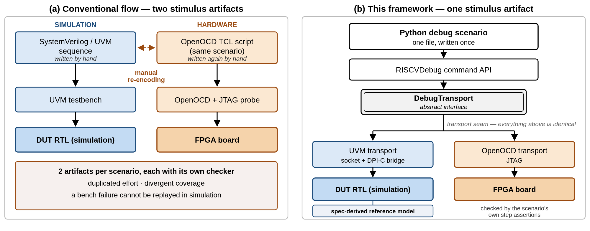

# Bridging Pre- and Post-Silicon Stimulus Generation for RISC-V Debug

*A Python-Based Cross-Platform Framework*

Jahanzeb Khalid, 10xEngineers, Lahore, Pakistan (jahanzeb.khalid@10xengineers.ai)
Hassan Ashraf, 10xEngineers, Lahore, Pakistan (hassan.ashraf@10xengineers.ai)

## Abstract

Verifying a RISC-V Debug Subsystem is split across two disciplines that share almost no artifacts. Pre-silicon teams write SystemVerilog/UVM sequences against the Debug Module Interface (DMI); emulation/post-silicon teams drive the same hardware through OpenOCD over JTAG. The result is duplicated effort, divergent coverage, and a reproduction gap: a debug test that fails on hardware cannot be replayed in simulation without a human re-encoding it by hand. This paper presents a Python framework that narrows that gap by decoupling a debug test's *intent* from its *transport*. One command layer expresses the scenario; one abstract transport interface reaches either a UVM testbench, through a socket and DPI-C bridge, or real hardware, through OpenOCD, with the stimulus unchanged. We evaluate on CVA6 with a v1.0 debug module and Ibex with an unmodified v0.13 module, each running 17 specification-traceable scenarios self-checked against a SystemVerilog reference model derived from the specification text rather than from the RTL. Both reach 100.00% merged functional coverage over 14 covergroups, and all 17 scenarios then execute unmodified on an Arty A7 FPGA board: switching targets requires only a one-line configuration edit, with no transport-conditional logic in 2,259 lines of stimulus and 120 lines of SystemVerilog. We also quantify what portability costs, claiming novelty not in transaction abstraction but in a debug-protocol-specific transport seam spanning the simulation-to-hardware boundary.

**Keywords** — RISC-V; Debug Subsystem; functional verification; UVM; Python; JTAG; OpenOCD; portable stimulus; functional coverage.

## I. Introduction

Modern System-on-Chip verification is characterised by the "shift-left" paradigm, in which teams run software and system-level tests as early as possible. Hardware debug infrastructure, and specifically the RISC-V Debug Subsystem [1], resists it because of a structural divide between pre-silicon and emulation/post-silicon work.

Simulation-based verification of the Debug Subsystem is typically performed with constrained-random UVM sequences. They verify Debug Module Interface (DMI) bus protocol compliance and corner-case timing well, but capture the stateful workflows of a real debugger poorly. A debugger executes long, state-dependent sequences: halting a hart, the RISC-V term for a hardware thread; issuing abstract commands to read General Purpose Registers (GPRs); writing instructions into the program buffer; stepping the program counter. Expressing them purely in SystemVerilog is verbose and binds the tests to one environment.

Validation on real hardware, whether FPGA emulation or post-silicon bring-up, relies on tools such as OpenOCD communicating over physical JTAG. When a debug test fails there, root-causing it is hard, because the hardware stimulus, the exact sequence of JTAG shifts, cannot be replayed natively in the UVM environment. Engineers translate debug logs into SystemVerilog sequences by hand to reproduce bugs in RTL, which is slow and error-prone, and the two artifacts then drift. Figure 1 contrasts the two flows: conventionally each scenario exists twice, once as a SystemVerilog sequence and once as an OpenOCD script, checked by two unrelated checkers. This paper narrows that gap by decoupling the *intent* of a debug test, which registers to access and which assertions to make, from the *transport*, the medium used to reach the chip.

Our contributions are: (1) a transport-independent framework that executes identical debug stimulus across UVM simulation and hardware (Section IV-D); (2) a specification-derived reference model that validates multiple debug implementations without per-DUT branches (Sections III-B and IV-B); (3) a cross-DUT differential diagnostic for isolating RTL and verification defects (Section IV-E); and (4) a quantitative analysis of the performance cost of transport portability (Section IV-F).

*Figure 1. Conventional debug-stimulus flow (a) against the flow this framework enables (b): one artifact per target, each written and checked independently, versus a single scenario reaching both targets unmodified above an abstract transport seam. The reference model is simulation-side only.*

## II. Related Work

Table I compares this framework against the real alternatives for producing debug stimulus.

**Table I — Debug stimulus generation approaches compared**

| Approach | Cross-platform reuse | Tooling cost | Closes the hardware-reproduction gap? |
|---|---|---|---|
| Raw SystemVerilog/UVM sequences | None (pre-silicon only) | Simulator license | No, each scenario needs a hand-written OpenOCD equivalent |
| Random debug-stimulus generation [2] | None (pre-silicon only) | Generator + simulator | No, targets simulation depth, not hardware reuse |
| OpenOCD native TCL scripting | Hardware natively, simulation via Remote Bit-Bang (Section IV-F) | Free | Partly, never enters the UVM environment, so no reference model or coverage |
| Manual translation of a hardware failure | Not applicable (a process, not an artifact) | Engineer time | Nominally, but slow and error-prone by construction |
| Portable Stimulus Standard (PSS) [3] | High at scenario level, not transport level | Often commercial tooling | Partially, no native transport concept, needs a custom backend |
| **This framework** | **Full: the same file, unmodified** | **Existing simulator license, no new tools** | **Yes: the sequence that failed on hardware is the reproduction script** |

**Prior work on RISC-V debug verification.** The closest published work is Mishra *et al.* [2], who verify the debug unit of a RISC-V core by augmenting a biased-random assembly generator to emit debug sessions inside a running instruction stream, checked against a functional model. The two are complementary. Theirs maximises *stimulus depth and randomness* within a simulation environment, using random instruction mixes, asynchronous debug requests and interleaved interrupts and bus faults, none of which this framework attempts; ours maximises *execution-target portability* for a directed, specification-traced scenario set, and reaches hardware, which theirs does not address. A productive combination would layer random generation of the kind in [2] above the transport seam described here.

**Python in verification.** Driving an HDL simulator from Python is established practice: cocotb [4] provides a coroutine-based cosimulation environment, and Hua *et al.* [5] pair Python with UVM for memory-controller verification. This framework differs from both not in using Python, but in what sits below the API: cocotb and [5] terminate at a simulator, whereas the transport interface here also terminates at a physical chip.

### A. Relation to the Portable Stimulus Standard

PSS [3] and this framework solve related but distinct problems. PSS is a declarative action and activity graph over a resource model, solved by a constraint engine to generate scenario *variants*; its axis is scenario-space exploration, with realisation on a target delegated to generated `exec` blocks. This framework is an imperative stimulus library over a transport seam; its axis is execution-target portability, with scenario selection directed rather than solved. They differ decisively in that **PSS has no native concept of transport**: nothing in the standard models a JTAG, OpenOCD, or Direct Programming Interface (DPI-C) path, so a PSS flow targeting both a UVM testbench and a physical board still requires exactly the execution backend this paper describes. The two therefore compose rather than compete — a PSS `exec` block could target this framework's transport layer — which we regard as the most promising extension of this work. PSS remains the better choice for combinatorial coverage of a large resource model; this framework, for a narrow and deeply stateful protocol.

### B. Relation to the Transactor Pattern

The architecture described in Section III is, at the transaction level, a transactor in the classical sense [6]: a high-level call is converted into bus-level activity by a component that hides the conversion. We claim no novelty for that mechanism; the distinction we do claim is one of scope. A classical transactor is compiled into a single execution environment, so supporting a second target means writing a second transactor by hand and maintaining the two in step. Here the transport interface has two implementations, one reaching a UVM sequencer through DPI-C and one reaching real hardware through OpenOCD, selected at run time by configuration, with the stimulus above the seam byte-identical across both. The checking story is asymmetric — the reference model sits below the seam and checks simulation runs only, as Section V states in full. Above the seam, the choice of Python over TCL, the incumbent on the hardware side, supplies real control flow, exceptions and type annotations, and gives the stimulus direct access to an existing test and CI ecosystem.

## III. Methodology

Figure 1(b) outlines the architecture. A single Python stimulus, expressed once against the `RISCVDebug` command API, reaches either target through one abstract `DebugTransport` interface; only the branch beneath that interface differs. Scenarios are written against a fluent API modelling the RISC-V debugger, each a debug session of ordered steps: a halt scenario writes 1 to `dmcontrol.haltreq` and polls `dmstatus` until `allhalted` is set. The Python layer emits only abstract register accesses, which the transport converts for the target.

### A. A Structured Test Plan Drives Scenario Selection

Scenarios are not chosen ad hoc. They trace to a three-layer table derived from the specification [1]: **CAT1 (intention)**, the use case from the specification's Background section, such as "accessing hardware with no working CPU"; **CAT2 (feature)**, the capability from the System Overview and Debug Module chapters, such as Program Buffer execution; and **CAT3 (mechanism)**, the register or protocol element implementing it, such as `progbuf0-15` and `postexec`. The plan enumerates 162 test-case identifiers under 26 prefixes, so scenario coverage is measurable against the specification's own structure. The 17 scenarios are not one per identifier: each covers a cluster of related rows, and 114 of the 162 sit behind them. Of the remaining 48, 12 are cross-cutting rows describing the coverage model, assertions, error injection and regression tiers rather than stimulus, and 36 belong to optional features neither DUT implements: quick access, the access-memory abstract command, authentication, hart grouping and keep-alive.

### B. Simulation Flow and Self-Checking

The framework integrates Python with UVM through a decoupled, thread-safe pull architecture. A DMI request crosses the seam in five stages: the Python client emits a JSON command over a Unix domain socket; a DPI function, which at simulation start spawned a POSIX thread running that socket server, queues it; a UVM bridge component polls the queue and dynamically raises the matching native sequence, a DMI read, a DMI write or a TAP reset; the existing JTAG sequencer and driver convert it to pin activity; and the Debug Module responds. The bridge adds one UVM component and leaves the original testbench otherwise untouched. Every simulation run is self-checked. A SystemVerilog reference model of the Debug Module's register state, derived from the specification text rather than from the RTL under test, predicts the expected response to each DMI transaction, and a checker compares that prediction against what the RTL returned. Covergroups sample the same stream. Both read a per-DUT configuration file declaring that DUT's implementation-defined fields, so neither contains hardcoded per-DUT branches.

### C. Hardware Flow

For hardware targets the framework switches to an OpenOCD transport [7], using the RISC-V-specific distribution [8]. The identical request instead crosses a TCP socket to an OpenOCD process, which issues it through the low-level `riscv dmi_read` and `dmi_write` commands rather than OpenOCD's high-level debug abstractions, so OpenOCD acts purely as a protocol translator into JTAG scans driven onto the board through a physical probe. Above the transport interface the two paths are the same call; only the stages below it differ, and the register operations executed on hardware are therefore the operations executed in simulation.

The hardware target used throughout this paper is an FPGA board, that is, pre-silicon emulation; Section V states precisely what that does and does not license.

## IV. Experimental Results

### A. Verification Environment

The framework was evaluated against two RISC-V cores:

- **CVA6**, an application-class 64-bit core, with its debug subsystem (Debug Module and Debug Transport Module, DTM) updated to specification version 1.0. That update is our own work and is not yet merged upstream, so this target is a local fork pinned to a specific commit rather than a released v1.0 implementation.
- **Ibex**, in the Ibex Demo System, with `pulp-platform/riscv-dbg` unmodified at specification version 0.13.

The two *cores* and SoC integrations are unrelated. The two *debug subsystems* share upstream ancestry but have diverged substantially: across the eleven source files present in both trees, five in the Debug Module register file and six in the JTAG DTM, 1,102 of 3,333 lines differ (33%). The divergence is concentrated rather than uniform: `dm_csrs.sv` differs in 334 of 658 lines and the DTM's `dmi_jtag.sv` in 316 of 357, while three files are byte-identical. The count is a plain textual diff against the v0.13 baseline; the script producing it is committed alongside this paper, so the figure can be regenerated at the pinned commits.

Both were simulated in Questa Sim-64, seventeen scenario configurations per core, each self-checked and instrumented for coverage. All results below come from re-running the full regression on both cores for this paper.

### B. Simulation Results

Table II reports every scenario under two independent checks. *Txn* counts DMI transactions the scoreboard validated for protocol and response consistency and *Err* those that failed; *Chk* counts register reads compared against the specification-derived reference model and *MM* those that diverged from its prediction.

**Table II — Full simulation regression, both DUTs**

| Scenario | Debug feature exercised | CVA6 (v1.0) Txn / Err | CVA6 Chk / MM | Ibex (v0.13) Txn / Err | Ibex Chk / MM |
|---|---|---|---|---|---|
| `discovery` | DM presence, version, `hartinfo` | 7 / 0 | 3 / 0 | 7 / 0 | 3 / 0 |
| `dm_activation` | `dmactive` reset and activation | 18 / 0 | 7 / 0 | 18 / 0 | 7 / 0 |
| `read_dmstatus` | Raw `dmstatus` read | 2 / 0 | 1 / 0 | 2 / 0 | 1 / 0 |
| `report_halt_status` | Halt-status reporting | 11 / 0 | 4 / 0 | 11 / 0 | 4 / 0 |
| `halt` | Halt request and acknowledgment | 42 / 0 | 16 / 0 | 36 / 0 | 13 / 0 |
| `run_control` | Halt and resume run control | 49 / 0 | 15 / 0 | 49 / 0 | 15 / 0 |
| `reset_ctrl` | `ndmreset` and `hartreset` | 68 / 0 | 20 / 0 | 66 / 0 | 19 / 0 |
| `halt_on_reset` | Halt-on-reset request | 23 / 0 | 7 / 0 | 23 / 0 | 7 / 0 |
| `hart_selection` | `hartsel` / `hasel` addressing | 15 / 0 | 4 / 1 | 15 / 0 | 4 / 1 |
| `gpr_write` | GPR write and read-back | 33 / 0 | 12 / 0 | 27 / 0 | 9 / 0 |
| `csr_access` | Control and Status Register access | 56 / 0 | 20 / 0 | 48 / 0 | 16 / 0 |
| `program_buffer` | Program Buffer execution | 40 / 0 | 14 / 0 | 36 / 0 | 12 / 0 |
| `single_step` | Hardware single-step | 156 / 0 | 73 / 0 | 50 / 0 | 18 / 0 |
| `sw_breakpoint_progbuf` | SW breakpoint via Program Buffer | 38 / 0 | 15 / 0 | 30 / 0 | 11 / 0 |
| `sba` | System Bus Access, 32-bit | 20 / 0 | 6 / 0 | 20 / 0 | 6 / 0 |
| `trigger` | Trigger module registers | 117 / 0 | 33 / 0 | 117 / 0 | 33 / 0 |
| `external_trigger` | Halt-group discovery via `dmcs2` | 13 / 0 | 4 / 0 | 13 / 0 | 4 / 0 |
| **Total (17 scenarios)** | | **708 / 0** | **254 / 1** | **568 / 0** | **182 / 1** |

Every scenario completes on both DUTs. Across 1,276 scoreboard-checked transactions there are no protocol errors, and of 436 register values compared against the reference model, 434 match its prediction exactly. The two divergences are the same divergence, once per DUT. Selecting a hart that does not exist, both modules correctly set `allnonexistent` and `anynonexistent`, but leave `allrunning` and `anyrunning` set at the same time, reporting a hart as simultaneously nonexistent and running. The observed word differs from the prediction in exactly those two bits, 11 and 10: Ibex returns `0x0000cc82` against a predicted `0x0000c082`, CVA6 `0x0080cc83` against `0x0080c083`. The defect sits in `dm_csrs.sv`, the register logic the two still share, and predates the v1.0 fork. It is filed with the RTL owners and deliberately not patched, this work's scope being the stimulus framework rather than the design.

Two entries warrant comment. `single_step` checks more state on CVA6 because the v1.0 module exposes additional `dcsr` fields the scenario polls. `external_trigger` returns a negative result on both and is reported rather than omitted: `dmcs2` does not exist at v0.13, and although the v1.0 fork has it, every field reads as tied to zero, so halt groups are unimplemented on both. Two other scenarios prove real execution rather than a register round-trip: Program Buffer injects `addi x5, x5, 1; ebreak`, triggers it through `postexec` and confirms `x5 = 1` on real RTL, and the software-breakpoint scenario asserted in advance that `dcsr.cause` is unchanged when `ebreak` executes on an already-halted hart, which the run confirmed.

### C. Functional Coverage Closure

Passing scenarios are a necessary but insufficient bar; the acceptance criterion was complete functional coverage of the external-debug feature set. Each scenario's coverage database is saved separately and merged, so a bin hit by any scenario counts as covered.

**Table III — Merged functional coverage, external-debug feature set**

| DUT | Spec version | Scenarios merged | Covergroup types | Bins covered / total | Merged coverage |
|---|---|---|---|---|---|
| CVA6 | 1.0 | 17 | 14 | 150 / 150 | **100.00%** |
| Ibex | 0.13 | 17 | 14 | 149 / 149 | **100.00%** |

All 14 covergroups reach 100.00% individually on both DUTs, so the aggregate is not concealing a weak group. Closure came in four steps whose shape carries the more useful result: an initial merged 77.81% on both DUTs; 82.44% on CVA6 and 82.71% on Ibex after correcting a DMI read-correlation defect in the sampler, with no new stimulus written; 91.78% and 91.64% after adding the reset, halt-on-reset and hart-selection scenarios; and 100.00% once the covergroups became configuration-driven and one bin was placed under conditional compilation. A 100% figure is only meaningful alongside its denominator. Bins were excluded only where a specific RTL construct makes them unreachable, each cited to that construct: `allunavail`/`anyunavail` (the availability input is tied to zero in both SoC integrations) and `hasresethaltreq` (hardcoded to zero in both debug-module configurations). One bin required conditional compilation rather than exclusion: `ndmresetpending` has two independently reachable values at v1.0 and none at v0.13, and only the elaboration-time `ignore_bins` keyword removes a bin from the denominator, which a runtime sentinel cannot do. That single bin is the entire difference between the two denominators in Table III.

### D. Cross-Platform Reuse, Measured

The framework's central claim is that a scenario written once runs everywhere. To test rather than assert it, the complete Ibex scenario set was executed on an Arty A7 board carrying the Ibex Demo System, over the OpenOCD transport and a physical JTAG probe, and the two invocations compared file by file.

**Table IV — Stimulus reuse between simulation and FPGA hardware**

| Property | Measured |
|---|---|
| Scenarios executed on both simulation and hardware, from an identical entry point | 17 of 17 |
| Stimulus files / lines of Python | 19 / 2,259 |
| Branches in the stimulus layer that change the operations issued | **0** |
| Per-target differences | `transport` and its connection parameters; 1 memory address |
| SystemVerilog required by the framework, total | **120 lines, 3 sequences** |
| Artifacts to keep synchronised per new scenario | 1 (versus 2 for a UVM sequence plus an OpenOCD script) |

The stimulus layer contains no transport branch, hardware flag or OpenOCD-specific path anywhere in 2,259 lines; switching targets is a one-line edit to the `transport` field of a JSON config. Two honest exceptions are narrower than they appear. Four of the nineteen files ask whether a golden reference model is attached and fold its prediction into the pass criterion; this changes how strictly a step is *checked*, never which DMI operations are *issued*, so the reuse figure is unaffected. And the `halt` scenario parameterises a memory address, `0x80000000` in simulation against `0x00100000` on the board — data in configuration, not logic in stimulus.

The last two rows answer testbench complexity by measurement rather than estimate. The entire SystemVerilog surface is three sequences — a DMI read, a DMI write and a TAP reset — and did not grow as scenarios went from one to seventeen, because scenario logic lives above the seam, where the conventional alternative needs a SystemVerilog sequence *and* an OpenOCD script per scenario, kept in agreement by hand. This is what narrows the reproduction gap of Section I.

### E. What the Methodology Caught and Its Limits

Because one stimulus, reference model and checker run against two DUTs, the *distribution* of a failure across them carries diagnostic information before any waveform is opened. Table V records every defect found during the campaign against what that distribution implied, DV denoting design-verification code.

**Table V — Defect localisation via the cross-DUT signal**

| Symptom | Appeared on | Implied | Actually located in |
|---|---|---|---|
| `dmstatus` reads all-zero during halt poll | Both | Shared DV or common DM lineage | Shared DV: read sequence drained its response in one of two phases, offsetting every later read by one |
| `resumeack` mismatches, several hundred | Both | Shared DV or common DM lineage | Shared DV: model predicted a hart-driven signal synchronously with the triggering write |
| Coverage plateau at 77.81% | Both | Shared DV | Shared DV: sampler correlated read data with the wrong transaction |
| `single_step` resume timeout | Both | Shared DV | Shared DV: stimulus reused a resume primitive polling a state a stepped hart leaves too quickly |
| `abstractcs.busy` never clears | CVA6 only | CVA6-divergent RTL or CVA6-specific DV | CVA6 RTL: debug-ROM address migration, fixed at source by the RTL owners |
| `ndmresetpending` mispredicted | Ibex only | Ibex-divergent RTL or a DV assumption | Shared DV: model predicted a v1.0-only field regardless of configured version |
| `allrunning` set for a nonexistent hart | Both | Shared DV or common DM lineage | **Common DM lineage: a genuine RTL defect in the unchanged 67%** |

### F. Quantifying the Transport Trade-off

The OpenOCD transport can also target simulation directly, over the Remote Bit-Bang (RBB) protocol [7]: OpenOCD connects to a bit-level JTAG server compiled into the testbench instead of a physical probe, so a scenario can be rehearsed through the real OpenOCD and JTAG stack before reaching hardware. To cost that, an identical sequence — activate, halt, then 20 iterations each of register, GPR and 32-bit System Bus Access (SBA) reads and writes — was timed against both transports on the same running simulation of each DUT.

**Table VI — Direct UVM socket versus OpenOCD with Remote Bit-Bang, measured**

| Metric | Ibex direct | Ibex RBB | Ratio | CVA6 direct | CVA6 RBB | Ratio |
|---|---|---|---|---|---|---|
| Register read (mean) | 2.93 ms | 164.60 ms | 56.1× | 134.87 ms | 338.50 ms | 2.5× |
| Register write (mean) | 1.60 ms | 164.57 ms | 103.1× | 70.43 ms | 363.15 ms | 5.2× |
| GPR read (mean) | 9.41 ms | 493.23 ms | 52.4× | 472.86 ms | 1.137 s | 2.4× |
| GPR write (mean) | 7.88 ms | 493.35 ms | 62.6× | 403.93 ms | 966.68 ms | 2.4× |
| Memory read, SBA (mean) | 11.63 ms | 658.00 ms | 56.6× | 416.17 ms | 1.292 s | 3.1× |
| Memory write, SBA (mean) | 8.35 ms | 657.91 ms | 78.8× | 367.91 ms | 1.329 s | 3.6× |
| Throughput, full sequence | 144.4 ops/s | 2.3 ops/s | 63.1× | 3.2 ops/s | 1.1 ops/s | 2.9× |

The direct transport is faster on both, but the gap is not a constant: it is between one and two orders of magnitude larger on Ibex. Comparing *simulated* rather than wall-clock time explains why. A register read consumes very nearly the same simulated time on both DUTs, 2.3 to 4.0 µs, so the Remote Bit-Bang path performs no additional simulated work; what differs is wall-clock cost per simulated microsecond, dominated by CVA6 being a far larger design to evaluate each clock edge. Remote Bit-Bang adds a roughly fixed wall-clock cost per JTAG bit, one TCP round trip: +161.7 ms on Ibex's register read against +203.6 ms on CVA6's, similar in absolute terms despite very different baselines — a large fraction of Ibex's small per-operation time and a small fraction of CVA6's large one. The generalisable result is that **Remote Bit-Bang overhead scales with how thin the direct simulation path already is, not with a fixed multiplier**, which argues for measuring this per DUT rather than assuming a uniform portability tax. The practical recommendation follows: keep the direct transport as the default for scenario development and coverage regression, and reserve Remote Bit-Bang for what only it validates, the external OpenOCD and JTAG stack itself, where its cost is acceptable at far lower iteration counts.

## V. Limitations and Threats to Validity

**Single-hart only.** Halt and resume groups are unverified because both DUTs leave `dmcs2` unimplemented, and multi-hart scenarios need a second hart, which for an execution-based debug module is a far larger change than a register addition. We therefore make **no claim about scalability in hart count**; the scalability we do observe is in scenario count, the SystemVerilog surface staying at 120 lines while scenarios grew to 17 (Table IV).

**Hardware evidence is FPGA emulation, and checked more weakly than simulation.** The target is an Arty A7 board; OpenOCD reaches an emulated and a taped-out device over the same JTAG path, so we expect the result to carry, but we did not measure it on silicon. The reference model also sits inside the UVM environment and checks simulation runs only, so a hardware run is self-checked by the scenario's own assertions at step granularity rather than transaction by transaction; the reuse result of Section IV-D is a claim about stimulus, not checking strength. We used RISC-V debug specification v1.0 compliant ibex core to emulate on Arty A7 board.

**Coverage is of the model we built.** 100.00% is against 14 covergroups over the external-debug feature set, with exclusions itemised in Section IV-C; it is not a claim of exhaustive verification, and native-debug paths are outside the model entirely. The trigger scenario is register-level: it configures `tdata1` but does not arm a trigger and confirm a match-triggered halt, which requires native firmware execution.

**Directed rather than random, and diagnosis is heuristic.** Scenario selection is traceable to the test plan of Section III-A, which bounds the state space reached compared with random approaches such as [2], though the campaign nonetheless surfaced the defects in Table V. The seam would admit a random generator layered above it, but we have not built one, and the cross-DUT signal of Section IV-E reorders the search space rather than deciding it.

**Scope of evaluation.** The framework was exercised across two DUTs from unrelated projects, two specification versions and two transports, but **not** on a second simulator or a second FPGA board, so we claim independence at the DUT and transport level, explicitly not the tool level. The artifacts behind each result are committed and both regressions re-run in full for this paper, but the raw transcripts and session logs are *not*, so the tables are reproducible rather than auditable against a stored log. CVA6 also simulates with the design optimiser disabled, a constraint predating this work, because enabling it crashes the optimiser on vendored floating-point RTL; since Remote Bit-Bang's added cost tracks socket round-trip time rather than RTL evaluation, the CVA6 ratios in Table VI are a lower bound.

## VI. Conclusion

This paper presented a dual-transport Python framework that narrows the gap between simulation-based debug verification and validation on real hardware: a scenario is written once against a debug-protocol command layer and executed unmodified against either target. The hardware evidence is FPGA emulation. Three results bear on methodology beyond this framework. Running one stimulus library across two DUTs turns the distribution of a failure into a localisation signal, bounded in the two ways Section IV-E documents.

The contribution is deliberately narrow: not that a transactor can drive hardware from a high-level language, but that placing the seam at the simulation-to-hardware boundary, for a protocol whose toolchains are maintained by different teams, removes an organisational barrier as well as a technical one and yields a diagnostic a single-target flow cannot produce.

## Acknowledgment

The authors thank their colleagues at 10xEngineers for reviewing the verification strategy and test plan, and for maintaining the RISC-V debug-module RTL against which this framework was evaluated.

## References

[1] RISC-V International, "RISC-V Debug Specification, Version 1.0-STABLE," Dec. 8, 2022. [Online]. Available: https://github.com/riscv/riscv-debug-spec

[2] S. Mishra, L. Hao, A. Sharma, A. Anjum, L. Franco, S. Roy, and J. Scott, "Random testcase generation and verification of debug unit for a RISC-V processor core," in *Proc. Design and Verification Conference and Exhibition U.S. (DVCon U.S.)*, San Jose, CA, USA, 2023.

[3] Accellera Systems Initiative, "Portable Test and Stimulus Standard," Version 3.0, Aug. 2024. [Online]. Available: https://www.accellera.org/images/downloads/standards/pss/Portable_Test_Stimulus_Standard_v3.0.pdf

[4] cocotb contributors, "cocotb: a coroutine-based cosimulation library for writing testbenches in Python." [Online]. Available: https://www.cocotb.org

[5] X. Hua, S. Yaze, J. Zou, E. Lin, Y. Zhao, and P. Wang, "A UVM and Python co-simulation framework for automated memory controller verification," in *Proc. Int. Conf. Signal Processing, Computer Networks and Communications (SPCNC)*, Wuhan, China, 2025, pp. 657–660, doi: 10.1109/SPCNC68200.2025.11406641.

[6] J. Bergeron, *Writing Testbenches: Functional Verification of HDL Models*, 2nd ed. Boston, MA, USA: Springer, 2003.

[7] The OpenOCD Project, "Open On-Chip Debugger: OpenOCD User's Guide," Release 0.12.0+dev. [Online]. Available: https://openocd.org/doc/pdf/openocd.pdf (accessed Apr. 2026)

[8] RISC-V Collab, "riscv-openocd," GitHub repository. [Online]. Available: https://github.com/riscv-collab/riscv-openocd
