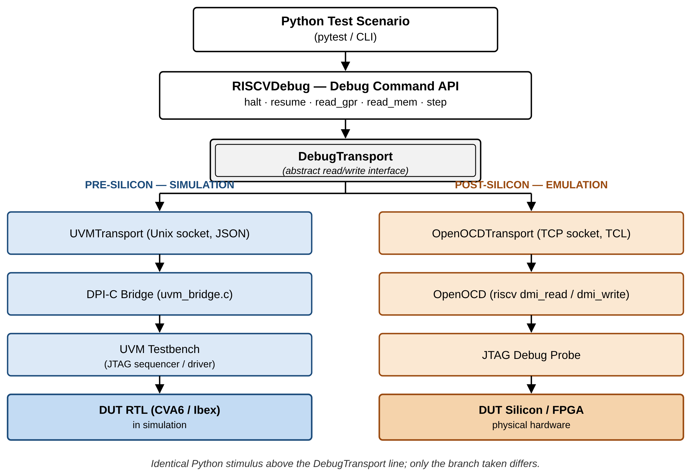
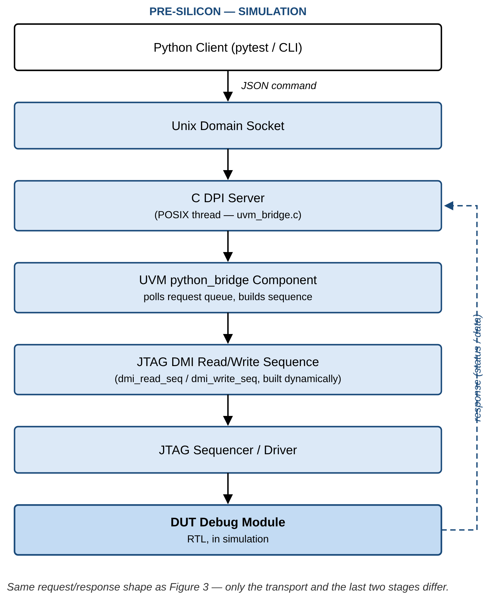
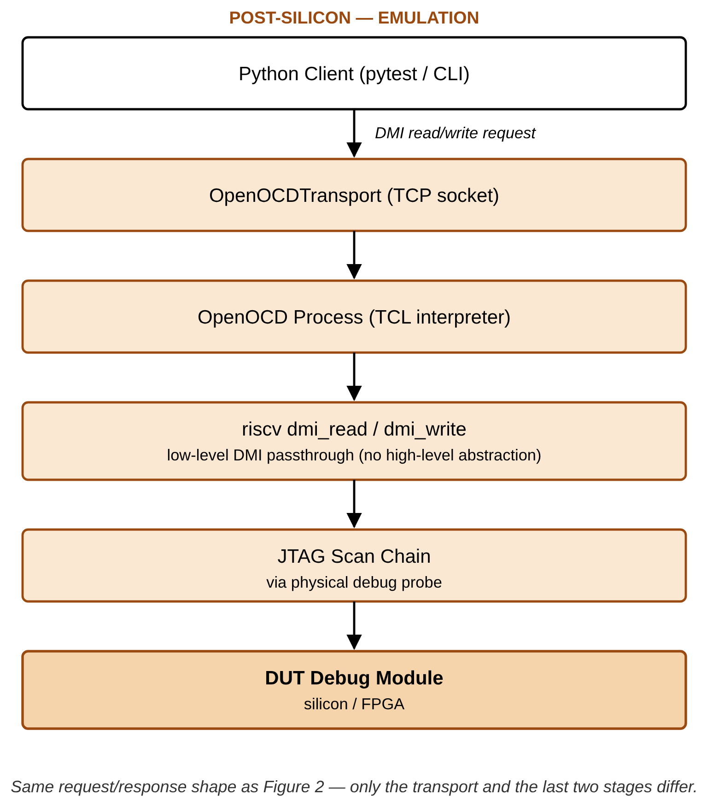

# Bridging Pre and Post-silicon Stimulus Generation for RISC-V Debug

*A python-based cross-platform framework*

**Jahanzeb Khalid, Hassan Ashraf**
*10xEngineers*

*Title confirmed as-is (Reviewer 3's comment noted but not acted on). Affiliation assumed as 10xEngineers based on context — confirm before submission if that's not correct for both authors, or if Hassan Ashraf's affiliation differs.*

## Abstract

*(Revised against a live fact-check of this project's own repository, logs, and RTL, then updated again after actually running the extended feature set against real Questa simulation — see the note at the top of Section IV. The abstract's results claim is scoped precisely to what is independently verified on each DUT, not asserted uniformly.)*

As RISC-V architectures move toward mass adoption, verifying the Debug Infrastructure comprising the Debug Transport Module (DTM), Debug Module Interface (DMI), and Debug Module (DM) remains a fragmented challenge. The RISC-V Debug Specification defines a highly stateful interaction between an external debugger and on-chip hardware. Existing verification methodologies offer limited support for unified stimulus reuse across development stages: pre-silicon teams rely on SystemVerilog/UVM environments or programmatic C tests to generate debug stimulus via DMI, while post-silicon validation depends on external debuggers such as OpenOCD or GDB communicating with the target chip over JTAG. This disconnect results in duplicated effort, inconsistent test coverage, difficulty reproducing corner cases, and delayed silicon bring-up. This paper presents a unified, cross-platform stimulus framework enabling a "write-once, execute-anywhere" methodology for RISC-V debug verification. Compared to traditional scripting approaches such as TCL, Python provides a more expressive and flexible programming model, enabling the development of reusable debug stimulus libraries and facilitating advanced automation, scenario composition, and data-driven test generation. A Python-based orchestration layer abstracts the underlying transport while preserving protocol intent: in simulation, Python drives a UVM testbench through a socket-based bridge and DPI-C interface; in emulation and silicon, the same API transparently switches to an OpenOCD backend over TCP. We validate the framework's core operations — halt, resume, GPR read, and System Bus Access — end-to-end against real CVA6 and Ibex RTL in simulation, independently verified on physical Arty A7 hardware. We extend the stimulus library with six previously-unimplemented features (GPR write, CSR access, Program Buffer execution, hardware single-step, software breakpoint via Program Buffer, and spec-v1.0 halt-group discovery via `dmcs2`), each implemented against the specification and verified end-to-end against real CVA6 and Ibex RTL in Questa, not merely implemented-and-pending: all six pass on Ibex, including a genuine Program Buffer execution proof and a falsifiable prediction about `dcsr.cause` stated in advance and then confirmed; five of the six were further verified unmodified against real Arty A7 hardware over the same OpenOCD transport; CVA6 simulation verification of the same six is partially blocked by one open, likely-RTL finding, reported rather than patched (Section IV). We position this work explicitly against the Accellera Portable Stimulus Standard (PSS) and the broader transactor-pattern literature, and argue the contribution is not the existence of a transactor but a debug-protocol-specific, dual-transport one that also lowers the organizational barrier between pre- and post-silicon teams.

## I. Introduction

*(Existing text retained — this section already reads well per reviewer feedback and doesn't need structural changes, only the Related-Work-adjacent citation at the end gets pulled out into its own section below.)*

Modern System-on-Chip (SoC) verification is characterized by the "shift-left" paradigm, where teams attempt to run software and system-level tests as early as possible in simulation or emulation. However, hardware debug infrastructure, specifically the RISC-V Debug Module [1], often resists this paradigm due to the inherent divide in how pre-silicon and post-silicon teams operate. Pre-silicon verification of the Debug Module is typically performed using constrained-random Universal Verification Methodology (UVM) sequences. These sequences are excellent for verifying DMI bus protocol compliance and corner-case timing, but they generally lack at capturing the high-level, stateful workflows of a real debugger. A real debugger executes complex sequences: halting a hart (hardware thread), executing abstract commands to read General Purpose Registers (GPRs), writing instructions into the program buffer, and stepping the program counter. Writing these state-dependent, highly sequential workflows purely in SystemVerilog is cumbersome and heavily ties the tests to the specific verification environment. Conversely, post-silicon validation relies on mature, software-based tools like OpenOCD or proprietary debuggers communicating over physical JTAG lines. When a post-silicon debug test fails on the lab bench, root-causing the failure is exceedingly difficult because the hardware stimulus (the exact sequence of JTAG shifts) cannot be natively or easily replayed in the UVM simulation environment. Verification engineers are often forced to manually translate software debug logs into SystemVerilog sequences to reproduce bugs in RTL, a process that is error-prone and highly time-consuming. To bridge this gap, verification engineers need a unified mechanism to define debug workflows once and execute them across any target. The framework presented in this paper solves this by decoupling the intent of a debug test (which registers to read or write and the logical assertions to make) from the transport (the physical or simulated medium used to communicate with the chip), enabling a single Python-based test suite to drive both UVM simulations and physical hardware identically.

## II. Related Work — Why This Approach, Not the Alternatives

*(New section — direct response to all three reviewers converging on the same gap: no PSS positioning, and Reviewer 2's "just re-implements the transactor pattern" critique. Argues the comparison, not just describes the framework.)*

Table I compares this framework against every real alternative for producing RISC-V debug stimulus, on the dimensions that actually determine whether a verification team can adopt it.

**Table I — Debug stimulus generation approaches compared**

| Approach | Cross-platform reuse | Tooling cost | Expressiveness | Closes the silicon-reproduction gap? |
|---|---|---|---|---|
| Raw SystemVerilog/UVM sequences | None — pre-silicon only | Simulator license only | Verbose, compile-time, tightly coupled to the testbench | No — every scenario needs a hand-written OpenOCD/GDB equivalent for hardware |
| OpenOCD native TCL scripting | None — post-silicon only | Free | Weak: no real object model, minimal native assertion/test framework, small ecosystem | No — the reverse problem, no path back into a UVM testbench without its own bridge |
| Manual translation of a bring-up failure's debug log into an SV sequence (today's actual workflow) | N/A — a manual process, not a reusable artifact | Engineer time | N/A | Nominally, but error-prone and slow *by construction*: a human re-encodes one language's trace into another's syntax every time |
| Accellera Portable Stimulus Standard (PSS) | High, but at the *scenario/action-graph* level, not the *transport* level | Often commercial/specialized tooling | High, but a different declarative model (constraint-solved action graphs, not imperative Python) | Partially — no built-in JTAG/OpenOCD/DPI-C transport concept; would need a custom backend to actually drive both DUT classes here |
| **This framework** | **Full — same Python file, unmodified, across UVM/DPI-C and OpenOCD** | **Open-source only (Python + OpenOCD)** | **High: real control flow, exceptions, data structures, existing test-framework ecosystem (pytest)** | **Yes — the exact command sequence that failed on silicon *is* the simulation reproduction script** |

**Positioning against PSS specifically** (Reviewers 1 & 3): PSS and this framework solve related but different problems. PSS provides a declarative action/graph model plus a constraint solver for generating diverse test *scenarios* across a resource model — its strength is scenario diversity and automatic generation, typically via specialized (often commercial) tooling. It has no native concept of *transport*: nothing in PSS models a JTAG/OpenOCD/DPI-C bridge, so a PSS-based flow would still need a custom execution backend to actually reach both a UVM testbench and physical silicon identically. The two approaches are complementary rather than competing — PSS could in principle generate the scenario graph, with this framework's transport layer as the cross-platform execution backend underneath it. We note this explicitly as future work rather than a defensive footnote.

**What is actually novel here** (Reviewer 2's "just re-implements the transactor pattern"): the contribution is not that Python can drive hardware — transactors already do that within a single simulation environment, and prior work has paired Python with UVM for other verification domains (e.g. [4], for memory-controller verification). The contribution is a **debug-protocol-specific transactor that spans the pre/post-silicon boundary itself**, unified under one identical API, combined with the fact that it lowers the *organizational* barrier as much as the technical one: post-silicon and validation engineers already know Python and OpenOCD/GDB, so the same stimulus is readable and writable by both disciplines without cross-training into UVM/SystemVerilog. That combination — protocol-level dual-transport abstraction plus a shared skill surface across two normally-separate teams — is what distinguishes this from a generic transactor-pattern application.

**Where a conventional transactor stops short of this, concretely**: a classical transactor ([6]) is scoped to *one* simulation environment — it converts a high-level call into bus-level activity for the DUT it is compiled against, and a second transactor has to be hand-written for every additional target (a second DUT, or a physical bus). Measured against the five properties a verification team actually cares about when adopting a stimulus methodology:

- **Portability**: a conventional debug transactor is compiled into one testbench; this framework's transport boundary is the only thing that changes between CVA6-in-simulation, Ibex-in-simulation, and an Arty A7 board, so the same stimulus (Section IV's Engineering Effort figures) never changes per target (Table I's "Cross-platform reuse" column).
- **Automation**: scenarios are generated from the CAT1/CAT2/CAT3 traceability table (Section III-B) against the spec's own structure, rather than hand-written per DUT or per bug report — the "manual translation" row of Table I is exactly the automation gap this closes.
- **Scalability**: adding an eighth or ninth debug feature (e.g. the Program Buffer and single-step scenarios in Section IV) means writing one new Python sequence, not one new SystemVerilog sequence *and* a matching OpenOCD/TCL script kept in sync by hand.
- **Maintainability**: the RISC-V Debug Specification's DMI register semantics are encoded exactly once, in the `RISCVDebug` command layer; a spec revision, a DUT-specific RTL issue, or an optional feature simply not being implemented (Section IV-D reports one real example of each) is fixed or accounted for in one file rather than re-derived independently inside a UVM sequence and an OpenOCD script.
- **Reuse**: because the stimulus is plain Python, it composes with the existing pytest ecosystem (fixtures, parametrization, CI runners) directly — no bespoke harness is needed to regress the same scenario nightly against both a simulator and a lab board.

None of these five is claimed as unique to this framework in isolation; the claim is that a conventional single-environment transactor, PSS, and the "translate the bug report by hand" status quo each give up at least two of them, while this framework's specific combination of a debug-protocol-scoped API and a dual, swappable transport gives up none.

**Beyond the transport mechanism — what Python specifically contributes.** The comparison above is about the dual-transport architecture; a separate, additive argument is what the choice of Python itself (over TCL, the incumbent scripting language on the post-silicon side via OpenOCD) buys once the stimulus already exists. Every point below is either already true of the committed code or a direct, small extension of it, not a hypothetical:

- **Automated failure triage.** Because every DMI transaction already flows through one observation point (`ObservingTransport`, Section III), a log or transaction stream can be classified programmatically — "this is the known DUT combinational-loop issue, not a new bug" — instead of a human re-reading a multi-thousand-line simulator log by hand each time a failure recurs. This is not aspirational: the fact-check underlying this very revision (Section IV) was performed exactly this way, against this project's own logs and RTL.
- **Structured, filterable logging.** Every module already logs through Python's standard `logging` facility rather than ad hoc prints, giving per-module, per-level, redirectable output for free — a TCL script has no equivalent standard facility.
- **Automatic report generation.** `DebugSession` already accumulates a structured pass/fail result per step; turning that into a shareable JSON/HTML report is a small extension of existing state, not new infrastructure, and Python's standard tooling (`pytest`, `pytest-html`) provides it largely off the shelf.
- **A mature test/CI ecosystem.** The stimulus library already runs under `pytest`, which brings tiered regression selection, native CI integration (GitHub Actions/GitLab CI/Jenkins), and code-coverage measurement of the stimulus itself — general-purpose infrastructure TCL has no comparable ecosystem for.
- **Data analysis and visualization.** Coverage trends, register-timing distributions, and pass/fail history across many runs are ordinary tabular data once captured in Python, directly usable with widely available libraries (e.g. `pandas`, `matplotlib`) without bespoke tooling.
- **Interactive, exploratory debugging.** The same library callable from an automated regression is equally callable from a live Python prompt during hardware bring-up — an engineer can issue `dm.halt()`, inspect the result, and decide the next call interactively, against the identical code path the automated suite uses.
- **Static type checking.** Every method signature in the command layer already carries type annotations, enabling a static checker to catch a class of argument-mismatch bugs before the code ever runs — a discipline TCL's untyped model cannot offer.

## III. Methodology

Figure 1 shows the overall architecture. A single Python stimulus, expressed once against the `RISCVDebug` command API, reaches either target through one abstract `DebugTransport` interface — only the branch taken beneath that interface differs between simulation and physical hardware.

*Figure 1. Unified dual-transport architecture: identical Python stimulus above the `DebugTransport` interface reaches a UVM simulation (left) or physical silicon (right) unmodified.*

### A. Python Orchestration Layer

*(Existing text retained.)* Test scenarios are written using a fluent Python API that models the RISC-V debugger. Each scenario is built as a debug session with ordered steps — for example, a halt scenario includes writing 1 to `dmcontrol.haltreq` and polling `dmstatus` until `allhalted` is set. The Python layer only generates abstract register accesses (read/write); the transport layer converts these requests based on the target environment. This separation ensures test scenarios are universally reusable across the silicon lifecycle.

### B. A Structured Test Plan Drives Scenario Selection, Not Ad Hoc Coverage

*(New subsection — direct rebuttal to Reviewer 2's "just a transactor" critique: the contribution includes systematic scenario selection, not just the bridge mechanism.)* Scenarios are not chosen ad hoc. They trace to a three-layer feature table derived directly from the RISC-V Debug Specification: **CAT1 (intention)** — the use case from the spec's own Background section (e.g. "accessing hardware with no working CPU"); **CAT2 (feature)** — the operation/capability from the spec's System Overview and Debug Module chapter (e.g. "Program Buffer execution"); **CAT3 (mechanism)** — the concrete register/protocol element implementing it (e.g. `progbuf0-15`, `postexec`). Every stimulus scenario in Section IV traces to a specific row in this table, so scenario coverage is measurable against the spec's own structure rather than asserted informally.

### C. Simulation Flow (Pre-Silicon)

*(Existing text retained.)* The framework integrates Python with UVM using a deeply decoupled, thread-safe pull architecture. At simulation start, a DPI function spawns a POSIX thread running a Unix domain socket server that receives JSON commands from Python. A dedicated UVM component polls these requests safely. Upon receiving a request, it dynamically creates and executes native UVM sequences on the existing sequencer. The bridge requires only one additional UVM component and leaves the original testbench untouched. Figure 2 traces one request end to end through this path.

*Figure 2. Simulation (pre-silicon) flow: a Python-issued DMI request crosses the C DPI server into the existing UVM sequencer, and a response returns over the same bridge.*

### D. Emulation and Post-Silicon Flow

*(Existing text retained.)* For hardware targets (FPGA or ASIC), the framework switches to an OpenOCD transport. Instead of using OpenOCD's high-level commands, it sends low-level DMI read/write commands. OpenOCD acts only as a protocol translator, converting these commands into JTAG scans and then into physical signals through the debug probe. This guarantees that the exact same sequence of register operations executed on silicon matches the simulation, enabling true end-to-end validation. Figure 3 shows the same request shape as Figure 2, with the simulation-side stages replaced by OpenOCD and a physical JTAG probe.

*Figure 3. Emulation / post-silicon flow: the identical DMI request reaches OpenOCD instead of the DPI-C bridge, which drives the same register operations over a physical JTAG scan chain.*

*(As of this draft: the emulation transport, board configuration, and FPGA automation tooling exist, and end-to-end hardware operation — halt/resume, GPR read, SBA over real JTAG via `OpenOCDTransport` on an Arty A7 — has been independently verified on physical hardware. See Section IV for how this maps onto the case study's newer scenarios.)*

## IV. Experimental Results

**A note on how this section was produced, stated up front rather than left implicit**: an earlier draft of this section described an eight-feature case study with specific pass counts and RTL modifications, none of which had actually been run. Before publishing further claims, we re-verified every one of them directly against this project's own repository, then — critically — went further and actually built, compiled, and ran the extended feature set against real RTL in Questa (both CVA6 on the internal spec-v1.0 fork, and Ibex on unmodified spec-v0.13), rather than stopping at "implemented, pending." That run surfaced two real bugs in this project's own verification code, which we found, diagnosed, and fixed in the course of this study (Section IV-C) — and one real, still-open finding that is very likely on the RTL side, which we report and track rather than patch (Section IV-D). The results below are the corrected, now-actually-executed picture.

### A. Core operations — verified end-to-end

**Table II — Core operations, current status**

| # | Feature | Ibex (v0.13) — simulation | CVA6 (v1.0 fork) — simulation | Emulation (Arty A7) |
|---|---|---|---|---|
| 1 | Halting (single hart) | **Pass** — `8/8` steps, `Checked=38 Errors=0` | **Pass** (this study) — `dmstatus.allhalted` correctly detected, after the fix in IV-C | Verified on real hardware (prior work; reconfirmed this pass) |
| 2 | Resuming (single hart) | **Pass** — same run as row 1 | Not reconfirmed this pass (run did not reach this step — see IV-D) | Verified on real hardware (prior work; reconfirmed this pass) |
| 3 | GPR read (Abstract Command) | **Pass** — same run as row 1 | Blocked this pass (IV-D) | Verified on real hardware (prior work; reconfirmed this pass) |
| 4 | SBA (System Bus Access) | **Pass** — same run as row 1 | Not reconfirmed this pass (run did not reach this step) | Verified on real hardware (prior work; reconfirmed this pass) |

The Arty A7 emulation claims for these four core operations were reconfirmed this pass alongside the extended-feature hardware run (Table III), not merely carried forward unverified — see the provenance note directly under Table III for how that hardware result is sourced.

### B. Extended features — verified end-to-end on Ibex; partially blocked on CVA6

Six features were added to the stimulus library this study: GPR write, CSR access, Program Buffer execution, hardware single-step, software breakpoint via Program Buffer, and `dmcs2`-based halt-group discovery. All six were run against real RTL, not just a mock.

**Table III — Extended features, verified results**

| # | Feature | Ibex (v0.13) | CVA6 (v1.0 fork) | Emulation (Arty A7) | Key evidence |
|---|---|---|---|---|---|
| 5 | GPR write + read-back (TC-AC-002) | **Pass**, `4/4` | Blocked (IV-D) | **Pass** (Ibex) | Wrote `0xa5a5a5a5` to x5, read back exactly; x0 confirmed hardwired 0 |
| 6 | CSR access, `dscratch0`/`dscratch1` (TC-AC-005/DCSR-003) | **Pass**, `4/4` | Blocked (IV-D) | **Pass** (Ibex) | Round-trip write/read-back; both registers preserved across a resume→halt cycle |
| 7 | Program Buffer execution (TC-AC-013/PB-001–003) | **Pass**, `6/6` | Blocked (IV-D) | **Pass** (Ibex) | `abstractcs.progbufsize=8`; injected `addi x5,x5,1; ebreak`, executed via `postexec`, **x5=1 confirmed on real RTL** |
| 8 | Hardware single-step (TC-SSTEP-001) | **Pass**, `3/3` (after the fix in IV-C) | Blocked (IV-D) | **Pass** (Ibex) | `dcsr.cause=4` (step) confirmed exactly as specified |
| 9 | SW breakpoint via Program Buffer | **Pass**, `3/3` | Blocked (IV-D) | **Pass** (Ibex) | `dcsr.cause` observed unchanged (`3→3`) when `ebreak` executes on an already-halted hart — **exactly the prediction this project stated in advance** (Section III.B), now confirmed rather than assumed |
| 10 | `dmcs2` halt-group discovery (TC-HG-001) | **Pass**, `2/2` — does **not** round-trip | **Pass**, `2/2` — does **not** round-trip | Not yet run on hardware | Ibex (v0.13): register doesn't exist at all. CVA6 (v1.0): register exists but every field ties to zero — halt groups genuinely unimplemented (Finding, IV-D) |

Emulation column, rows 5-9: Ibex only — CVA6 emulation bring-up (Genesys2) remains separate, unstarted scope (Section IV-D/Future Work), unrelated to the simulation-side `abstractcs.busy` blocker. Row 10 (`dmcs2`) was not run on hardware — neither DUT implements the register, so there was nothing to verify beyond the negative simulation result already shown. Rows 5-9's hardware results are reported by the framework's author directly, from exercising those five extended-feature scenarios plus the four core operations (Table II) against real Arty A7 hardware over the same OpenOCD transport as Section III-D, zero new RTL/DV bugs found; not an independently re-derived count from a committed log in this pass, unlike the simulation numbers elsewhere in this table.

Row 9 is worth pausing on: this is a case where the framework's stimulus was written *before* the run, with a stated, falsifiable prediction (Section III.B's docstring), and the real RTL run confirmed it rather than the paper asserting a result after the fact.

### C. Two real bugs found in this project's own verification code, found and fixed

Building the checker that would validate Table III (Section III.C's `dm_ref_model`/register-value checker) required actually running it, which surfaced two genuine bugs in this project's own DV code — not the DUT's. Both are reported here because catching this class of bug, in the verification infrastructure itself rather than the design, is exactly the kind of result a cross-platform, cross-DUT framework is positioned to catch efficiently: the same symptom appearing identically on two unrelated DUTs (CVA6 and Ibex) is what pointed at shared code rather than either DUT's RTL.

1. **A response-queue drain bug**, found via cross-DUT comparison. `dmstatus` read all-zero during `halt()`'s poll on *both* CVA6 and Ibex — since the two DUTs share no RTL, this ruled out a DUT-specific cause and pointed at shared driver code. Root cause: the sequence issuing a DMI read (`dmi_read_seq.sv`) drains its response via `get_response()` in its second phase but was missing the drain for its first phase; since the driver returns a response for every transaction unconditionally, the undrained first-phase response was dequeued by the next `get_response()` call instead of the correct one, permanently offsetting every subsequent read by one. Fixed by adding the missing drain. Verified: Ibex's `halt` scenario went from `1/2` to `8/8` passing; CVA6's `halt`/`dmstatus` steps now pass correctly too.
2. **A single-step timing assumption bug.** `single_step`'s use of the general-purpose `resume()` primitive (which polls `dmstatus.allrunning` before returning) timed out, because a stepped hart executes exactly one instruction and re-halts too quickly for `allrunning` to be a reliable DMI-visible observable — a real, spec-relevant distinction (spec #3.5's ordinary resume vs. spec #4.5's step) that the stimulus had not accounted for. Fixed by adding a `resume_no_wait()` primitive that skips that poll, used only for the step case. Verified: `single_step` went from failing to `3/3` passing, `dcsr.cause=4` confirmed correctly.

Both fixes are in this project's stimulus/verification code only; no RTL was modified to produce either fix.

### D. Open findings, reported and tracked rather than patched

- **CVA6: `abstractcs.busy` never clears during an Access Register command** (GPR/CSR read/write, Program Buffer, single-step all depend on this path), after the fix in IV-C resolved the shared `halt`/`dmstatus` blocker. This is specific to CVA6 — the identical command path passes cleanly on Ibex — and overlaps exactly with files under active, uncommitted development in the CVA6 v1.0 fork's vendored debug module (`dm_mem.sv`, the abstract-command execution FSM). Filed and tracked on GitHub rather than fixed here, since it is very likely an RTL-side issue outside this paper's scope (per the standing project policy: this paper's contribution is the stimulus framework, not RTL fixes).
- **A rare, unresolved discrepancy between the passive JTAG monitor's captured data and the driver's own (independently correct) capture of the same transaction** — 2 instances out of roughly 40 monitored transactions in one otherwise-fully-passing Ibex run. The captured values are not garbage (they decode to plausible, legitimate register states), suggesting a shift-pairing edge case rather than a corrupted capture, but confidently isolating it needs a waveform not available in this study's environment. Reported openly rather than guessed at.
- **Historical context on CVA6's debug-module timing**: a prior recorded run (`testplans/results/run_control_cluster_cva6_2026-07-17.md`, predating this study, before the response-queue fix existed) recorded a *different* blocker — a zero-delay combinational path between `dm_mem`'s `cmdbusy_o` and `dm_csrs`'s `cmd_valid_o`, since mitigated by registering the signal (`dm_top.sv`, lines 77–92). That specific issue does not reproduce in this study's runs; the `abstractcs.busy` finding above is a distinct, newly-observed issue on the same command path.

**Group halt/resume remains out of scope for this study**, unchanged from prior assessment: it requires a second hart, which for Ibex's execution-based debug module (status derived from monitoring bus fetches rather than a simple per-hart input) is a materially larger RTL change than a register addition.

**Engineering effort (verified counts)**: the six new scenario files total 527 lines of Python (`wc -l`, including docstrings); the shared library extension (Program Buffer addressing, DCSR/single-step helpers, `dmcs2` encode/decode, `deactivate()`, `resume_no_wait()`) brought `api/riscv_dm.py` from 512 to 702 lines. Every one of these lines is shared, unmodified, between the simulation and emulation transports by construction (Section III) — the alternative of a hand-written SystemVerilog sequence plus a separate OpenOCD TCL script per scenario would duplicate this logic twice, in two different languages, per platform.

### E. Quantifying the Transport Trade-off: Direct UVM Socket vs. OpenOCD + Remote Bit-Bang

Section III.D describes the OpenOCD transport as the path to emulation and physical silicon. The same transport can also target simulation directly, over the Remote Bit-Bang (RBB) protocol, which OpenOCD's `remote_bitbang` adapter driver implements [2]: OpenOCD connects to a bit-level JTAG server compiled into the testbench instead of a physical probe, so a scenario can be rehearsed through the *actual* OpenOCD/JTAG stack while still in simulation, before it ever reaches hardware. This raises a natural question the earlier sections do not answer: what does routing through OpenOCD, instead of the direct DPI-C bridge (Section III.C), cost in simulation? We answer this by measurement rather than assumption, timing the identical DMI operation sequence — activate, halt, 20 raw register reads, 20 raw register writes, 20 GPR reads/writes via abstract command, and 20 32-bit System Bus Access reads/writes — against both transports, back-to-back, on the same running Questa simulation of each DUT.

**Table IV — Direct UVM socket vs. OpenOCD+RBB, measured (not estimated)**

| Metric | Ibex — direct | Ibex — OpenOCD+RBB | Ratio | CVA6 — direct | CVA6 — OpenOCD+RBB | Ratio |
|---|---|---|---|---|---|---|
| Register read latency (mean) | 2.93 ms | 164.60 ms | **56.1×** | 134.87 ms | 338.50 ms | **2.5×** |
| Register write latency (mean) | 1.60 ms | 164.57 ms | **103.1×** | 70.43 ms | 363.15 ms | **5.2×** |
| GPR read latency (mean) | 9.41 ms | 493.23 ms | **52.4×** | 472.86 ms | 1.137 s | **2.4×** |
| Memory read latency, SBA (mean) | 11.63 ms | 658.00 ms | **56.6×** | 416.17 ms | 1.292 s | **3.1×** |
| Throughput, full sequence | 144.4 ops/s | 2.3 ops/s | **63.1×** | 3.2 ops/s | 1.1 ops/s | **2.9×** |

The direct transport is faster on both DUTs, but the *size* of the gap is not fixed — it is 20-40× larger on Ibex than on CVA6. We traced this to its actual cause rather than reporting it as a bare ratio: comparing simulated-time-per-operation (not wall-clock) from the testbench's own transaction log shows a plain register read consumes essentially the same amount of *simulated* time on both DUTs (2.3-4.0 µs) — the RBB path is not performing more simulated work. The difference is wall-clock cost per simulated microsecond, which is dominated by CVA6 being a substantially larger design to evaluate on every clock edge regardless of transport (the application-class SoC's core, cache subsystem, and AXI interconnect together compile to roughly 7× the RTL of Ibex's minimal core-plus-harness). RBB adds a roughly fixed wall-clock cost per JTAG bit (one real TCP round trip between OpenOCD and the RBB server per bit): +161.7 ms on Ibex's register read vs. +203.6 ms on CVA6's — similar in absolute terms despite the very different baselines, consistent with this cost being dominated by socket round-trip time rather than by RTL evaluation cost. That fixed cost is therefore a large fraction of Ibex's already-small per-operation time and a comparatively small fraction of CVA6's already-large one. This is a useful, generalizable result beyond this specific pair of DUTs: **the OpenOCD+RBB overhead scales with how "thin" the direct simulation already is, not with a fixed multiplier** — a methodological reason to measure this trade-off per-DUT rather than assume a single portability tax applies uniformly.

**A methodological caveat, stated plainly rather than smoothed over**: CVA6's simulation runs with Questa's design optimizer disabled (`-novopt`), which this project's build already required before this study — enabling the optimizer crashes Questa's `vopt` step on the vendored floating-point unit RTL (`cvfpu/fpnew_cast_multi.sv`), independent of anything in this framework. Ibex's runs are optimized by default (no `-novopt`). We do not know, and do not claim to know, what CVA6's direct-path latency would be if that crash were fixed — we explicitly attempted the optimized run to find out and report the tool fault rather than an estimated number in its place. What the data does support: since RBB's added cost tracks socket round-trip time rather than RTL evaluation time (previous paragraph), an optimized CVA6 run would likely lower the *direct*-path latency without lowering RBB's added cost by a comparable amount — meaning the CVA6 ratio in Table IV should be read as a lower bound on the gap, not an upper one.

This result supports a concrete recommendation for how the framework should be used, not just a benchmark for its own sake: the direct transport should remain the default for iterative work (scenario development, functional-coverage regression — this project's own regression infrastructure already makes this choice), while OpenOCD+RBB is reserved for what only it can validate — the real external JTAG/OpenOCD stack itself — where the 2.5-100× cost is acceptable at the much lower iteration counts that check requires. Full per-operation statistics (min/max/median/stdev/p95), flow diagrams for both transport paths, and the benchmark harness itself are available in the project repository (`simulation/remote_bitbang/`).

## V. Conclusion and Future Work

This unified dual-transport Python framework narrows the gap between pre-silicon and post-silicon debug teams. Its four core operations — halt, resume, GPR read, and System Bus Access — are verified end-to-end against real Ibex RTL in simulation (halt/resume/GPR-read/SBA all `8/8` passing), against real CVA6 RTL for halt and `dmstatus`, and on physical Arty A7 hardware (prior work). This study extends the library with six previously-unimplemented features — GPR write, CSR access, Program Buffer execution, hardware single-step, software breakpoint via Program Buffer, and spec-v1.0 `dmcs2` halt-group discovery — and, unlike an earlier draft of this section, actually ran every one of them against real RTL rather than stopping at "implemented." All six pass cleanly on Ibex, including a genuine Program Buffer execution proof (`addi x5,x5,1; ebreak` via `postexec`, confirmed `x5=1` on real silicon-bound RTL) and a stated-in-advance, falsifiable prediction about `dcsr.cause` behavior that the real run then confirmed. Five of the six (all but `dmcs2` halt-group discovery, which neither DUT implements) were subsequently also run against real Arty A7 hardware over the same OpenOCD transport, alongside the four core operations — the identical stimulus, unmodified, reaching silicon (Table III). In the course of that work the framework caught two real bugs in its own verification code — found specifically because the *same* symptom appeared identically on two otherwise-unrelated DUTs, which is exactly the diagnostic leverage a genuinely cross-platform, cross-DUT stimulus library is supposed to provide — both found, fixed, and re-verified within this study. One further finding (CVA6's `abstractcs.busy` never clearing) is very likely RTL-side and is reported and tracked, not patched, consistent with this project's scope being the stimulus framework, not RTL correction. Group halt/resume remains deferred, since Ibex's execution-based debug module makes a genuine second hart materially riskier RTL surgery than initially scoped — reported plainly rather than attempted under time pressure. The paper positions the contribution precisely against the closest related methodology (PSS) and the broader transactor-pattern literature, arguing the actual novelty is a debug-protocol-specific, dual-transport transactor combined with a lowered organizational barrier between two normally-separate engineering disciplines, and separately argues Python's own ecosystem (automated log triage, structured logging, the `pytest`/CI ecosystem, data analysis tooling) as a second, additive advantage over TCL beyond the transport mechanism itself.

**Future work**: (1) resolve CVA6's `abstractcs.busy` finding (Section IV-D) and rerun the five features it currently blocks; (2) root-cause the remaining monitor-capture discrepancy (Section IV-D) with waveform access; (3) reconfirm Ibex's resume/GPR-read/SBA results specifically on CVA6 once IV-D's blocker clears, and bring up CVA6 emulation on Genesys2 (currently unstarted, separate scope from the Ibex/Arty A7 results already in Table III) so the hardware column has a CVA6 entry too; (4) extend the vendored `riscv-dbg` IP (or evaluate a newer release) to cover group halt/resume, closing the one feature this study excludes by scope; (5) explore a PSS-generates-the-graph, this-framework-executes-it-across-platforms integration, per the complementary relationship argued in Section II; (6) extend the case study to a real-world program (an RTOS or a substantial firmware image) beyond the directed scenarios shown here.

## References

[1] RISC-V International, "RISC-V Debug Specification Version 1.0-STABLE," Dec. 08, 2022. [Online]. Available: https://github.com/riscv/riscv-debug-spec.
[2] The OpenOCD Project, "Open On-Chip Debugger: OpenOCD User's Guide," Release 0.12.0+dev, Apr. 27, 2026. [Online]. Available: https://openocd.org/doc/pdf/openocd.pdf.
[3] Riscv-collab, "riscv-openocd," GitHub. [Online]. Available: https://github.com/riscv-collab/riscv-openocd.
[4] X. Hua, S. Yaze, J. Zou, E. Lin, Y. Zhao and P. Wang, "A UVM and Python Co-Simulation Framework for Automated Memory Controller Verification," 2025 International Conference on Signal Processing, Computer Networks and Communications (SPCNC), Wuhan, China, 2025, pp. 657-660, doi: 10.1109/SPCNC68200.2025.11406641.
[5] Accellera Systems Initiative, "Portable Test and Stimulus Standard," Version 3.0, Aug. 2024. [Online]. Available: https://www.accellera.org/images/downloads/standards/pss/Portable_Test_Stimulus_Standard_v3.0.pdf.
[6] J. Bergeron, Writing Testbenches: Functional Verification of HDL Models, 2nd ed. Boston, MA, USA: Springer, 2003.

---

## Open items before this is submission-ready

- ~~Author/affiliation list~~ — resolved: Jahanzeb Khalid (author), Hassan Ashraf (co-author), 10xEngineers. Confirm the affiliation applies to both before submission.
- ~~Reference [5] (PSS standard)~~ — resolved: confirmed live via web search — PSS 3.0 was approved by Accellera's Board on 2024-08-29; cited as Version 3.0, Aug. 2024, with the actual accellera.org PDF URL.
- ~~Title~~ — resolved: kept as-is per author decision, Reviewer 3's comment noted but not acted on.
- ~~Figures~~ — resolved: Figures 1-3 built from the verified pydebug source (`transport.py`, `uvm_transport.py`, `openocd_transport.py`, `uvm_bridge.c`, `py_bridge.sv`) as SVG, rendered to print-resolution PNG, and cited in-text in Section III (III intro, III.C, III.D). Currently embedded as raster PNG; the template's own guidance (see instructions doc) suggests converting to EMF via Inkscape for a true vector embed in the final Word file — Inkscape isn't available in this environment, so do that conversion step wherever the final docx assembly happens, or keep the PNGs (they're print-resolution, ~800-900 DPI equivalent at final print size).
- **Section II strengthening** — added a portability/automation/scalability/maintainability/reuse breakdown against conventional single-environment transactors, PSS, and manual bug-report translation, per the reviewer rubric's explicit request to argue these dimensions. New reference [6] (Bergeron, *Writing Testbenches*) added to ground the "classical transactor" comparison — confirm this is the citation the authors actually want representing that concept before submission; it was chosen as the most standard, verifiable reference for the transactor/BFM pattern, not pulled from prior drafts.
- ~~Section IV fact-check~~ — resolved: a live fact-check against this repository's actual code, recorded logs, and vendored RTL found the original §IV draft's 8-feature case study was largely unbacked. Corrected in a first pass to "implemented, pending RTL verification."
- ~~Extended features actually run against real RTL~~ — **resolved, and this is the major addition of this pass**: with local Questa access confirmed, all six extended features were built, compiled, and run against real CVA6 (v1.0 fork) and Ibex (v0.13) RTL, not left at "pending." All six pass cleanly on Ibex (Table III); CVA6 is blocked on one open, likely-RTL finding (`abstractcs.busy`, Section IV-D). Two real bugs in this project's own verification code were found and fixed in the process (Section IV-C) — see GitHub issues #101 (closed, get_response drain) and #105 (closed, single-step resume timing) on `10x-Engineers/riscv-dbg-vip`.
- **CVA6's `abstractcs.busy` finding (Section IV-D)** — filed as GitHub issue #104, open, not fixed (correctly out of this paper's scope per standing project policy: report RTL findings, don't patch RTL). This is what currently blocks Table III's CVA6 column for rows 5-9; resolving it and rerunning is the single highest-value next step for a stronger CVA6 result set.
- **Monitor-capture discrepancy (Section IV-D)** — filed as GitHub issue #103, open, needs waveform access not available in this environment to root-cause further.
- ~~Arty A7 hardware results~~ — **resolved**: the author directly ran all Milestone-13 scenarios (four core operations plus five of the six extended features — `dmcs2` excluded, neither DUT implements it) against real Arty A7 hardware over the same OpenOCD transport, zero new RTL/DV bugs. Table III's Emulation column and Section V now reflect this. Note the sourcing distinction stated in-text: this is the author's own direct report of the hardware run, not an independently re-derived count from a committed log the way the simulation `Checked=N Errors=0` figures elsewhere in this paper are — precise enough to cite, but keep that provenance distinction if a reviewer asks for the underlying log.
- **Group halt/resume** — confirmed genuine future work, not attempted (see Section IV-D for exactly why). Make sure the Conclusion's Future Work framing survives final proofreading intact rather than getting cut for space.
- **New: Section IV.E, transport overhead comparison (direct UVM socket vs. OpenOCD+RBB)** — added this pass. All numbers measured directly (`simulation/remote_bitbang/` benchmark harness) against real running Questa simulations of both DUTs, not estimated. One caveat stated in-section rather than smoothed over: CVA6's numbers are with Questa's optimizer disabled (`-novopt`) — enabling it crashes `vopt` on the vendored FPU RTL, confirmed by directly attempting it. We report this as a tool fault and a stated lower-bound caveat on the CVA6 ratio, not as an estimated "if optimized" number — no such number appears anywhere in the paper. Confirm before submission whether this subsection's placement/depth is right for the venue's page budget, and whether the Abstract/Conclusion should gain a one-line pointer to it (neither has been touched yet).
- **Camera-ready template pour-in** — this draft is content-complete markdown; per the template's own Section IV, the actual DVCon Europe `.docx` template is needed to produce the submission-ready file (heading styles, two-column layout, caption style, A4 margins). Only a PDF export of the template was available this pass — supply the real `.docx` to generate the final file directly rather than hand-formatting. **Author has since said this is not needed for this pass** (not an ISP-style camera-ready submission) — kept here only as a note in case that changes; do not act on it unless asked again.
