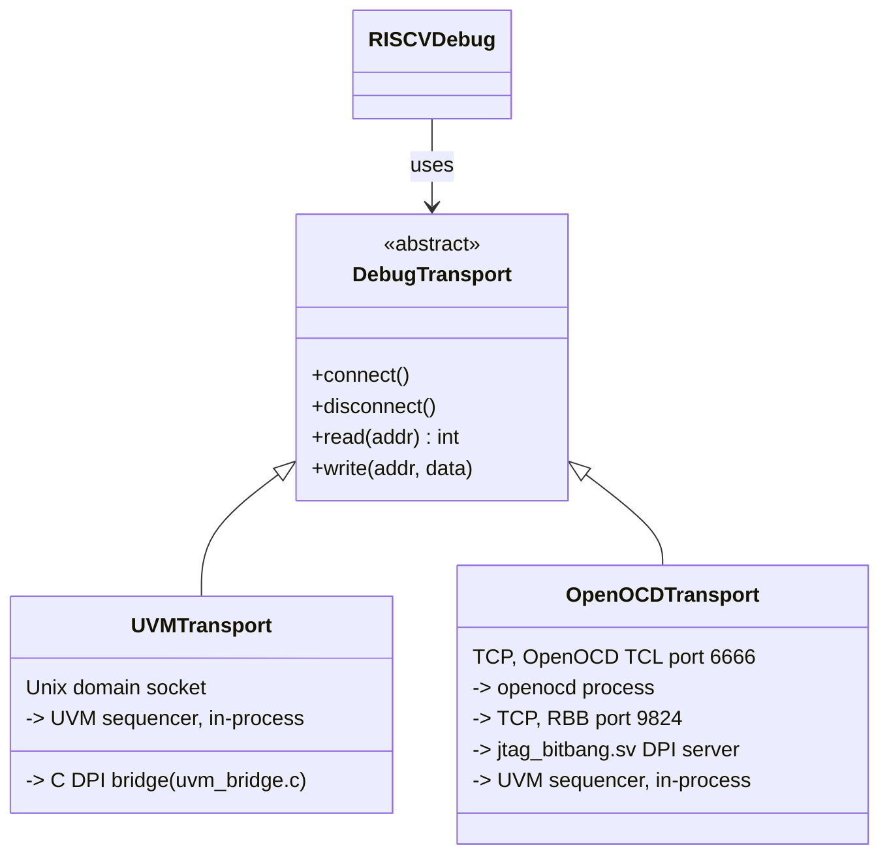
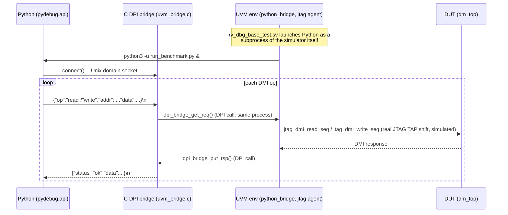
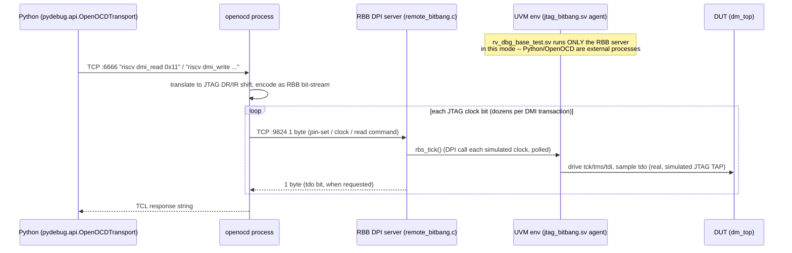

# Remote Bit-Bang (RBB) Simulation Module — Architecture

## What this module is

`simulation/remote_bitbang/` packages a **simulation-only** JTAG-over-TCP
debug flow — OpenOCD talking to a Questa simulation through the
[Remote Bit-Bang](https://github.com/riscv/riscv-isa-sim/blob/master/riscv/remote_bitbang.h)
protocol — as a self-contained, documented, benchmarkable unit, separate
from:

- **PyDebug's own direct UVM-socket transport** (`src/pydebug/api/uvm_transport.py`),
  which does not use RBB or OpenOCD at all.
- **The hardware/FPGA OpenOCD flow** (`*_sim/configs/openocd_arty_a7_100t.cfg`,
  `openocd_genesys2_cva6.cfg`), which drives a real board over a physical
  JTAG adapter, not a simulator.

The underlying RBB server (`src/pydebug/c_bridge/remote_bitbang.c`), the SV
agent that drives it (`src/pydebug/sv/agents/jtag/jtag_bitbang.sv`), and the
per-DUT OpenOCD configs (`ibex_sim/configs/openocd_bitbang_ibex.cfg`,
`cva6_sim/configs/openocd_bitbang_soc.cfg`) already existed in this project
before this module — they are the single source of truth for *how RBB is
wired into each SoC's testbench*, and this module does not duplicate them.
What this module adds: a dedicated place to **launch, control, exercise,
and measure** that flow, independent of the DUT-specific Makefiles' own
`soc_openocd` target (which only runs one fixed scenario).

## Two transports, one DMI-register surface

Every DMI-level operation (read/write dmcontrol, read dmstatus, abstract
commands, System Bus Access) is expressed once, in
`src/pydebug/api/riscv_dm.py`'s `RISCVDebug` class, against an abstract
`DebugTransport` (`src/pydebug/api/transport.py`). Two concrete transports
implement it:



`RISCVDebug` and every scenario built on it (`src/pydebug/sequences/*.py`)
is completely unaware which transport it's driving — this is what makes the
performance comparison in this module a fair one: the *operation sequence*
is identical, only the path to the simulator differs.

## Process / data flow

### PyDebug direct path (baseline, `soc_test` / `--mode uvm`)



One process boundary (Python <-> the simulator process), crossed over a
Unix domain socket — no TCP, no intermediate protocol translation.

### OpenOCD + RBB path (`soc_openocd` / `--mode openocd`)



Two extra process boundaries and two extra protocol translations (TCL <->
bit-bang encoding, bit-bang <-> DPI) compared to the direct path, **and**
the JTAG shift itself — which the direct path also performs, just entirely
inside the simulator process (`jtag_driver.sv`/`jtag_monitor.sv` on the
`SRC_SV_KIT` agent) — is now driven one bit at a time from *outside* the
simulator, with a real TCP round trip per bit. This is the structural
reason the two paths have such different latency; see
`performance_comparison.md` for the measured size of the gap.

## Module layout

```
simulation/remote_bitbang/
├── scripts/            launch/orchestrate: compile-if-needed, start the
│                        RBB-mode sim, start OpenOCD, run a benchmark or
│                        scenario, tear down. Shell, not Make, so it can
│                        drive either <dut>_sim/ without editing either
│                        Makefile.
│   ├── common.sh         DUT parameter resolution (ibex | cva6), shared
│   │                     by every other script.
│   ├── launch_uvm_benchmark.sh    PyDebug/UVM-socket baseline run.
│   ├── launch_rbb_benchmark.sh    OpenOCD+RBB run.
│   └── run_comparison.sh          both, back to back, + the report.
├── tcl/                 launch/control OpenOCD and Questa via TCL.
│   ├── rbb_launch.tcl     parameterized OpenOCD launch config (DUT via
│   │                     `-c "set DUT ibex"`), the tcl/-folder counterpart
│   │                     to the canonical per-DUT .cfg files under
│   │                     `<dut>_sim/configs/`.
│   ├── rbb_control.tcl    a scripted halt/read/resume sequence issued
│   │                     directly through OpenOCD's own TCL interpreter —
│   │                     no Python involved at all; useful to isolate
│   │                     "is RBB/JTAG itself working" from "is pydebug's
│   │                     transport code working" when bringing up a new DUT.
│   └── questa_rbb_run.do  interactive/waveform-dump Questa run-control
│                         script, the debugging-oriented counterpart to the
│                         batch `-do "run -all; quit -f"` the shell scripts use.
├── python/               the benchmark itself.
│   ├── run_benchmark.py       drives one transport through a fixed
│   │                         operation sequence, timing every operation.
│   ├── compare_transports.py  turns two run_benchmark.py JSON outputs into
│   │                         a markdown report + SVG chart.
│   └── results/                raw JSON output, one file per (dut, transport).
├── examples/             minimal, standalone usage references + example
│                        scenario configs.
└── documentation/        this file, performance_comparison.md, and
                          generated figures/.
```

## Design decisions and trade-offs

**Why shell scripts orchestrate `vsim`/`openocd` directly instead of only
calling `make soc_test`/`soc_openocd`.** Those Makefile targets always
recompile (`soc_compile` has no file-based staleness check — it is a
prerequisite of `soc_test`, and `make` treats a non-file target as
permanently out of date), which is the right default for CI-style
regression but is a multi-minute tax on every benchmark iteration during
tuning. `scripts/common.sh`'s `ensure_compiled()` instead checks whether
`<dut>_sim/work/` already exists and only recompiles if it's missing or
`--recompile` is passed — a deliberate, narrow divergence from the
project's existing Makefiles, kept local to this module rather than
changing their behavior for every other caller.

**Why the benchmark is a standalone script (`run_benchmark.py`) rather
than a scenario registered in `pydebug.cli`'s `SCENARIO_REGISTRY`.** Every
other scenario assumes a single already-selected transport and is launched
generically by the CLI, which itself performs the connect/startup-wait
logic *before* handing control to the scenario — that's the right shape for
"run one debug session," but it hides exactly the phase timings (socket
wait, `connect()`, OpenOCD spawn + JTAG examination) this benchmark needs
to report separately. `run_benchmark.py` still imports and drives the same
`pydebug.api` primitives (`UVMTransport`, `OpenOCDTransport`, `RISCVDebug`)
the CLI does — it duplicates the CLI's *orchestration* (waiting for the
bridge socket, spawning `openocd`, waiting for JTAG examination), not its
DMI-level logic, specifically so each phase can be timed independently and
reported honestly rather than folded into one opaque "connect" number.

**Why `register_read`/`register_write` and `gpr_read`/`gpr_write` are
reported as separate metrics.** A raw DMI read/write (`dmstatus`,
`dmcontrol`) is one JTAG DR shift. A GPR read/write via an abstract command
is 2-3 DMI transactions (write `command`, poll `abstractcs.busy`, read/write
`data0`) — reporting only one of these would either understate "how long
does a debugger's `read $x1` actually take" (if only the raw number is
shown) or overstate the cost of the DMI protocol itself (if only the
compound number is shown). Both are measured and shown so a reader can
attribute latency to the right layer.

**Why no fabricated numbers.** Every figure in `performance_comparison.md`
and its per-DUT variants is the direct, unedited output of
`compare_transports.py` reading real `run_benchmark.py` JSON — see that
script's own header comment. Where a metric could not be measured (e.g. a
run failing before completing a phase), the report says `N/A`, not an
estimate.

**A real finding surfaced by measuring both DUTs, not assumed up front.**
The RBB-vs-direct slowdown ratio is *not* constant across DUTs (~50-100x on
Ibex, ~2.5-9x on CVA6, see `performance_comparison.md`) — CVA6's own
per-simulated-cycle wall-clock cost (a full application-class SoC vs.
Ibex's smaller core) already dominates even the direct path's latency, so
RBB's added per-bit TCP round trip is a proportionally smaller tax on top
of it. This was only visible by actually running the benchmark against
both DUTs, not something that could have been predicted from the protocol
description alone — see the Analysis section of `performance_comparison.md`.
