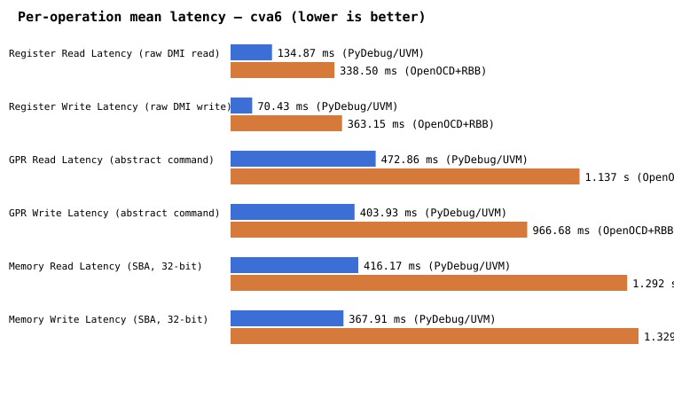

# PyDebug vs. OpenOCD+RBB — Performance Comparison (cva6)

All numbers below are measured, not estimated — direct output of `python/run_benchmark.py` against a real, running Questa simulation of the cva6 SoC (`cva6_sim/`), same ELF, same scenario body, run back-to-back on the same machine. See `python/compare_transports.py` for how this table and the charts were generated.

## Connect / Halt

| Phase | PyDebug (UVM socket) | OpenOCD + RBB | Ratio (RBB / PyDebug) |
|---|---|---|---|
| Transport connect | 107.5 us | 1.003 s | 9329.2x |
| Activate DM | 298.23 ms | 798.43 ms | 2.7x |
| Halt processor | 202.11 ms | 1.396 s | 6.9x |

## Per-operation latency (mean of N repeated ops, see `n` column)

| Operation | n | PyDebug mean | PyDebug p95 | OpenOCD+RBB mean | OpenOCD+RBB p95 | Ratio (mean) |
|---|---|---|---|---|---|---|
| Register Read Latency (raw DMI read) | 20 | 134.87 ms | 139.38 ms | 338.50 ms | 377.13 ms | 2.5x |
| Register Write Latency (raw DMI write) | 20 | 70.43 ms | 83.29 ms | 363.15 ms | 470.29 ms | 5.2x |
| GPR Read Latency (abstract command) | 20 | 472.86 ms | 492.04 ms | 1.137 s | 1.840 s | 2.4x |
| GPR Write Latency (abstract command) | 20 | 403.93 ms | 438.14 ms | 966.68 ms | 998.22 ms | 2.4x |
| Memory Read Latency (SBA, 32-bit) | 20 | 416.17 ms | 534.93 ms | 1.292 s | 1.330 s | 3.1x |
| Memory Write Latency (SBA, 32-bit) | 20 | 367.91 ms | 397.83 ms | 1.329 s | 1.371 s | 3.6x |

## Aggregate test execution

| Metric | PyDebug (UVM socket) | OpenOCD + RBB | Ratio |
|---|---|---|---|
| Total ops in benchmark body | 122 | 122 | — |
| Total benchmark-body time | 37.824 s | 110.738 s | 2.9x |
| Throughput | 3.2 ops/s | 1.1 ops/s | 2.9x (PyDebug faster) |
| Full wall-clock (incl. startup) | 37.827 s | 121.245 s | 3.2x |

