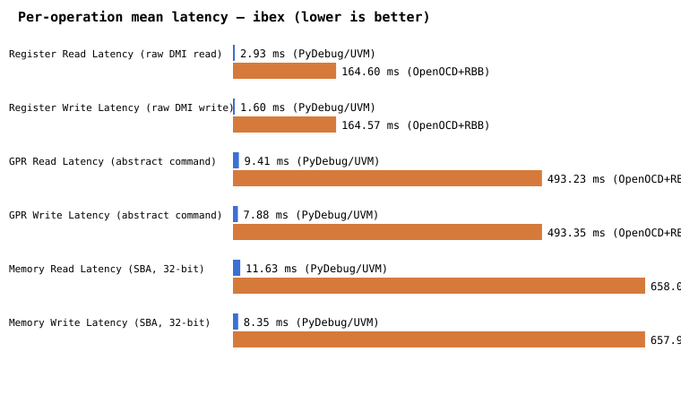

# PyDebug vs. OpenOCD+RBB — Performance Comparison (ibex)

All numbers below are measured, not estimated — direct output of `python/run_benchmark.py` against a real, running Questa simulation of the ibex SoC (`ibex_sim/`), same ELF, same scenario body, run back-to-back on the same machine. See `python/compare_transports.py` for how this table and the charts were generated.

## Connect / Halt

| Phase | PyDebug (UVM socket) | OpenOCD + RBB | Ratio (RBB / PyDebug) |
|---|---|---|---|
| Transport connect | 83.9 us | 502.22 ms | 5984.8x |
| Activate DM | 3.15 ms | 164.11 ms | 52.0x |
| Halt processor | 5.69 ms | 492.74 ms | 86.6x |

## Per-operation latency (mean of N repeated ops, see `n` column)

| Operation | n | PyDebug mean | PyDebug p95 | OpenOCD+RBB mean | OpenOCD+RBB p95 | Ratio (mean) |
|---|---|---|---|---|---|---|
| Register Read Latency (raw DMI read) | 20 | 2.93 ms | 3.84 ms | 164.60 ms | 165.91 ms | 56.1x |
| Register Write Latency (raw DMI write) | 20 | 1.60 ms | 2.32 ms | 164.57 ms | 165.78 ms | 103.1x |
| GPR Read Latency (abstract command) | 20 | 9.41 ms | 11.90 ms | 493.23 ms | 494.84 ms | 52.4x |
| GPR Write Latency (abstract command) | 20 | 7.88 ms | 11.68 ms | 493.35 ms | 495.00 ms | 62.6x |
| Memory Read Latency (SBA, 32-bit) | 20 | 11.63 ms | 21.46 ms | 658.00 ms | 659.62 ms | 56.6x |
| Memory Write Latency (SBA, 32-bit) | 20 | 8.35 ms | 9.83 ms | 657.91 ms | 660.05 ms | 78.8x |

## Aggregate test execution

| Metric | PyDebug (UVM socket) | OpenOCD + RBB | Ratio |
|---|---|---|---|
| Total ops in benchmark body | 122 | 122 | — |
| Total benchmark-body time | 844.86 ms | 53.290 s | 63.1x |
| Throughput | 144.4 ops/s | 2.3 ops/s | 63.1x (PyDebug faster) |
| Full wall-clock (incl. startup) | 847.02 ms | 58.876 s | 69.5x |

