# RISC-V Debug Verification Strategy

Living document — edit in place as work progresses, same discipline as `PORTING_DELTA_REPORT.md`, `INTEGRATION_GUIDE.md`, and `EMULATION_PLAN.md`. Organized around capability, not spec structure: the spec's own Background (#1.4, *why* debug support exists) and Supported Features (#1.5, *what* it must do), then full clause-by-clause operation catalogs — what the Debug Module offers and how an external debugger verifies it, what the Trigger Module offers and how an external debugger verifies it, and what Sdext/Trigger-Module behavior a *native* (self-hosted) debugger relies on and how that gets verified — each with a shared testbench-structure diagram and one test-flow diagram per operation. Then broken down by test-bench scope (Simulation Unit-level / System-level, then Emulation) — each with its own Models, Checking, Agents, and Stimulus strategy. Cross-references `testplans/riscv_debug_testplan.md` (the CAT1/CAT2/CAT3 mechanism-level table and its TC-IDs) rather than duplicating it — this document answers *how* and *at what level* each feature gets verified; the testplan answers *which concrete register/TC-ID* proves it.

## Intention

The five use cases from spec #1.4 Background — every feature below exists to serve one or more of these:

- Accessing hardware on a hardware platform without a working CPU. (External debug.)
- Bootstrapping a hardware platform to test, configure, and program components before there is any executable code path in the hardware platform. (External debug.)
- Debugging low-level software in the absence of an OS or other software. (External debug.)
- Debugging issues in the OS itself. (External or native debug.)
- Debugging processes running on an OS. (Native or external debug.)

## Features

The spec's own #1.5 Supported Features list, verbatim — this is the top-level checklist this strategy verifies:

1. All hart registers (including CSRs) can be read/written.
2. Memory can be accessed either from the hart's point of view, through the system bus directly, or both.
3. RV32, RV64, and future RV128 are all supported.
4. Any hart in the hardware platform can be independently debugged.
5. A debugger can discover almost [1] everything it needs to know itself, without user configuration.
6. Each hart can be debugged from the very first instruction executed.
7. A RISC-V hart can be halted when a software breakpoint instruction is executed.
8. Hardware single-step can execute one instruction at a time.
9. Debug functionality is independent of the debug transport used.
10. The debugger does not need to know anything about the microarchitecture of the harts it is debugging.
11. Arbitrary subsets of harts can be halted and resumed simultaneously. (Optional)
12. Arbitrary instructions can be executed on a halted hart — no new debug functionality is needed when a core has additional or custom instructions or state, as long as there exist programs that can move that state into GPRs. (Optional)
13. Registers can be accessed without halting. (Optional)
14. A running hart can be directed to execute a short sequence of instructions, with little overhead. (Optional)
15. A system bus manager allows memory access without involving any hart. (Optional)
16. A RISC-V hart can be halted when a trigger matches the PC, read/write address/data, or an instruction opcode. (Optional)
17. Harts can be grouped, and harts in the same group will all halt when any of them halts. These groups can also react to or notify external triggers. (Optional)

`[1]` retained verbatim from the spec's own footnote marker on feature 5 — consult spec #1.5 for the exact caveat text rather than assuming; not reproduced here to avoid mis-quoting.

**Not in this numbered list but still in scope**:

- Authentication/DM-locking (#3.12, a full subsection, IP-protection use case).
- The JTAG DTM itself (the transport layer, underlies every feature above) — this is precisely what feature 9's "transport independence" is about, since OpenOCD/emulation swaps the DTM's electrical carrier without touching anything above it.

### Features ↔ Intention traceability

The spec's #1.5 Features list doesn't come with intention tags built in the way the Debug Module's own operations list does — so unlike the testplan's CAT2 rows (which this project already tagged with an intention when that table was first built), this mapping is this project's own analysis, not a verbatim spec quote. Short labels for the five Intentions above: **I1** = accessing hardware with no working CPU, **I2** = bootstrapping before any executable code path, **I3** = debugging low-level software with no OS, **I4** = debugging issues in the OS itself, **I5** = debugging processes running on an OS.

| Feature # | Feature | Intention(s) served |
|---|---|---|
| 1 | All hart registers R/W | I1, I3, I4 |
| 2 | Memory access (hart/bus/both) | I1, I3, I4 |
| 3 | RV32/64/128 support | I1–I5 (orthogonal architecture-width requirement, not tied to one use case) |
| 4 | Any hart independently debugged | I3, I4, I5 |
| 5 | Debugger self-discovery | I1, I2 primarily (needed before anything else works); useful throughout I3–I5 |
| 6 | Debug from first instruction | I2, I3 |
| 7 | Halt on software breakpoint | I3, I4, I5 |
| 8 | Hardware single-step | I3, I5 |
| 9 | Transport independence | I1–I5 (orthogonal — about *how* you connect, not *why*) |
| 10 | No microarchitecture knowledge needed | I1–I5 (orthogonal design principle) |
| 11 | Arbitrary hart-subset halt/resume | I4, I5 |
| 12 | Arbitrary instructions on halted hart | I3 |
| 13 | Register access without halting | I4, I5 |
| 14 | Short instruction sequence, low overhead | I4, I5 |
| 15 | System bus manager, no hart involved | I1 |
| 16 | Halt on trigger match | I3, I4, I5 |
| 17 | Hart grouping | I4, I5 |

Cross-checked both directions: every one of the five Intentions is served by at least one Feature (I2 "Bootstrapping" is the thinnest, resting mostly on the cross-cutting Features 3/5/9/10 rather than a dedicated one), and every Feature maps to at least one Intention — nothing orphaned either way.

### Features ↔ testplan traceability

The testplan (`testplans/riscv_debug_testplan.md`) and this Features list both cover the same spec, but they slice it up differently:

- The testplan is organized by **operation** — things like "halt a hart," "reset a hart," "discover the DM." This comes from the spec's own numbered list of Debug Module operations.
- This Features list is organized by **capability** — things like "any hart can be debugged independently," which is more of a *promise about behavior* than a single operation.

Because the two lists are cut differently, they don't line up one-to-one — one Feature here might be backed by two testplan rows (or by none at all yet). The table below maps each Feature to the testplan row(s) that verify it, so we can also spot which Features currently have no testplan row backing them:

| Feature # | Feature | Testplan CAT2 row(s) | Status |
|---|---|---|---|
| 1 | All hart registers R/W | Abstract GPR read/write; Abstract access to non-GPR registers (CSRs) | Covered |
| 2 | Memory access (hart POV / system bus / both) | Memory access from hart's point of view; Direct System Bus Access | Covered |
| 3 | RV32/RV64/RV128 support | — (cross-cutting: `aarsize`/`aamsize`/`sbaccess` width fields on every mechanism, not one row) | Cross-cutting, not a single row |
| 4 | Any hart independently debugged | Halt / resume individual hart; Report hart halt status | Partially covered — `TC-RC-*` backs "Halt/resume," but "Report hart halt status" (`haltsum0-3`) has zero TC-IDs (see Feature-Level Verification Detail below) |
| 5 | Debugger self-discovery | Discover DM/implementation info | Covered |
| 6 | Debug from first instruction | Reset signal / debug from first instruction; Halt-on-reset | Covered — has TC-IDs (`TC-RST-*`, `TC-HOR-*`) |
| 7 | Halt on software breakpoint (`ebreak`) | — | **Gap**: no CAT2 row yet for Sdext `ebreak`-in-M-mode halt behavior — see the new Sdext/Trigger-Module native-debugging catalog below for the native (`ebreakm=0`) side of this |
| 8 | Hardware single-step | Hardware single-step | Covered |
| 9 | Transport independence | Underlying-every-row DTM note; verification level 5 (cross-platform) | Covered structurally, not a register mechanism |
| 10 | No microarchitecture knowledge needed | — (design principle; proven behaviorally by reusing identical stimulus across Ibex/CVA6, level 5) | Proven by construction, not a row |
| 11 | Arbitrary hart-subset halt/resume (Optional) | Multi-hart halt/resume/reset | Covered |
| 12 | Arbitrary instructions on halted hart (Optional) | Program Buffer | Covered |
| 13 | Register access without halting (Optional) | — | **Gap**: no CAT2 row yet for non-halting register access |
| 14 | Short instruction sequence on a running hart, low overhead (Optional) | — | **Gap**: distinct from Program Buffer's halted-hart case; no CAT2 row yet |
| 15 | System bus manager, no hart involved (Optional) | Direct System Bus Access | Covered |
| 16 | Halt on trigger match (Optional) | Hart-side Trigger Module | Covered |
| 17 | Hart grouping (Optional) | Hart grouping — halt group; External trigger halt response; External trigger resume signaling | Covered |

Features 7, 13, and 14 are real gaps in the testplan's CAT2 table, not oversights in this mapping — add rows for them the next time `riscv-debug-testplan` walks the table (see that skill's phased approach), rather than silently assuming they're covered by an adjacent row.

## Design Under Test

- **Spec implementation approach (Appendix A.1 vs A.2)**: this is a property of the DM's **hardware**, discovered by reading the DUT's RTL — not a choice `pydebug` makes, since the external DMI protocol is identical either way (Access Register and SBA are both mandatory-shaped regardless of what happens inside the DM). Both of this project's current DUTs (Ibex, CVA6) integrate the same PULP `riscv-dbg` IP as their Debug Module. `riscv-dbg`'s abstract-command datapath (`dm_mem.sv`) generates and executes short instruction sequences on the hart itself — via the debug ROM / "park loop" — to move data between GPRs/CSRs and the `data0-11` window. That is **Appendix A.2, Execution Based**, not A.1. (This corrects an earlier pass of this document, which mistakenly read `pydebug`'s driver-side use of the Access Register/SBA DMI commands as an "A.1" hardware choice — using the spec's mandatory external protocol says nothing about the DM's internal implementation.)
  - Practical consequence: the HART park-loop model (see Models, below) is required, not optional scaffolding — an A.2-style DM executes real (if hidden from the debugger) instructions rather than muxing registers directly, so a golden model needs its own visibility into that execution to predict outcomes.
- **Spec version compliance**: this testplan and strategy are written against RISC-V Debug Spec v1.0.0-rc3. Confirm the actual compliance version of each DUT's `riscv-dbg` instantiation (check its `dm_pkg.sv` parameters / CHANGELOG — `riscv-dbg` has tracked versions from v0.13 through v1.0 over time) rather than assuming exact alignment; record any version delta as a Limitation (see Simulation → Unit-level → Limitations below).
- **Custom features**: none identified yet for either the Ibex or CVA6 integration. Confirm per DUT by diffing its `dm_top`/`dm_pkg` instantiation parameters against vanilla `riscv-dbg` defaults (e.g. non-standard CSRs surfaced through Abstract Access, or custom Sdtrig actions per the testplan's "Sdtrig actions 8–9" rationale note) — don't assume none exist just because none are known yet.
- **CORE-DM interface**: the signal-level boundary between each hart and the Debug Module — what the Core-DM Agent (see Agents, below) drives/monitors. Exact port names/widths must be extracted from each DUT's actual `dm_top.sv`/hart-wrapper instantiation, not assumed; the table below is the canonical signal set `riscv-dbg`-family DMs expose per hart, given as the framework to confirm against real RTL, not a substitute for reading it:

| Signal (typical `riscv-dbg` naming) | Direction | Purpose |
|---|---|---|
| `haltreq` | DM → hart | Request hart enter Debug Mode |
| `resumereq` | DM → hart | Request hart leave Debug Mode |
| `hartreset` | DM → hart | Reset just this hart |
| `halted` | hart → DM | Hart confirms it is in Debug Mode |
| `resumeack` | hart → DM | Hart confirms resume completed |
| `unavailable` | hart → DM | Hart cannot currently be debugged (e.g. powered down) |
| `havereset` | hart → DM | Hart confirms it went through reset |
| `debug_req` | DM → hart | Debug interrupt line forcing entry to Debug Mode |
| Abstract-command / Program Buffer execution bus | DM ↔ hart | Carries the generated instruction stream for A.2-style abstract-command execution |

- **Reusable core vs. per-project adapter**: everything from the JTAG TAP through DM/Trigger-Module registers is spec-fixed and reusable across every DUT (`pydebug`'s transport/DMI layer, `sv_kit/`'s JTAG VIP, the golden model); the only genuinely new piece per DUT is the adapter binding it to that DUT's specific hierarchy — `tb_top_<soc>.sv` for simulation and an OpenOCD `.cfg` for emulation, per `INTEGRATION_GUIDE.md`'s checklist.

## Debug Module — External-Debugger Operation Catalog and Test Flows

What the Debug Module offers, and how an external debugger verifies each thing it offers. The spec's own opening list for the Debug Module (the 14 "might support" items plus the 3-part "must implement" list) is exactly the CAT2 seed list the `riscv-debug-verif-strategy` and `riscv-debug-testplan` skills already point at — this section is not a new ontology, it's that same feature list read clause-by-clause and turned into (a) a spec-cited operation catalog and (b) one test-flow diagram per operation showing concretely how an external debugger proves each one, on top of one shared testbench-structure diagram. Operations are numbered by their spec subsection, in spec order. Every operation maps to a CAT2 row in `testplans/riscv_debug_testplan.md`/the Gap matrix below — five of the twenty parsed here don't have one yet and are flagged inline; those are new entries added to the Gap matrix at the end of this document, not silently absorbed into an existing row.

### Testbench structure (shared across every operation below)

One master diagram, not one per operation — the agent/model/checker set is invariant across every Debug Module operation; only *which* agents actively drive traffic vs. passively observe changes per operation (noted per-operation below) and per Unit-level/System-level scope (see the Agents tables earlier in this document). Every per-operation test-flow diagram that follows is a specific traversal through this same structure.

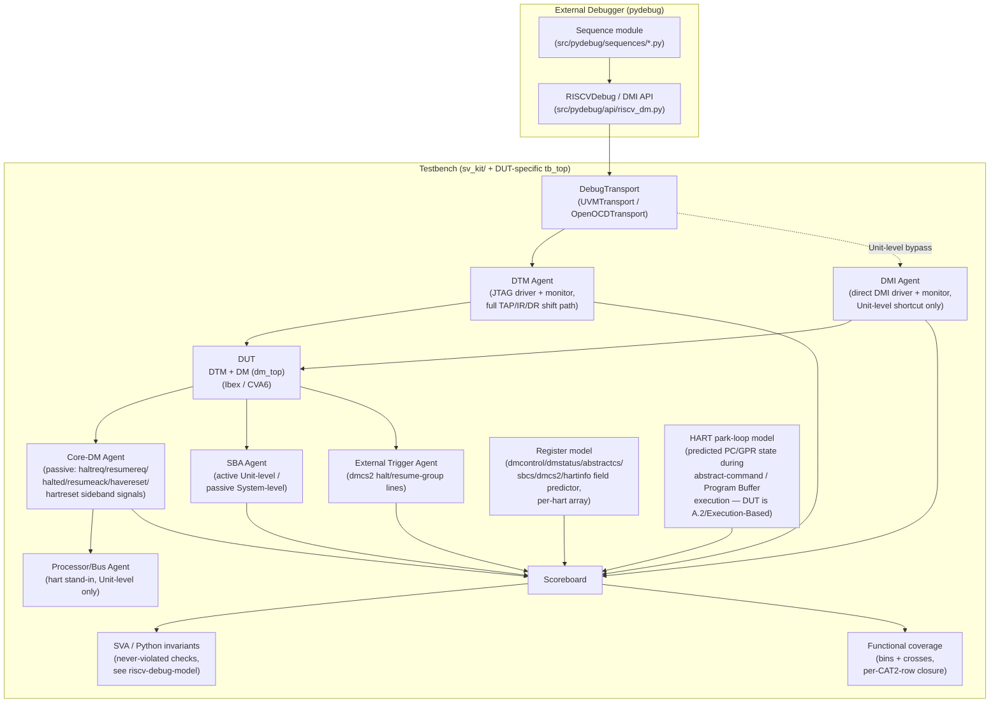

### Operation catalog

| # | Operation | Spec clause | Registers/fields | CAT2 row |
|---|---|---|---|---|
| OP1 | DMI register access (nop/read/write, sticky busy/error, `nextdm` chaining) | #3.1, #6.1.5 | DMI bus itself; `dtmcs.dmistat/dmireset`, `dmi.op/address/data`, `nextdm` | **New — no CAT2 row yet** |
| OP2 | Platform reset (`ndmreset`) | #3.2 | `dmcontrol.ndmreset`, `dmstatus.ndmresetpending` | Reset signal / debug from first instruction |
| OP3 | Selected-hart reset (`hartreset`) | #3.2 | `dmcontrol.hartreset`, `dmstatus.allhavereset`/`anyhavereset`, `dmcontrol.ackhavereset` | Reset signal / debug from first instruction |
| OP4 | Select a single hart (+ `HARTSELLEN` discovery) | #3.3.1 | `dmcontrol.hartsel` (`hartsello`/`hartselhi`) | **New — currently folded into "Multi-hart," should split** |
| OP5 | Select multiple harts (hart array mask) | #3.3.2 | `dmcontrol.hasel`, `hawindowsel`, `hawindow` | Multi-hart halt/resume/reset |
| OP6 | Discover hart DM state (nonexistent/unavailable/running/halted) | #3.4 | `dmstatus.all*`/`any*` (nonexistent/unavail/running/halted), `stickyunavail`, `dmcontrol.ackunavail` | Report hart halt status; partly Discover DM/implementation info |
| OP7 | Halt request | #3.5 | `dmcontrol.haltreq`, `dmstatus.allhalted`/`anyhalted` | Halt / Resume individual hart |
| OP8 | Resume request | #3.5 | `dmcontrol.resumereq`, `dmstatus.allresumeack`/`anyresumeack`/`allrunning`/`anyrunning` | Halt / Resume individual hart |
| OP9 | Halt-on-reset configuration | #3.5 | `dmcontrol.setresethaltreq`/`clrresethaltreq`, `dmstatus.hasresethaltreq` | Halt-on-reset |
| OP10 | Halt group assignment & propagation | #3.6 | `dmcs2.grouptype=0`/`group`/`hgselect`/`hgwrite` | Hart grouping — halt group |
| OP11 | Resume group assignment & propagation | #3.6 | `dmcs2.grouptype=1`/`group`/`hgselect`/`hgwrite` | **New — currently no row; "resume group" is the spec's own symmetric mechanism to OP10, not the same row** |
| OP12 | External trigger halt/resume notify | #3.6 | `dmcs2.dmexttrigger`, `hgselect=1` | External trigger halt response; External trigger resume signaling |
| OP13 | Abstract command: Access Register (GPR/CSR/FPR R/W, + `postexec`) | #3.7.1.1 | `command` (`cmdtype=0`), `data0-11`, `abstractcs.cmderr`/`busy` | Abstract GPR read/write; Abstract access to non-GPR registers |
| OP14 | Abstract command: Quick Access | #3.7.1.2 | `command` (`cmdtype=1`) | **New — currently only implied by the Feature-14 gap, no CAT2 row** |
| OP15 | Abstract command: Access Memory | #3.7.1.3 | `command` (`cmdtype=2`), `data0`/`arg1`, `abstractauto.autoexecdata` | Memory access from hart's point of view |
| OP16 | Program Buffer write & execute | #3.8 | `progbuf0-15`, `command.postexec`, `abstractcs.impebreak`/`progbufsize` | Program Buffer |
| OP17 | System Bus Access (SBA) R/W, autoincrement | #3.10 | `sbcs`, `sbaddress0-3`, `sbdata0-3` | Direct System Bus Access |
| OP18 | Minimally intrusive access (composite: non-halting Access Register/Memory, Quick Access, SBA) | #3.11 | combination of OP13 (non-halting)/OP14/OP17 | Cross-cutting — backs Feature 13/14 gap, no dedicated CAT2 row (by design: it's a *property* of OP13/14/17, not a new mechanism) |
| OP19 | Authentication handshake | #3.12 | `authdata`, `dmstatus.authenticated`/`authbusy` | Authentication / DM locking |
| OP20 | Version detection (exact spec-mandated procedure) | #3.13 | `dmcontrol` (read/preserve-bits/write/poll), `dmstatus.version` | **New — currently folds into "Discover DM/implementation info," but #3.13 defines an exact, side-effect-aware sequence worth its own row/TC-ID** |

### OP1 — DMI register access (#3.1, #6.1.5)

The DMI is a subordinate bus (7–32 address bits, 32-bit registers) that every other operation in this catalog rides on top of. At the DTM level, `op` in the `dmi` JTAG register is 0=nop/1=read/2=write/3=reserved; a busy(3) or failed(2) status is **sticky** — the debugger must write `dmireset` in `dtmcs` before any further DMI access will proceed, and until cleared the scanned-in `data`/`address` are ignored. This is the substrate-level operation everything else below depends on, so it gets its own row rather than being folded into whichever register happens to be touched first.

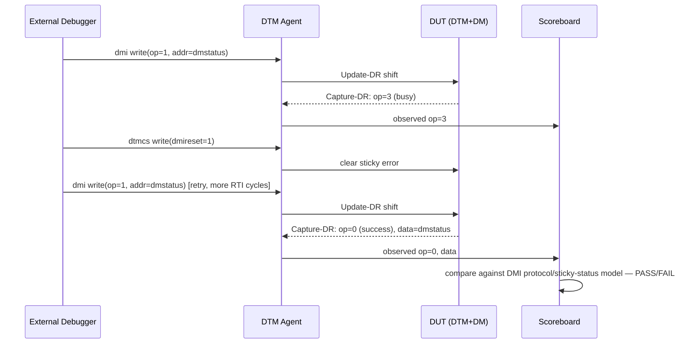

### OP2 — Platform reset, `ndmreset` (#3.2)

`ndmreset` resets everything except the DM/DTM/DMI; while asserted, only `dmcontrol` R/W and `ndmresetpending` R are guaranteed to behave — every other DMI access is spec-UNSPECIFIED. `ndmresetpending` (if implemented) tracks completion.

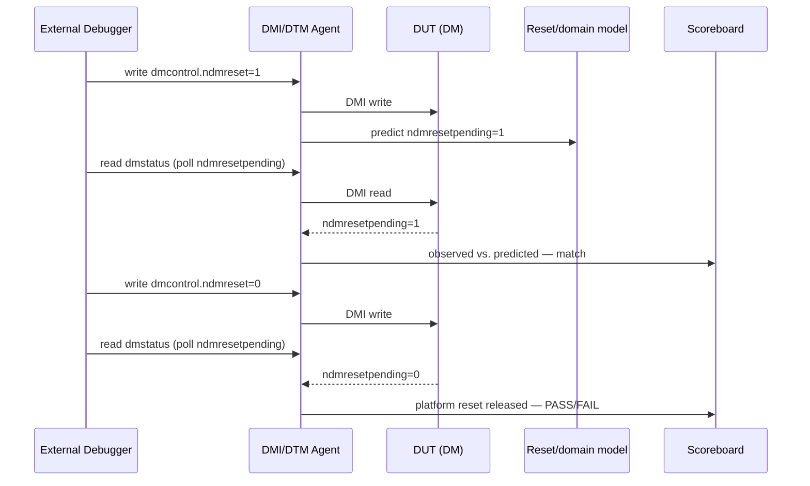

### OP3 — Selected-hart reset, `hartreset` (#3.2)

Resets just the currently-selected hart(s); an implementation may legally reset *more* harts than selected, discoverable by selecting those other harts afterward and checking `anyhavereset`. `havereset` is sticky and cleared only by `ackhavereset`.

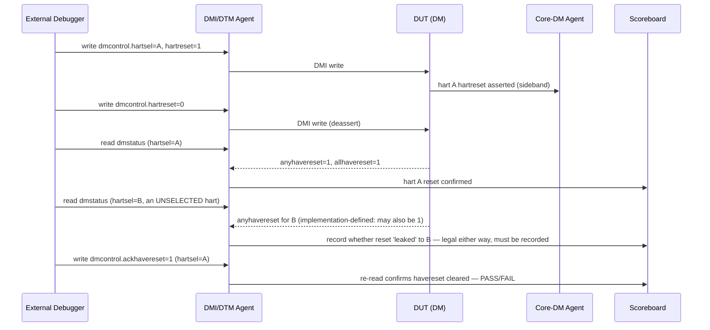

### OP4 — Select a single hart, `HARTSELLEN` discovery (#3.3.1)

`hartsel` is `hartselhi:hartsello`, WARL — a debugger discovers the actual implemented width by writing all-ones and reading back which bits stuck.

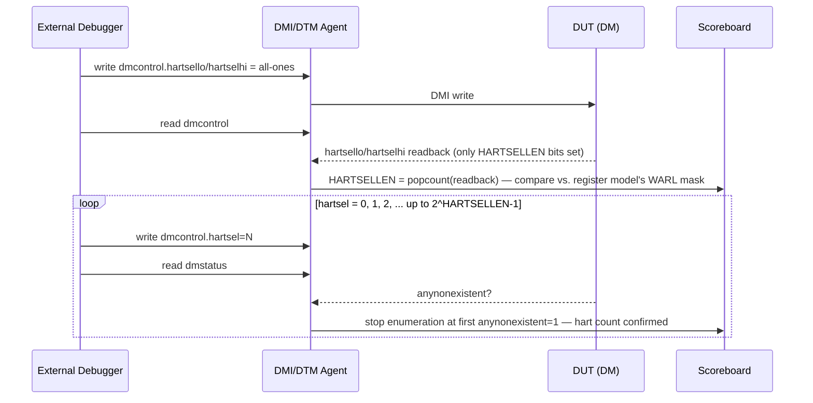

### OP5 — Select multiple harts, hart array mask (#3.3.2)

`hasel=1` adds the harts marked in the hart-array-mask register (written a 32-bit window at a time via `hawindowsel`/`hawindow`) to the currently-selected set alongside `hartsel`. Abstract commands explicitly ignore this mechanism and only ever target `hartsel`.

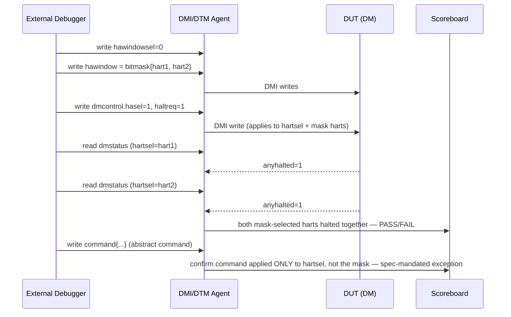

### OP6 — Discover hart DM state (#3.4)

Four states per hart — nonexistent/unavailable/running/halted — reported via `dmstatus.all*`/`any*` for the currently-selected hart(s). `stickyunavail` optionally latches the unavailable state until acknowledged with `ackunavail`.

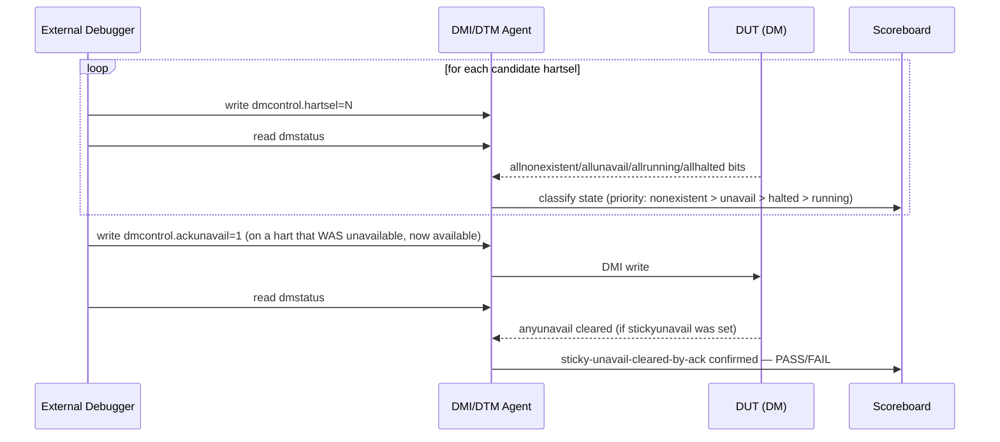

### OP7/OP8 — Run control: halt request / resume request (#3.5)

The core run-control primitive: `haltreq=1` sets the halt-request bit for selected harts (running harts halt within the 1s response bound; halted harts ignore it); `resumereq=1` clears resume-ack for selected harts and resumes the halted ones (ignored on running harts, and ignored entirely if `haltreq` is also set in the same write). This CAT2 row already has a full per-hart-independence treatment in "Feature 4" above — this diagram is the row-level (not Feature-level) version, showing the direct request/response pair without the constrained-random hart wrapper.

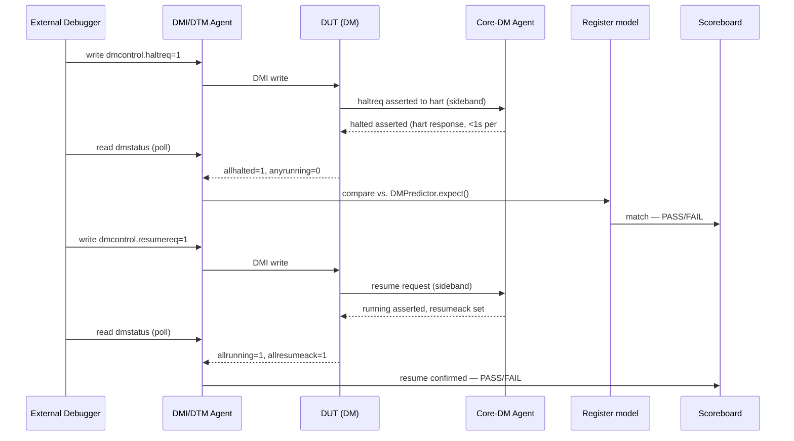

### OP9 — Halt-on-reset configuration (#3.5)

Optional feature, discovered via `dmstatus.hasresethaltreq`. When set for a hart, that hart enters Debug Mode immediately on the next reset deassertion — regardless of cause — without the debugger ever writing `haltreq`.

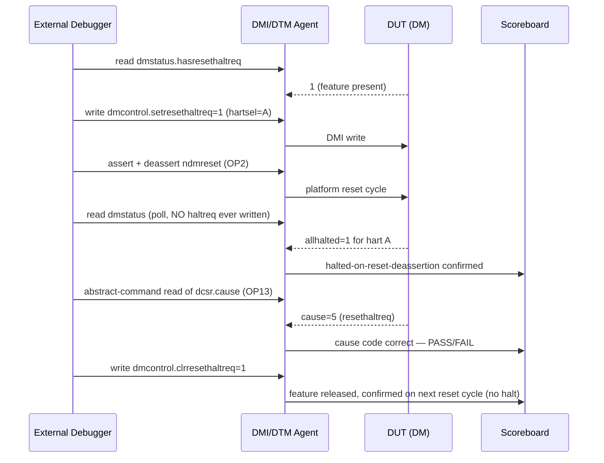

### OP10/OP11 — Halt group / resume group assignment & propagation (#3.6)

Group 0 is "ungrouped" (harts halt/resume independently as elsewhere in this catalog). Assigning harts to a non-zero halt group means one member halting causes every other running member to quickly halt too (`cause` typically 6). Resume groups (`dmcs2.grouptype=1`) are the spec's explicit symmetric mechanism — one member resuming causes the rest to resume. These are two distinct configurations of the same register (`dmcs2`), verified with mirrored flows.

```mermaid
sequenceDiagram
    participant Dbg as External Debugger
    participant Agt as DMI/DTM Agent
    participant DUT as DUT (DM)
    participant CoreDM as Core-DM Agent
    participant SB as Scoreboard

    Dbg->>Agt: write dmcs2{grouptype=0, hgselect=0, group=1, hgwrite=1} (hartsel=A)
    Dbg->>Agt: write dmcs2{grouptype=0, hgselect=0, group=1, hgwrite=1} (hartsel=B)
    Agt->>DUT: A and B both now in halt-group 1
    Dbg->>Agt: write dmcontrol.hartsel=A, haltreq=1
    Agt->>DUT: DMI write (ONLY A's haltreq set)
    DUT->>CoreDM: hart A halts; group propagation halts hart B too
    Dbg->>Agt: read dmstatus (hartsel=B)
    DUT-->>Agt: anyhalted=1 for B, despite B's haltreq never being written
    Agt->>SB: group-halt propagation confirmed — PASS/FAIL
    Note over Dbg,SB: Resume-group flow is the mirror: dmcs2.grouptype=1,<br/>resumereq on A only, check B's allrunning/resumeack follow
```

### OP12 — External trigger halt/resume notify (#3.6)

External triggers (`dmcs2.dmexttrigger`, `hgselect=1`) are abstract signal endpoints that can be members of a halt or resume group alongside harts — firing one notifies/is-notified-by every group member symmetrically with the hart-to-hart case above.

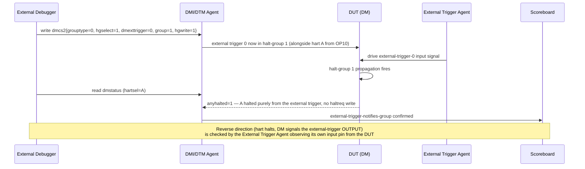

### OP13 — Abstract command: Access Register (#3.7.1.1)

`cmdtype=0`; `transfer`+`write` select direction, `regno` selects GPR (`0x1000-101f`)/FPR (`0x1020-103f`)/CSR (`0x0000-0fff`), `aarsize` selects width, `aarpostincrement` auto-increments `regno`, `postexec` additionally executes the Program Buffer once after the transfer. Because this project's DUTs are Appendix A.2 (Execution Based, see Design Under Test above), this is where the **HART park-loop model** is load-bearing — it's the only way to predict the outcome of a real hidden instruction sequence rather than a muxed register.

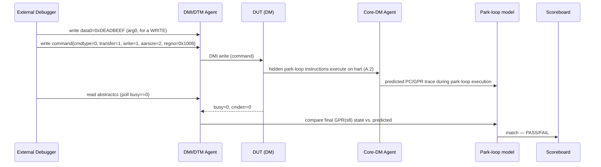

### OP14 — Abstract command: Quick Access (#3.7.1.2)

`cmdtype=1`, optional. Legal only when the target hart is currently **running** — the DM halts it, executes the Program Buffer exactly once, then automatically resumes it, minimizing intrusion. If the hart is already halted, or halts for an unrelated reason mid-sequence, `cmderr=4` (halt/resume).

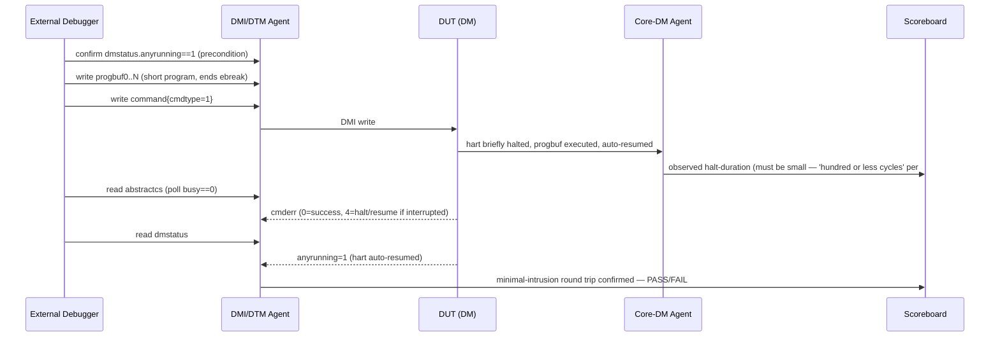

### OP15 — Abstract command: Access Memory (#3.7.1.3)

`cmdtype=2`; `arg1`=address, `arg0`=data; `aamvirtual` selects virtual vs. physical, `aamsize` selects width, `aampostincrement` auto-increments the address on success. Optional; may be supported halted-only, or halted+running.

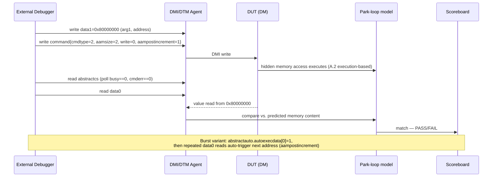

### OP16 — Program Buffer write & execute (#3.8)

`progbuf0-15` hold a debugger-written instruction sequence, executed via `postexec` on an Access Register command (OP13); must terminate in `ebreak`/`c.ebreak` (or rely on `impebreak`). If an exception occurs mid-execution, `cmderr=3`, execution stops, and the hart remains halted in Debug Mode with partial-execution state observable.

```mermaid
sequenceDiagram
    participant Dbg as External Debugger
    participant Agt as DMI/DTM Agent
    participant DUT as DUT (DM)
    participant Pmdl as Park-loop model
    participant SB as Scoreboard

    Dbg->>Agt: write progbuf0 = csrw s0, mstatus
    Dbg->>Agt: write progbuf1 = ebreak
    Agt->>DUT: DMI writes
    Dbg->>Agt: write command{transfer=1, write=1, postexec=1, regno=0x1008}
    Agt->>DUT: DMI write — writes s0, then executes progbuf
    DUT->>Pmdl: predicted PC steps through progbuf0, progbuf1(ebreak)
    Dbg->>Agt: read abstractcs (poll busy==0)
    DUT-->>Agt: cmderr (0=success, 3=exception)
    alt cmderr==3 (exception)
        Agt->>SB: hart remains halted in Debug Mode; partial-execution GPR state checked against park-loop model up to the fault point
    else cmderr==0
        Agt->>SB: full program executed as predicted — PASS/FAIL
    end
```

### OP17 — System Bus Access (#3.10)

`sbcs` configures access size/autoincrement/auto-trigger-on-address/auto-trigger-on-data; works independent of hart run state, with no hart involvement at all — the strongest form of "minimally intrusive."

```mermaid
sequenceDiagram
    participant Dbg as External Debugger
    participant Agt as DMI/DTM Agent
    participant DUT as DUT (DM)
    participant SBA as SBA Agent
    participant SB as Scoreboard

    Dbg->>Agt: write sbcs{sbaccess=2, sbautoincrement=1, sbreadonaddr=1}
    Agt->>DUT: DMI write
    Dbg->>Agt: write sbaddress0=0x80000000
    Agt->>DUT: DMI write — triggers a bus read (sbreadonaddr)
    DUT->>SBA: system-bus read transaction
    SBA-->>DUT: data response (synthesized, Unit-level active mode)
    Dbg->>Agt: read sbdata0
    DUT-->>Agt: value; address auto-incremented for next access
    Agt->>SB: compare vs. SBA Agent's known memory content
    Dbg->>Agt: read sbcs.sberror/sbbusyerror
    DUT-->>Agt: 0/0
    Agt->>SB: burst read clean — PASS/FAIL
```

### OP18 — Minimally intrusive debugging (composite) (#3.11)

Not a new register — the spec explicitly groups three already-covered mechanisms (non-halting Access Register/Memory from OP13/OP15, Quick Access from OP14, SBA from OP17) as jointly answering "how do I debug a hart I can barely afford to stop." Verified by re-running each constituent flow back-to-back while the Core-DM Agent independently confirms the target hart's own instruction stream is undisturbed beyond the documented bound (a "hundred or less cycles" hiccup for Quick Access; zero disturbance for the other two) — this is the concrete mechanism behind the Feature 13/14 gaps flagged in the Features ↔ testplan traceability table above.

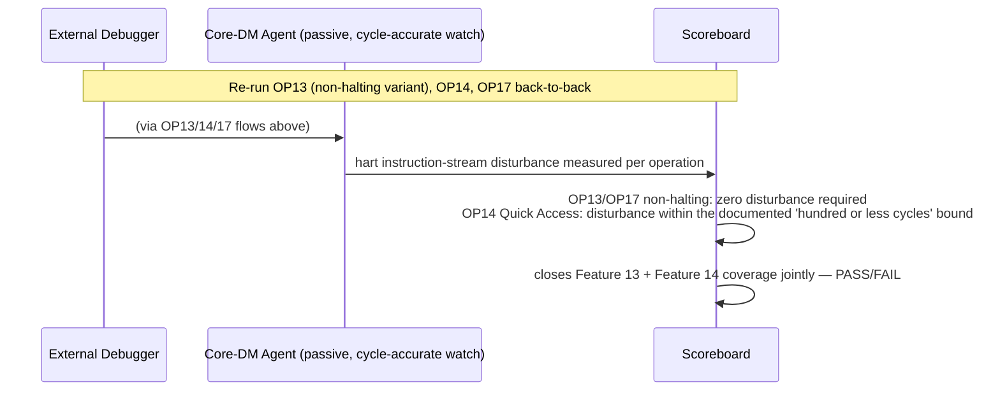

### OP19 — Authentication handshake (#3.12)

While `authenticated=0`, the DM must not interact with the platform and every register reads 0/ignores writes, with five explicit exceptions: `authenticated`, `authbusy`, `version` (all in `dmstatus`, read-only), `dmactive` (R/W), and `authdata` (R/W). `authbusy` gates back-to-back `authdata` accesses.

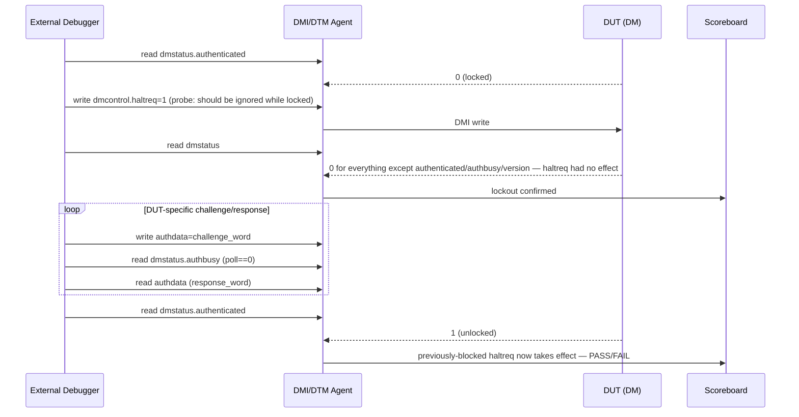

### OP20 — Version detection (#3.13)

The spec defines an *exact* procedure, not "read some version register": read `dmcontrol`; if `dmactive==0` or `ndmreset==1`, write `dmcontrol` preserving `hartreset`/`hasel`/`hartsello`/`hartselhi` from the value just read while setting `dmactive=1` and clearing everything else; poll until `dmactive==1`; read `dmstatus.version`. The spec also enumerates exact side effects if `ndmreset` had to be cleared (haltreq/resumereq cleared, ndmreset deasserted) — a correct test checks those side effects actually happened when triggered, not just that a version value came back.

```mermaid
sequenceDiagram
    participant Dbg as External Debugger
    participant Agt as DMI/DTM Agent
    participant DUT as DUT (DM)
    participant SB as Scoreboard

    Dbg->>Agt: read dmcontrol
    DUT-->>Agt: dmactive=0, ndmreset=1, hartreset=X, hasel=Y, hartsel=Z (arbitrary prior state)
    Agt->>SB: dmactive==0 or ndmreset==1 -> conditional branch taken
    Dbg->>Agt: write dmcontrol = preserve{hartreset=X,hasel=Y,hartsello/hi=Z} | dmactive=1, else 0
    Agt->>DUT: DMI write
    Dbg->>Agt: read dmcontrol (poll dmactive==1)
    DUT-->>Agt: dmactive=1
    Dbg->>Agt: read dmstatus
    DUT-->>Agt: version field (1=0.11, 2=0.13, 3=1.0)
    Agt->>SB: version in {1,2,3}; AND haltreq/resumereq now read 0, ndmreset now 0<br/>(the enumerated side effects) — PASS/FAIL, not just 'a version came back'
```

## Trigger Module — External-Debugger Operation Catalog and Test Flows

What the Trigger Module offers, and how an *external* debugger uses it. The Trigger Module (Sdtrig) is the hart-side hardware-breakpoint/watchpoint mechanism; whether a match becomes a Debug-Mode-entry event or an ordinary exception is a single field on the trigger itself — `action` (0 = raise a breakpoint exception, 1 = enter Debug Mode; #5.2) — and `action=1` is only legal when the trigger's `dmode=1`. This section covers the `action=1`/`dmode=1` path: an external debugger configures a trigger while the hart is halted, resumes it, and lets the trigger autonomously re-enter Debug Mode when it matches, with `dcsr.cause=2` distinguishing it from a plain `haltreq`. The `action=0` path — the Trigger Module's *native*-debug use — is covered separately below, since it never touches the DM/DMI/DTM at all.

**This catalog is hybrid stimulus by construction.** A trigger only proves itself by actually matching real hart activity, so every operation below needs both existing stimulus types working together, not a third one invented for this purpose: the **External Debug stimulus** (DMI/DTM Agent traffic, same as the Debug Module catalog above) drives configuration and readback, bracketing a short run of the **ASM/C/C++ firmware stimulus** (Simulation → Unit-level → Stimulus strategy, item 2) that actually trips the configured condition. None of the nine operations below have a CAT2 row in the testplan yet — the testplan's current single placeholder ("Hart-side Trigger Module") should be replaced by these nine once `riscv-debug-testplan` walks this catalog.

### Testbench structure (shared across every operation below)

Configuring `tselect`/`tdata1-3` is just more DMI/abstract-command traffic through the exact same agents as the Debug Module catalog — no new agent is needed, so that master diagram isn't redrawn here. What *is* new is the three-phase hybrid pattern every operation below follows, and the model it needs: the **Trigger-match predictor** (already listed as a suggested-not-yet-built model under Simulation → Unit-level → Models, item 1c) is required, not optional, for this catalog — without it the scoreboard has no independent way to predict *when* a trigger should fire against the firmware's known access trace, only that the DUT eventually reported something.

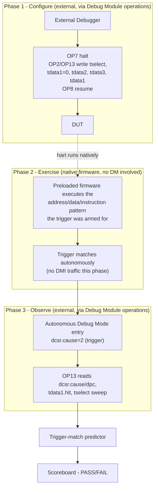

### Operation catalog

| # | Operation | Spec clause | Registers/fields | CAT2 row |
|---|---|---|---|---|
| EXT-TRIG-OP1 | Trigger enumeration (discover count + supported types per trigger) | #5.1 | `tselect`, `tdata1.type`, `tinfo.info` | **New** |
| EXT-TRIG-OP2 | Trigger configuration sequence (write-0-then-configure) | #5.7 preamble | `tdata1=0` → `tdata2`/`tdata3` → `tdata1` | **New** |
| EXT-TRIG-OP3 | Address/data match hardware breakpoint or watchpoint (`mcontrol`/`mcontrol6`), Debug-Mode action | #5.7.11, #5.7.12, #5.2 (`action=1`) | `tdata1` (`type=2`/`6`), `tdata2`, `execute`/`load`/`store`, `dmode=1`, `action=1` | **New** |
| EXT-TRIG-OP4 | Instruction-count trigger — external "run N instructions then Debug Mode" | #5.7.13, #5.2 (`action=1`) | `tdata1` (`type=3`, `icount`), `count`, `dmode=1`, `action=1` | **New** |
| EXT-TRIG-OP5 | Interrupt trigger, Debug-Mode action | #5.7.14, #5.2 (`action=1`) | `tdata1` (`type=4`, `itrigger`), `tdata2` interrupt mask | **New** |
| EXT-TRIG-OP6 | Exception trigger, Debug-Mode action | #5.7.15, #5.2 (`action=1`) | `tdata1` (`type=5`, `etrigger`), `tdata2` exception-code mask | **New** |
| EXT-TRIG-OP7 | External trigger source (`tmexttrigger`), Debug-Mode action | #5.7.16, #5.2 (`action=1`) | `tdata1` (`type=7`), `select` (TM external trigger inputs) | **New** |
| EXT-TRIG-OP8 | Context-scoped hardware breakpoint (ASID/VMID/context filtering) | #5.7.9, #5.7.10, #5.7.17, #5.7.18 | `mcontext`, `hcontext`, `scontext`, `textra32`/`textra64` (`mhselect`/`mhvalue`/`sselect`/`svalue`/`sbytemask`) | **New** |
| EXT-TRIG-OP9 | Trigger chaining (multiple triggers must all match together before firing) | #5.7.11/#5.7.12 `chain` field | `tdata1.chain` across 2+ consecutive trigger indices | **New** |

### EXT-TRIG-OP1 — Trigger enumeration (#5.1)

Write 0 to `tselect`; an illegal-instruction exception means no triggers exist at all. Otherwise read `tselect` back — if it doesn't hold what was written, stop (fewer triggers than that index). Read `tinfo`; if that itself excepts, fall back to reading `tdata1.type` instead (`type=0` means this index doesn't exist). If `tinfo==1`, this index doesn't exist either. Otherwise `tinfo.info`'s bitmask lists every type this trigger index supports. Repeat, incrementing `tselect`.

```mermaid
sequenceDiagram
    participant Dbg as External Debugger
    participant Agt as DMI/DTM Agent
    participant DUT as DUT (DM, halted hart)
    participant SB as Scoreboard

    loop tselect = 0, 1, 2, ...
        Dbg->>Agt: Access Register write tselect=N (CSR 0x7a0)
        Dbg->>Agt: Access Register read tselect
        DUT-->>Agt: readback
        Agt->>SB: readback != N -> stop, N triggers exist
        Dbg->>Agt: Access Register read tinfo (CSR 0x7a4)
        alt tinfo excepts (cmderr=3)
            Dbg->>Agt: Access Register read tdata1, check type==0
        else tinfo==1 or type==0
            Agt->>SB: trigger N doesn't exist -> stop
        else
            DUT-->>Agt: tinfo.info bitmask
            Agt->>SB: record supported types for trigger N
        end
    end
```

### EXT-TRIG-OP2 — Trigger configuration sequence (#5.7 preamble)

All `tdata` registers are write-any-read-legal (WARL); a new `tdata2`/`tdata3` value might not be legal under the trigger's *current* `tdata1.type`. The spec's own guaranteed-safe procedure: write 0 to `tdata1` first (this disables the trigger and leaves `tdata2`/`tdata3` writable with any value legal for *any* type this trigger supports), write the desired `tdata2`/`tdata3`, then write the real `tdata1` last, and always read `tdata1` back afterward since the hardware may silently adjust an unsupported field combination.

```mermaid
sequenceDiagram
    participant Dbg as External Debugger
    participant Agt as DMI/DTM Agent
    participant DUT as DUT (DM, halted hart)
    participant SB as Scoreboard

    Dbg->>Agt: Access Register write tdata1=0
    Agt->>DUT: trigger now disabled, tdata2/tdata3 freely writable
    Dbg->>Agt: Access Register write tdata2=<compare value>
    Dbg->>Agt: Access Register write tdata3=<textra config, if used>
    Dbg->>Agt: Access Register write tdata1=<real config: type, m/s/u, execute/load/store, action, dmode>
    Dbg->>Agt: Access Register read tdata1 (confirm, WARL)
    DUT-->>Agt: readback
    Agt->>SB: readback matches intended config, or documents which field the hardware adjusted — PASS/FAIL
```

### EXT-TRIG-OP3 — Hardware breakpoint/watchpoint via `mcontrol`/`mcontrol6` (#5.7.11, #5.7.12, #5.2)

The flagship external-trigger flow, following the three-phase pattern from Testbench structure above. `execute`/`load`/`store` select what kind of access the trigger watches; `select` chooses address vs. data comparison; `match` chooses equal/NAPOT/range/mask comparison; `timing` (before/after) controls exactly when it fires relative to the matching instruction. `dmode=1`+`action=1` is what makes this an *external* hardware breakpoint rather than a native one (contrast with NATIVE-OP2 below, same registers with `action=0`).

```mermaid
sequenceDiagram
    participant Dbg as External Debugger
    participant Agt as DMI/DTM Agent
    participant DUT as DUT (DM)
    participant FW as Firmware (native execution)
    participant TMPred as Trigger-match predictor
    participant SB as Scoreboard

    Note over Dbg,Agt: Phase 1 — configure (EXT-TRIG-OP2 sequence)
    Dbg->>Agt: tdata1{type=6, dmode=1, action=1, m=1, execute=1}, tdata2=<watch address>
    Dbg->>Agt: write dmcontrol.resumereq=1 (OP8)
    Agt->>DUT: hart resumes
    Note over DUT,FW: Phase 2 — firmware executes toward the watched address, no DMI traffic
    FW->>DUT: instruction fetch at watched address
    DUT->>DUT: trigger matches -> autonomous Debug Mode entry, cause=2
    Note over Dbg,SB: Phase 3 — observe
    Dbg->>Agt: read dmstatus (poll allhalted==1)
    Dbg->>Agt: Access Register read dcsr.cause, dpc
    DUT-->>Agt: cause=2, dpc=<watched address>
    Dbg->>Agt: Access Register read tdata1.hit (or hit0/hit1 for mcontrol6)
    DUT-->>Agt: hit=1
    Agt->>TMPred: compare vs. predicted match point from firmware's known trace
    TMPred->>SB: match — PASS/FAIL
```

### EXT-TRIG-OP4–OP7 — `icount` / `itrigger` / `etrigger` / `tmexttrigger`, generic Debug-Mode-entry flow

Structurally identical to each other and to EXT-TRIG-OP3's three-phase pattern — only what Phase 1 configures and what Phase 2's firmware does to trip it differs, tabulated rather than redrawn four times:

| Op | `tdata1.type` | Phase 1 config | Phase 2 firmware action |
|---|---|---|---|
| EXT-TRIG-OP4 (`icount`) | 3 | `count=N`, `dmode=1`, `action=1`, mode-enable bits | executes any `N` instructions in an enabled mode |
| EXT-TRIG-OP5 (`itrigger`) | 4 | `tdata2`=interrupt-number bitmask, `dmode=1`, `action=1` | an enabled interrupt is taken |
| EXT-TRIG-OP6 (`etrigger`) | 5 | `tdata2`=exception-code bitmask, `dmode=1`, `action=1` | the selected synchronous exception occurs |
| EXT-TRIG-OP7 (`tmexttrigger`) | 7 | `select`=TM-external-input bitmask, `dmode=1`, `action=1` | an External Trigger Agent (same agent as Debug Module `OP12`) drives the selected TM input line |

```mermaid
sequenceDiagram
    participant Dbg as External Debugger
    participant Agt as DMI/DTM Agent
    participant DUT as DUT (DM)
    participant Stim as Firmware or External Trigger Agent
    participant SB as Scoreboard

    Note over Dbg,Agt: Phase 1 — configure per the table above, then resume (OP8)
    Stim->>DUT: Phase 2 — the type-specific condition occurs (see table)
    DUT->>DUT: trigger matches -> autonomous Debug Mode entry, cause=2
    Dbg->>Agt: Phase 3 — poll allhalted, read dcsr.cause==2, tdata1.hit==1
    DUT-->>Agt: confirms this SPECIFIC trigger (via tselect sweep) reported the fire, not a different one
    Agt->>SB: type-specific event correctly attributed — PASS/FAIL
```

### EXT-TRIG-OP8 — Context-scoped hardware breakpoint (#5.7.9, #5.7.10, #5.7.17, #5.7.18)

An external debugger scopes a watchpoint to one process/thread/VM by additionally requiring `mcontext`/`scontext`/`hcontext` (or ASID/VMID via `mhselect`/`sselect` in `textra32`/`textra64`) to match, so the same physical hardware breakpoint doesn't fire while unrelated code runs on the same hart — directly useful when the DM is attached to an OS-hosted target and the debugger only cares about one process.

```mermaid
sequenceDiagram
    participant Dbg as External Debugger
    participant Agt as DMI/DTM Agent
    participant DUT as DUT (DM)
    participant FW as Firmware (two contexts: target + decoy)
    participant SB as Scoreboard

    Dbg->>Agt: configure mcontrol6 trigger (EXT-TRIG-OP3), execute=1, address=X
    Dbg->>Agt: write textra64{sselect=1(scontext), svalue=<target ASID>}
    Dbg->>Agt: resume (OP8)
    FW->>DUT: decoy context executes address X (different ASID) — must NOT fire
    Dbg->>Agt: read dmstatus (expect allhalted==0)
    FW->>DUT: target context executes address X (matching ASID) — MUST fire
    Dbg->>Agt: read dmstatus (poll allhalted==1), dcsr.cause==2
    Agt->>SB: fired only for the matching context, not the decoy — PASS/FAIL
```

### EXT-TRIG-OP9 — Trigger chaining (#5.7.11/#5.7.12 `chain`)

A chain of consecutive triggers (`chain=1` on all but the last) only fires the final trigger's action once *every* trigger in the chain has matched, together — used for e.g. "this address AND this data value" watchpoints that a single trigger can't express alone.

```mermaid
sequenceDiagram
    participant Dbg as External Debugger
    participant Agt as DMI/DTM Agent
    participant DUT as DUT (DM)
    participant FW as Firmware
    participant SB as Scoreboard

    Dbg->>Agt: tselect=0; tdata1{type=6, chain=1, select=0(addr), match=0}, tdata2=<addr>
    Dbg->>Agt: tselect=1; tdata1{type=6, chain=0, dmode=1, action=1, select=1(data), match=0}, tdata2=<data>
    Dbg->>Agt: resume (OP8)
    FW->>DUT: store to <addr> with a DIFFERENT value — address matches, data doesn't -> no fire
    Dbg->>Agt: read dmstatus (expect allhalted==0)
    FW->>DUT: store to <addr> with <data> — both link conditions match together
    Dbg->>Agt: read dmstatus (poll allhalted==1)
    Agt->>SB: fired only when BOTH chained triggers matched the SAME instruction — PASS/FAIL
```

## Sdext & Trigger Module — Native-Debugging Verification Strategy

What a *native* (self-hosted) debugger relies on, and how that gets verified. Per the spec's own Background (#1.4), native debug means debug software running on the same RISC-V platform it's debugging — no external DM/DMI/DTM/JTAG involved at all during the actual debug event. This inverts nearly every assumption the two external catalogs above make: there's no `pydebug` sequence driving DMI traffic through the shared testbench structure during the event itself — the only stimulus is real firmware, and the only thing to check is what a real trap handler observes about its own state.

**Scope boundary, stated explicitly rather than assumed.** Most of Sdext is *not* native-debug territory, even though it's the ISA extension a native debugger might expect to lean on. Debug Mode itself (#4.1) is DM-orchestrated: `dcsr`/`dpc`/`dscratch0-1` are only accessible *from* Debug Mode (#4.9's own preamble), which by construction requires the Debug Module to have already halted the hart — a self-hosted monitor with no DM attached cannot reach Debug Mode at all. The spec's own Appendix B.3 ("Native Debugger Implementation") says this outright: *"Native debuggers won't have access to `dcsr`, but can use the `icount` trigger."* So the genuinely native slice of Sdext is narrow: the `ebreak`-with-`ebreakX=0` ordinary-exception behavior (the toggle's *off* position — `ebreakX=1` is the external side, already implied by the Debug Module catalog's halt/resume operations), and the CSR-isolation boundary itself. Everything else in Sdext (halt/resume/reset semantics, WFI/WRS-during-halt-request, LR/SC-reservation-loss-on-Debug-Mode-entry, the `priv` virtual register) is a property of Debug Mode entry regardless of what caused it, and is already covered — directly or by cross-reference — in the Debug Module external catalog above.

The Trigger Module's native slice is much larger, because `action=0` (breakpoint exception, not Debug Mode entry) is the spec's own dedicated native-debug path — #5.4 ("Native Triggers") is an entire subsection about exactly this, distinct from the `action=1` catalog above.

### Testbench structure (shared across every operation below)

Extends the existing ASM/C/C++ firmware stimulus pattern (Simulation → Unit-level → Stimulus strategy, item 2) rather than the DMI-agent one — there is no external agent driving the event. The one addition: the trap handler embedded in the firmware itself becomes the checkpoint, self-checking `mcause`/`mepc`/trigger `hit` bits and depositing a pass/fail sentinel that `pydebug` (or a plain memory dump) reads back **after the fact, as a passive observer** — not as the mechanism driver, which is the key architectural difference from every diagram above.

```mermaid
flowchart LR
    SRC["test.S / test.c\n(trap handler + scenario)"]
    SRC --> CC["riscv-gcc cross-compile\n+ DUT linker script"]
    CC --> ELF["ELF"]
    ELF --> BIN["objcopy -> hex/image"]
    BIN --> PRELOAD["Preload before reset\n(no external debugger)"]
    PRELOAD --> HART["Hart executes natively,\nincl. its own trap handler"]
    HART --> EVENT["Native event fires:\nebreak / trigger action=0"]
    EVENT --> TRAP["Trap handler entry\nmcause=Breakpoint, mepc"]
    TRAP --> SELFCHECK["Handler self-checks\nmcause/mepc/hit bits,\nwrites PASS/FAIL sentinel"]
    SELFCHECK --> READBACK["Post-mortem readback\n(pydebug is a passive\nobserver, not the driver)"]
```

A new model surface follows from this: the **Native trap/privileged-CSR model** (predicts `mcause`/`mepc`/`mstatus.MIE`/`mtvec` trap-entry semantics per the Privileged Spec, independent of anything DMI-visible) — listed in the Unit-level Models list above (item 1c) alongside the Trigger-match predictor, since native verification needs it and the Debug Module catalog never did.

### Operation catalog

| # | Operation | Spec clause | Registers/fields | CAT2 row |
|---|---|---|---|---|
| NATIVE-OP1 | `ebreak` native breakpoint exception (`ebreakX=0`) | #4.9.1 (`ebreakm`/`s`/`u`/`vs`/`vu` fields), Privileged Spec breakpoint exception | `dcsr.ebreakm/s/u/vs/vu=0`, `mcause=Breakpoint`, `mepc` | **New** — the native side of the existing "Halt on software breakpoint" testplan gap (feature 7) |
| NATIVE-OP2 | Trigger-based native breakpoint/watchpoint exception (`action=0`) | #5.2 (`action=0`), #5.7.11–#5.7.15 (each with `action=0`) | `tdata1.action=0`, `tdata1.dmode=0`, per-type `tdata2`/`tdata3`, `mcause=Breakpoint` | **New** |
| NATIVE-OP3 | Native single-step via `icount` | #4.5.2, Appendix B.3.1 | `tdata1` (`type=3`), `count`, `pending`, `m`/`s`/`u`/`vs`/`vu` | **New** |
| NATIVE-OP4 | Reentrancy protection during a native trap handler | #5.4 | `tcontrol.mte`/`mpte` (option 2), or hardware MIE/SIE/VS-mode-SIE gating (option 1) | **New** |
| NATIVE-OP5 | Multi-trigger disambiguation via `hit`/`hit0`/`hit1` | #5.7.11/#5.7.12 `hit` fields, #5.3 priority (Table 13) | `tselect` sweep + `hit` bits; `mcause` alone is ambiguous | **New** |
| NATIVE-OP6 | Context-scoped native trigger (process/VM-scoped breakpoint, OS-hosted) | #5.7.9, #5.7.10, #5.7.17, #5.7.18 (native usage, `action=0`) | `mcontext`/`hcontext`/`scontext`, `textra32`/`textra64` | **New** |
| NATIVE-OP7 | Debug-Mode-CSR isolation boundary (negative test) | #4.9 preamble ("only accessible from Debug Mode") | `dcsr`/`dpc`/`dscratch0-1` access attempted from non-Debug-Mode code | **New** |

### NATIVE-OP1 — `ebreak` native breakpoint exception (#4.9.1, Privileged Spec)

With `dcsr.ebreakm=0` (the default/reset value — this is what makes it the "off" position of the same toggle the Debug Module catalog's halt/resume operations rely on for `ebreakm=1`), executing `ebreak` in M-mode behaves exactly as an ordinary Privileged-Spec exception: traps to the configured handler with `mcause=Breakpoint`, `mepc`=the `ebreak` instruction's own address, no DM/Debug-Mode involvement whatsoever. The same toggle exists per-mode (`ebreaks`/`ebreaku`/`ebreakvs`/`ebreakvu`).

```mermaid
sequenceDiagram
    participant FW as Firmware (self-hosted monitor)
    participant HART as Hart
    participant SB as Scoreboard (post-mortem)

    Note over FW: dcsr reset value has ebreakm=0 by default —<br/>confirm no external debugger ever set it to 1
    FW->>HART: execute ebreak instruction at address X
    HART->>HART: trap taken — mcause=Breakpoint(3), mepc=X
    HART->>FW: trap handler entry (M-mode, mtvec)
    FW->>FW: self-check: mcause==3, mepc==X, NOT in Debug Mode<br/>(no dcsr access attempted — see NATIVE-OP7)
    FW->>FW: write PASS/FAIL sentinel to known address
    Note over SB: post-mortem — pydebug/memory dump reads sentinel
```

### NATIVE-OP2 — Trigger-based native breakpoint/watchpoint exception (#5.2, #5.7.11–15)

Every trigger type from the external catalog above has an `action=0` mirror: instead of `dmode=1`+`action=1` causing autonomous Debug Mode entry, `dmode=0`+`action=0` causes an ordinary breakpoint exception (`mcause=Breakpoint`) taken to whatever privilege mode is configured (`m`/`s`/`u`/`vs`/`vu` enable bits) — this is the spec's dedicated self-hosted-debug mechanism (#1.4: "The optional Trigger Module provides features that are useful for native debug"), configured entirely by the target's own privileged software, never by an external debugger.

```mermaid
sequenceDiagram
    participant FW as Firmware (self-hosted monitor)
    participant HART as Hart
    participant SB as Scoreboard (post-mortem)

    FW->>HART: csrw tdata1, {type=6, action=0, dmode=0, m=1, execute=1}
    FW->>HART: csrw tdata2, <watch address>
    Note over FW,HART: same write-0-then-configure discipline as EXT-TRIG-OP2,<br/>just issued as native csrw instructions instead of DMI writes
    FW->>HART: (later) execute instruction at watch address
    HART->>HART: trigger matches -> breakpoint exception (NOT Debug Mode), mcause=Breakpoint
    HART->>FW: trap handler entry
    FW->>FW: self-check: mcause==Breakpoint, tselect sweep finds hit==1 on the armed trigger
    FW->>FW: write PASS/FAIL sentinel
```

### NATIVE-OP3 — Native single-step via `icount` (#4.5.2, Appendix B.3.1)

Since a native debugger cannot touch `dcsr.step`, the spec's documented workaround uses `icount` with `count=1`: the trigger decrements `count` on every retired instruction (or trap) in an enabled mode, and when `count` reaches 0, sets `pending` and fires just before the *next* instruction executes. Appendix B.3.1's own worked example is precise about a subtlety worth testing directly: the `csrw tdata1` instruction that arms the trigger itself counts toward decrementing `count`, so a debug stub must account for its own instruction count (e.g. `count=4` to skip past its own restore-and-`mret` sequence) rather than naively using `count=1`.

```mermaid
sequenceDiagram
    participant FW as Firmware (self-hosted monitor)
    participant HART as Hart
    participant SB as Scoreboard (post-mortem)

    FW->>HART: li t0, {count=4, action=0, m=1}
    FW->>HART: csrw tdata1, t0  (this instruction: count 4->3)
    FW->>HART: lw t0, 8(sp)    (restore: count 3->2)
    FW->>HART: lw sp, 0(sp)    (restore: count 2->1)
    FW->>HART: mret            (return to stepped code: count 1->0, pending=1)
    HART->>HART: pending=1 -> fires just before the NEXT instruction in an enabled mode
    HART->>FW: breakpoint exception after exactly one stepped instruction
    FW->>FW: self-check: exactly one instruction of user code executed since mret
    FW->>FW: write PASS/FAIL sentinel
```

### NATIVE-OP4 — Reentrancy protection during a native trap handler (#5.4)

The hazard: a trigger configured to fire in M-mode could re-match on the trap handler's *own* instructions, corrupting `mcause`/`mepc` before the original trap is even saved. The spec mandates one of two protections: **(1)** hardware prevents `action=0` triggers from matching/firing while in M-mode with `mstatus.MIE=0` (and the S-mode/VS-mode equivalents via `medeleg`/`hedeleg`), or **(2)** `tcontrol.mte`/`mpte` are implemented with `medeleg[3]` hard-wired to 0. Verification must confirm whichever option this DUT claims actually holds — this is exactly the kind of property a directed single test easily misses, since a "clean" run never even exercises the reentrant case.

```mermaid
sequenceDiagram
    participant FW as Firmware (self-hosted monitor)
    participant HART as Hart
    participant SB as Scoreboard (post-mortem)

    FW->>HART: arm a trigger matching an address INSIDE the trap handler itself, action=0, m=1
    FW->>HART: trigger an unrelated first exception (e.g. ecall) to enter the handler
    HART->>HART: handler's own instructions execute inside the matching address range
    alt Option 1 (hardware masks while MIE=0)
        HART->>SB: trigger does NOT re-fire — handler completes, mepc/mcause intact
    else Option 2 (tcontrol.mte/mpte)
        HART->>SB: confirm mte cleared on trap entry, restored to mpte on mret — trigger inert throughout
    end
    FW->>FW: self-check: original ecall's mepc/mcause were never overwritten by a spurious re-fire
    FW->>FW: write PASS/FAIL sentinel
```

### NATIVE-OP5 — Multi-trigger disambiguation via `hit`/`hit0`/`hit1` (#5.7.11/12, #5.3)

Every native trigger type funnels into the *same* `mcause=Breakpoint` exception code regardless of which trigger fired, or how many are configured — `mcause` alone cannot tell the handler which one matched. The handler must sweep `tselect` across every implemented trigger and check `hit` (or `hit0`/`hit1` for `mcontrol6`, which additionally encode *when* relative to the instruction: before/after/immediately-after). Table 13's priority ordering matters here too: when a trigger and an unrelated fault (e.g. a page fault) coincide on the same instruction, the handler needs deterministic attribution, not a race.

```mermaid
sequenceDiagram
    participant FW as Firmware (self-hosted monitor)
    participant HART as Hart
    participant SB as Scoreboard (post-mortem)

    FW->>HART: arm TWO triggers (different tselect), both action=0, both able to match the same test code
    FW->>HART: execute code that matches BOTH conditions on the same instruction
    HART->>HART: breakpoint exception, mcause=Breakpoint (identical regardless of which/how many fired)
    HART->>FW: trap handler entry
    loop tselect = 0, 1, ... (every implemented trigger)
        FW->>HART: csrw tselect, N; csrr t0, tdata1 (or mcontrol6's hit0/hit1)
        FW->>FW: record hit bit for trigger N
    end
    FW->>FW: self-check: hit set on BOTH triggers that should have matched, clear on any that shouldn't
    FW->>FW: write PASS/FAIL sentinel
```

### NATIVE-OP6 — Context-scoped native trigger (#5.7.9, #5.7.10, #5.7.17, #5.7.18)

The OS-integration case: a kernel implementing process-scoped breakpoints (the native analogue of `ptrace`) uses `mcontext`/`scontext`/`hcontext` (or ASID/VMID via `textra32`/`textra64`) so the same physical trigger only fires for one process/thread/VM, `action=0` throughout — mirrors EXT-TRIG-OP8's mechanism exactly, but configured and consumed entirely in-kernel rather than by an attached external debugger.

```mermaid
sequenceDiagram
    participant FW as Firmware (kernel-hosted breakpoint manager)
    participant HART as Hart
    participant SB as Scoreboard (post-mortem)

    FW->>HART: csrw mcontext/scontext, <target process ASID>
    FW->>HART: csrw tdata1, {type=6, action=0, m=0, s=1, execute=1}; tdata2=<watch address>
    FW->>HART: schedule DECOY process (different ASID) through the watched address — must NOT fire
    FW->>FW: self-check: no exception taken during decoy's execution
    FW->>HART: schedule TARGET process (matching ASID) through the watched address — MUST fire
    HART->>FW: breakpoint exception taken only for the target process
    FW->>FW: self-check: exception fired exactly once, only during the target process's execution
    FW->>FW: write PASS/FAIL sentinel
```

### NATIVE-OP7 — Debug-Mode-CSR isolation boundary, negative test (#4.9 preamble)

Proves the boundary condition the rest of this native catalog depends on: `dcsr`/`dpc`/`dscratch0-1` genuinely cannot be reached from ordinary (non-Debug-Mode) code, which is *why* native single-step has to route through `icount` (NATIVE-OP3) instead of `dcsr.step` in the first place. A DUT that let native code touch these registers would silently break the isolation the whole native/external split depends on.

```mermaid
sequenceDiagram
    participant FW as Firmware (ordinary M-mode code, NOT halted, NO DM attached)
    participant HART as Hart
    participant SB as Scoreboard (post-mortem)

    FW->>HART: attempt csrr t0, dcsr  (while NOT in Debug Mode)
    HART->>HART: illegal instruction exception (per #4.9 preamble)
    HART->>FW: trap handler entry, mcause=Illegal Instruction
    FW->>FW: self-check: mcause==Illegal Instruction, NOT a successful read
    FW->>HART: repeat for dpc, dscratch0, dscratch1
    FW->>FW: self-check: all four Debug-Mode-only CSRs correctly rejected outside Debug Mode
    FW->>FW: write PASS/FAIL sentinel
```

## Scope

### Simulation

#### Unit-level

##### Verification

**Models** — this is the highest-leverage piece of the whole strategy; different model types answer different questions and shouldn't be collapsed into one:

1. **UVM model, strictly for simulation**:
   - **a. Register model** — predicts DMI-visible register state field-by-field:
     - Debug Module registers (`dmcontrol`, `dmstatus`, `abstractcs`, `command`, `data0-11`, `progbuf0-15`, `sbcs`, `sbaddress0-3`, `sbdata0-3`, `dmcs2`, `hawindowsel`/`hawindow`, `authdata`, `haltsum0-3`, `hartinfo`, `confstrptr0-3`)
     - Trigger module CSRs (`tselect`, `tdata1-3`, `tinfo`, `tcontrol`, `mcontext`/`scontext`/`hcontext`/`mscontext`)
     - Sdext CSRs (`dcsr`, `dpc`, `dscratch0-1`)
   - **b. HART park-loop model** — since the DUT is A.2/Execution-Based (see Design Under Test), abstract commands actually execute hidden instructions on the hart. This model tracks, per hart ID, the predicted PC and register-file state as it steps through that generated instruction stream, so the scoreboard can predict the *outcome* of an abstract command or Program Buffer execution, not just poke a value and hope.
   - **c. Additional models worth building** (suggested, not yet built — two are promoted from "suggested" to "required" by the Trigger Module / native-debugging catalogs below):
     - **Trigger-match predictor (required for the Trigger Module external catalog)** — independently evaluates `tdata1`/`tdata2` configuration against a stream of PC/address/data values from the Core-DM/monitor to predict trigger fire events; needed because Sdtrig behavior is genuinely complex (e.g. `mcontrol6.uncertain` for vector/push-pop accesses, `icount` firing on *all* traps by spec mandate). Without it, the scoreboard can only confirm the DUT reported *something*, not *when* it should have.
     - **Native trap/privileged-CSR model (required for the Sdext/Trigger-Module native-debugging catalog)** — predicts `mcause`/`mepc`/`mstatus.MIE`/`mtvec` trap-entry semantics per the Privileged Spec, entirely independent of anything DMI-visible, since native events never touch the DM. New model surface — the register model above only covers DMI-visible state.
     - **DMI protocol/sticky-status model** — tracks `dmi` op/address/data and the sticky busy/error behavior (#6.1.5) independently of DM register semantics, so malformed or batched-scan sequences are caught even if every individual register value would otherwise look fine.
     - **Reset/domain state model** — tracks `ndmreset`/`hartreset`/`*havereset` as its own small state machine, since reset interacts with nearly every other model and is easy to get subtly wrong if folded into the general register model.
     - **Halt-group / external-trigger notification model** — predicts group-wide halt propagation and external-trigger notify/response signaling for feature 17 (hart grouping), which is genuinely a separate concern from any single hart's own register state.
     - **Authentication state model** — tracks `authbusy`/`authenticated` transitions per attempt sequence, if `HAS_AUTHENTICATION=1` for a given DUT.
2. **SystemVerilog-based model, for cross-platform (FPGA) modeling** — supersedes this document's earlier recommendation to skip a second golden model entirely. That earlier "skip" call was specifically about avoiding a *second-language* duplicate: a standalone C/C++ model running on FPGA (e.g. on a soft-core or host-adjacent processor) would re-derive the same spec rules in a second language and inevitably drift from the SV/UVM one over time. A model written in **synthesizable SystemVerilog** doesn't have that problem — it shares the same coding paradigm, and much of the same source logic, as the two SVA tiers already built (`sv_kit/dmi_assertions.sv` protocol tier, `integration_with_cva6/cva6_sim/dm_csrs_assertions.sv` register tier) and the coverage subscriber (`sv_kit/covergroups.sv`), just synthesized into the FPGA bitstream alongside the DUT instead of compiled into a Questa `uvm_subscriber`.
   - **What it is**: a synthesizable-subset SV checker/predictor block, instantiated on-target next to the DUT, that watches DMI/JTAG traffic (or the same Core-DM sideband signals the Core-DM Agent taps in simulation) and independently predicts/flags register-field and run-control violations at hardware clock speed — not software interpreted on a soft-core.
   - **What this changes for Emulation**: checking is no longer limited to the lightweight `StepResult.ok` expected-value checks round-tripped through OpenOCD from the host — see the Emulation section below for how this closes the "same stimulus, same checking depth" gap between simulation and emulation.
   - **Constraint to track**: must stay within the synthesizable SV subset (no classes, no `#delay`, immediate/concurrent assertions may need translation to synthesizable assertion IP or plain `always_ff` checker logic depending on the target FPGA toolchain) — when porting a check from the simulation-side model or SVA tiers, verify it actually synthesizes rather than assuming a straight copy-paste works.
   - **Reuse discipline**: derive this model from the same spec-cited field definitions already established in `pydebug/src/pydebug/model/registers.py` (Python) and the existing SV assertion tiers — don't re-derive bit positions/WARL rules a third time from the spec text; port the existing source of truth rather than re-authoring it.

**Checking**:

- **Self-checking** — encoded directly in each stimulus step (the `StepResult(ok=..., msg=...)` pattern from `riscv-debug-stimulus`), confirming the outcome of any directed transaction as it happens, not just that the sequence ran without crashing.
- **Scoreboards/checkers** — compare register reads/writes against the register model and park-loop model above, on every DMI transaction.
- **Assertions** — SVA properties for invariants that must never be violated regardless of stimulus (e.g. "a halted hart ignores further `haltreq`", "`resumereq` is ignored while `haltreq` is set", "`dmi` busy/error stays sticky until explicitly cleared") — these track directly to the Design Rationale Notes already captured in the testplan.
- **Coverage bins** — functional coverage confirming the desired stimulus space was actually reached (register field cross-products, TC-ID scenario hits), not just that assertions never fired.

##### Checker implementation (SV register model — decided 2026-07-23)

The "Register model" (1.a above) and "Scoreboards/checkers ... compare register reads/writes against the register model ... on every DMI transaction" (Checking, above) were strategy-level intent only until this pass — the only golden model that existed was the **Python** one (`pydebug/src/pydebug/model/predictor.py`, dmcontrol/dmstatus run control). No SV-side register model or model-backed checker existed; `sv_kit/scoreboard.sv` only checks DMI protocol-status bits (busy/error), never register *values*. This pass adds the missing SV model and wires it into the checker.

**Plumbing pattern** (informed by reviewing an external reference verification IP's checker architecture, used for pattern only — no code, names, or comments from it are reused here): one `uvm_analysis_export` + TLM analysis FIFO per monitored interface, connected in `connect_phase`; `run_phase` forks one `forever` task per interface, each blocking on `fifo.get(txn)` — the blocking `get()` is the "event" that wakes the task when a new transaction arrives. For pydebug's single DMI/JTAG monitor stream this collapses to one export/FIFO/task in a new `dm_checker` component, added as a third subscriber to the monitor's analysis port alongside the existing `debug_scoreboard` and `debug_coverage` (`env.sv` connect_phase).

**Checking semantics — a shadow register model, not an explicit per-step compare**:
- The model (`dm_ref_model`, new SV file mirroring `predictor.py`'s semantics field-for-field) is updated on every observed **write** to a modeled register.
- On every observed **read**, the checker compares the DUT's returned value against the model's current predicted value for that address, automatically — **no sequence or stimulus step calls a compare method**; checking is entirely a property of the monitored transaction stream, so any read anywhere is checked for free.
- **DMI is pipelined one transaction deep** (spec #6.1.5): a JTAG DMI read is two DR shifts (op=READ submits the request; op=NOP retrieves the result on the *next* shift). The checker therefore holds a one-deep "pending request" register and compares a transaction's *response* fields against the *previous* transaction's request, never same-transaction — this is a real protocol property, not an implementation convenience.
- **On any model/RTL mismatch: report only, never auto-resolve.** The checker emits a distinctly-tagged error (e.g. `MODEL_MISMATCH`, separate from the existing protocol-status errors `debug_scoreboard` already reports) with the register, expected value, actual value, and transaction index. Whether the fix belongs in the SV model, the RTL, or is a declared/acceptable difference is the author's call, made after reading the report — exactly the example the author gave: "a write came and wrote some register, RTL didn't update the correct value because it had a bug, but DV wrote correct" is precisely the class of bug this is meant to catch and surface, not silently patch.
- Scope of what `dm_ref_model` predicts this pass: full dmcontrol/dmstatus run control (ported from `predictor.py`), plus **self-consistency shadows** for the abstract-command data path (`data0`/`command`: track values *we* wrote via a GPR/CSR write command, check they read back unchanged on a subsequent read of the *same* register — the model cannot and does not claim to know arbitrary hart-initial register content) and for System Bus Access (`sbaddress0`/`sbdata0`, same self-consistency scoping for memory *we* wrote).
- New/modified files: `sv_kit/jtag_monitor.sv` (fix: capture TDO, not just TDI, so `dmi_rdata`/`dmi_status` are ever non-zero on the monitor stream — currently hardcoded to 0, a pre-existing gap, not new), `sv_kit/dm_ref_model.sv` (new), `sv_kit/dm_checker.sv` (new), wired into `env.sv`/`debug_pkg.sv`.
- Driver-side self-checking sequences (`dmi_read_seq.sv` et al.) already receive `dmi_rdata`/`dmi_status` via the driver's existing `item_done()`/`get_response()` path (`jtag_driver.sv` already captures TDO into `dr_data_out` and calls `unpack_dmi()` before returning the item) — that path was already correct; only the passive monitor was missing this.

**Agents** — roles and how active/passive they are differs between unit-level and system-level (see the System-level section below for the same table's second column):

| Agent | Role | Unit-level activity |
|---|---|---|
| DMI Agent | Drives/monitors the DMI register bus directly, bypassing JTAG | Configurable Active/Passive — active mode drives traffic directly at DMI to save simulation time |
| DTM Agent | Drives the JTAG TAP (IR/DR shifts, IDCODE, `dtmcs`, `dmi`) | Active |
| Core-DM Agent | Monitors the hart-side interface between the CPU and DM (see the CORE-DM interface table above) | Passive |
| External Trigger Agent | Drives/monitors `dmcs2` external-trigger lines for halt-group/multi-DM scenarios | Active — the only way to exercise multi-DM synchronization when the unit-level bench has just one real DM |
| SBA Agent | Responds to System Bus Access requests from the DM | Active — synthesizes bus responses itself rather than needing real backing memory |
| Processor/Bus Agent | Represents the hart(s) for multicore scenarios; sends dummy transactions responding to halt/resume/abstract-command requests. The UVM park-loop model (Models 1.b) publishes its predicted state onto this agent, which the agent then communicates to the DM. | Active |

##### Stimulus strategy

Two reusable stimulus types, each portable beyond this one test bench — both get explained in full since both need a block diagram per the request:

**1. Reusable External Debug stimulus (Python).** Because verification expands across platforms (simulation → emulation → eventually post-silicon), the stimulus itself must be portable, not re-written per platform. This project's answer is a Python stimulus library (`pydebug`) that connects to a C-DPI-driven UVM testbench in simulation, or an OpenOCD TCL server in emulation, without changing a single high-level debug command.

Request/response flow, end to end:

1. A sequence module (e.g. `halt_sequence.py`'s `build_halt_sequence`) calls a high-level method on `RISCVDebug` (e.g. `dm.halt()`), which is really a small number of DMI register reads/writes (e.g. write `dmcontrol.haltreq=1`, poll `dmstatus.allhalted`).
2. `RISCVDebug`/`DMI` (`src/pydebug/api/riscv_dm.py`) translates that into `transport.write(addr, data)` / `transport.read(addr)` calls against the abstract `DebugTransport` interface — this is the one seam that differs between platforms.
3. In simulation, `UVMTransport` serializes that request over a Unix/TCP socket to a small C bridge (DPI-C), which the UVM testbench polls from a `rv_dbg_base_test`-style task; that task drives the request onto a real JTAG/DMI agent's driver, the agent shifts it onto the DUT's actual DTM pins, and the DUT's DM responds; the agent's monitor captures the response, which flows back up the same chain (driver → DPI bridge → socket → `UVMTransport` → `DMI` → the Python caller) as an ordinary function return value.
4. In emulation, `OpenOCDTransport` instead opens the OpenOCD TCL port (6666) and issues the equivalent `dmi_write`/`dmi_read` TCL commands; OpenOCD drives the real board's JTAG pins directly — no DPI bridge, no UVM testbench, no simulator at all.
5. Either way, the sequence module and every layer above `DebugTransport` never knows or cares which branch executed — this is what makes the same TC-ID-traced sequence usable, unmodified, in both places.

```mermaid
flowchart TB
    SEQ["Sequence module\n(e.g. halt_sequence.py)"]
    DM["RISCVDebug / DMI\n(dm.halt(), dm.read_gpr(), ...)"]
    TRANSPORT["DebugTransport (abstract)"]
    SEQ --> DM --> TRANSPORT

    TRANSPORT --> UVMT["UVMTransport\n(Unix/TCP socket)"]
    TRANSPORT --> OCDT["OpenOCDTransport\n(TCP port 6666, TCL)"]

    UVMT --> BRIDGE["C Bridge (DPI-C)"]
    OCDT --> OCDSRV["OpenOCD server"]

    BRIDGE --> UVMTEST["UVM test task\n(rv_dbg_base_test)"]
    OCDSRV --> BOARD["Target board\n(Arty A7 / Genesys2)"]

    UVMTEST --> AGENT["JTAG/DMI Agent\n(driver + monitor, sv_kit/)"]
    BOARD --> AGENT

    AGENT --> DMI["DMI bus"]
    DMI --> DUT["DUT DM\n(Ibex / CVA6)"]
```

**2. Reusable ASM/C/C++ firmware stimulus.** Runs as actual firmware/OS-level code on the RISC-V hart, to verify *native* debug operations (trigger matches, `ebreak`, WFI-during-debug) that only fire from the hart's own instruction stream — the external-debug stimulus above cannot generate these events itself, only observe their effect.

1. A test author writes a small program (e.g. `tests/native/trigger_test.c`) targeting the scenario (feature 7's `ebreak`, feature 16's trigger match, etc.).
2. Cross-compiled with the RISC-V GCC toolchain against the DUT's linker script into an ELF.
3. `objcopy`'d to a Verilog hex (`$readmemh`, simulation preload — same "memory-preload hierarchy path" pattern already used by `tb_top_ibex.sv`/`tb_top_cva6.sv`) or a raw image (OpenOCD load, emulation).
4. Preloaded before the hart leaves reset; the hart then fetches and executes *natively* — no external single-stepping.
5. When the native event fires (`ebreak`, Sdtrig match, targeted exception), the DM enters/reports Debug Mode (`dcsr.cause`, `dmstatus` halt bits) on its own.
6. The external-debug stimulus (same Python library, same transport) then reads back GPRs/CSRs/memory to confirm the hart stopped at the expected point with the expected state — this is where the two stimulus types meet: the firmware creates the native-debug event, the Python library still performs the actual checking.

```mermaid
flowchart LR
    SRC["test.S / test.c\n(native-debug scenario)"]
    SRC --> CC["riscv-gcc cross-compile\n+ DUT linker script"]
    CC --> ELF["ELF"]
    ELF --> BIN["objcopy → hex (sim) /\nimage (emulation)"]
    BIN --> PRELOAD["Preload into DUT memory\nbefore reset release"]
    PRELOAD --> HART["Hart fetches & executes natively"]
    HART --> EVENT["Native event fires:\nebreak / Sdtrig match / exception"]
    EVENT --> DM["DM reports Debug Mode\n(dcsr.cause, dmstatus halt bits)"]
    DM --> CHECK["External-debug stimulus (pydebug)\nreads back state to verify"]
```

#### System-level

##### Verification

Models and Checking are unchanged from Unit-level above — the same register model, park-loop model, and checking disciplines apply; system-level exercises them against a fuller platform (real memory map, real reset topology, potentially multiple harts) rather than a stripped-down bench, so no separate model/checking scheme is needed.

**Agents** — same roles as Unit-level; activity changes because real platform components now exist to respond instead of the agent synthesizing a response itself:

| Agent | Role | System-level activity |
|---|---|---|
| DMI Agent | Drives/monitors the DMI register bus directly | Passive — real traffic now arrives through JTAG/DTM; the DMI agent only monitors |
| DTM Agent | Drives the JTAG TAP | Active |
| Core-DM Agent | Monitors the hart-side CPU/DM interface | Passive |
| External Trigger Agent | Drives/monitors `dmcs2` external-trigger lines | Active — still no second real DM present at system level either, so this remains the only path to exercise multi-DM/group synchronization |
| SBA Agent | Responds to System Bus Access requests | Passive — real system memory/bus fabric now responds instead of the agent |
| Processor/Bus Agent | Represents hart(s) for multicore scenarios | Active if extra harts are still agent-stubbed; passive if real multi-hart RTL is present and drives its own responses — depends on whether this system-level bench includes real multi-core RTL, since we may or may not have dual/multi-core per DUT |

##### Stimulus strategy

Same as Unit-level's stimulus strategy above, unmodified — the entire point of the portable Python library and the ASM/C firmware harness is that the same stimulus runs at both levels without a rewrite. System-level testing exercises them against a more complete/realistic platform configuration (full memory map, real interrupt controller, real reset fan-out) rather than needing a second stimulus implementation.

### Emulation

System-level only — there is no meaningful "unit-level" once real silicon/FPGA fabric is involved; every emulation scenario is inherently a full-platform scenario. The Python↔OpenOCD bridge (`OpenOCDTransport`) and the stimulus library itself get ported unchanged; every sequence module, TC-ID, and check is identical to the simulation system-level ones above (`INTEGRATION_GUIDE.md`'s documented pattern) — this is the concrete proof of the portability claim, not aspirational.

**On-target checking (SV-based model, see Unit-level Models item 2 above)**: emulation checking is no longer host-only. In addition to the ported Python stimulus and its `StepResult.ok` checks, a synthesizable SV checker/predictor is built into the FPGA bitstream alongside the DUT. This closes a real gap a host-only setup can't: `StepResult.ok` only ever sees the specific values the stimulus explicitly reads back over OpenOCD, while the on-target SV checker observes *every* DMI transaction at hardware speed — the same visibility the Scoreboard has in simulation, not a sampled subset of it. Division of labor: the host-side Python checks remain the primary per-TC-ID pass/fail signal (so a test's result doesn't depend on a specific FPGA build), while the on-target SV checker runs as an always-on monitor flagging protocol/register violations the directed stimulus wasn't specifically looking for — the same role the two SVA tiers play in simulation, ported rather than reinvented.

## Cross-cutting verification levels

Orthogonal to the Unit-level/System-level/Emulation scope above — a lens asking "how deep is this feature's verification," anchored back to Intention:

| # | Level | Intention anchor | Platform |
|---|---|---|---|
| 1 | Protocol/interface (JTAG DTM, IDCODE, TAP) | Accessing hardware with no working CPU; Bootstrapping before any executable code path | Simulation |
| 2 | Register/DMI (field-level, model-checked) | same as level 1 | Simulation |
| 3 | Functional/scenario (halt, read, resume, step) | Debugging low-level software with no OS; Debugging issues in the OS itself | Simulation |
| 4 | System/integration (real SW running, interrupts, multi-hart) | Debugging issues in the OS itself; Debugging processes running on an OS | Simulation |
| 5 | Cross-platform (same stimulus, transport swapped) | Orthogonal — feature 9 (transport independence) and feature 10 (no microarchitecture knowledge) directly | Simulation + Emulation + Post-silicon |
| 6 | Stress/negative/compliance-edge | Authentication/DM-locking specifically, plus general P0 claims across every feature | All platforms |

## Feature × Verification-Level Matrix

Per #1.5 Feature (not the testplan's finer CAT2 grain — see the traceability table above for how they relate): which of the six cross-cutting levels applies, and how far verification has actually progressed.

| Feature | L1 Protocol | L2 Register | L3 Functional | L4 System | L5 Cross-platform | L6 Stress/Negative | TC-IDs so far |
|---|---|---|---|---|---|---|---|
| 1. All hart registers R/W | — | ✓ | ✓ | ✓ | ✓ | ✓ | none |
| 2. Memory access (hart/bus/both) | — | ✓ | ✓ | ✓ | ✓ | — | none |
| 3. RV32/64/128 support | — | ✓ | — | — | ✓ | — | none |
| 4. Any hart independently debugged | ✓ | ✓ | ✓ | ✓ | ✓ | ✓ | `TC-RC-001`–`007` (7) |
| 5. Debugger self-discovery | ✓ | ✓ | — | — | ✓ | — | none |
| 6. Debug from first instruction | ✓ | ✓ | ✓ | — | ✓ | ✓ | `TC-RST-001`–`006`, `TC-HOR-001`–`005` (11) |
| 7. Halt on software breakpoint | — | ✓ | ✓ | ✓ | — | — | none (testplan gap) |
| 8. Hardware single-step | — | ✓ | ✓ | ✓ | ✓ | — | none |
| 9. Transport independence | ✓ | — | — | — | ✓ | — | none |
| 10. No microarchitecture knowledge needed | — | — | ✓ | — | ✓ | — | none (proven by construction) |
| 11. Arbitrary hart-subset halt/resume | — | — | ✓ | ✓ | — | ✓ | none |
| 12. Arbitrary instructions on halted hart | — | ✓ | ✓ | ✓ | — | ✓ | none |
| 13. Register access without halting | — | ✓ | ✓ | — | — | — | none (testplan gap) |
| 14. Short instruction sequence, low overhead | — | ✓ | ✓ | ✓ | — | — | none (testplan gap) |
| 15. System bus manager, no hart involved | — | ✓ | ✓ | ✓ | ✓ | — | none |
| 16. Halt on trigger match | — | ✓ | ✓ | ✓ | — | ✓ | none |
| 17. Hart grouping | — | — | ✓ | ✓ | — | ✓ | none |

Reading the matrix alongside the traceability table above: features 7, 13, and 14 have no TC-IDs *and* no testplan row yet — genuinely the least-covered part of the whole feature list, not just the least-implemented.

## Feature-Level Verification Detail

For each Feature: which CAT3 mechanisms it exercises, which Agents/Model/Checker from the Unit-level Verification section (above) actually participate, and a testbench-structure diagram showing how they connect — not just that a level applies, but concretely how. Built incrementally, same discipline as the testplan — starting with the two Features that already have real TC-IDs, since those give an actual Agents/Model/Checker configuration to draw rather than a hypothetical one. Everything below is Unit-level (simulation); System-level differs only in which Agents are active vs passive (see the System-level Agents table above) — the diagrams don't need to be redrawn per level, only the agent activity re-read from that table.

**Per-hart features need a per-hart proof strategy.** Several Features (4, 6, 11, and others phrased as "any hart"/"each hart") aren't claims about one specific hart — they're claims that hold for *every* implemented hart. Directed testing of hart 0 alone doesn't prove that; it only proves hart 0 works. The correct methodology for these Features is **constrained-random hart selection**: each test iteration randomly picks which hart(s) to target (respecting the DUT's actual implemented range), applies the *same* directed stimulus regardless of which hart got picked, and regresses across many seeds so that, over enough runs, every implemented hart gets hit — with coverage bins tracking hart-index-reached to make that closure measurable rather than assumed. Critically, the checker must confirm two things every time, not one: the selected hart transitions as expected, **and** every other implemented hart's state is provably undisturbed — that second check is what actually proves "independent," since a DUT that secretly halts every hart together would still pass a check that only looks at the one hart requested.

Both Features below reuse the exact agent/model/scoreboard chain already drawn for `OP7`/`OP8` (Feature 4) and `OP2`/`OP3`/`OP9` (Feature 6) in the Debug Module catalog above — that chain isn't redrawn here. The only genuinely new thing a Feature-level pass adds is the **constrained-random-hart-selection wrapper** around those same operations, plus the two-check discipline (Check A: the target transitions correctly; Check B: every *other* hart is provably undisturbed — the actual "independent" proof, since a DUT that secretly halts every hart together would still pass a check that only looks at the one hart requested).

### Feature 4 — Any hart in the hardware platform can be independently debugged

**Mechanisms**: same as `OP7`/`OP8` above, plus `hartsel`/`hasel`/`hawindow` and `haltsum0-3` (the "Report hart halt status" CAT2 row, which — worth flagging since the traceability table above marks Feature 4 "Covered" — has **zero TC-IDs** of its own; only its sibling row "Halt/resume individual hart" does).

**Methodology**: each regression iteration randomizes `hartsel` within `0..NHART-1` (discovered via `OP4`'s `HARTSELLEN` procedure, or the DUT's known hart count) and applies the *unmodified* `OP7`/`OP8` sequence to whichever hart got picked — no hart-specific code path, which also proves Feature 10 ("no microarchitecture knowledge needed") as a side effect. Coverage closes on `{hart index} × {halt/resume/ignored-case}` across seeds, not from one directed run; if the DUT's hart count is itself parameterizable, regress across that too. The one model change from `OP7`/`OP8`: the register model must be a **per-hart array**, not a single flat register set, so the scoreboard can run Check B against every hart simultaneously.

```mermaid
flowchart LR
    RAND["Constrained-random hart selector\n(new seed per regression run)"]
    RAND --> SEQ["OP7/OP8 sequence, unmodified,\napplied to whichever hart was picked"]
    SEQ --> CHECK1["Check A: selected hart\ntransitions as expected"]
    SEQ --> CHECK2["Check B: every OTHER hart's\nstate unchanged (independence proof)"]
    CHECK1 --> COV["Coverage: hart-index x operation,\nclosed across seeds"]
    CHECK2 --> COV
```

### Feature 6 — Each hart can be debugged from the very first instruction executed

**Mechanisms**: same as `OP2`/`OP3`/`OP9` above (`ndmreset`/`hartreset`/`setresethaltreq`/`clrresethaltreq`/`havereset`).

**Methodology**: identical discipline to Feature 4 — randomize which hart(s) get `setresethaltreq` configured, trigger a reset, and apply `OP2`/`OP3`/`OP9`'s checks to the configured hart(s) (Check A) while confirming every other hart's reset/halt-on-reset state is undisturbed (Check B). `TC-HOR-004` already gestures at this with two *fixed* harts — generalize it into the random-selection-plus-regression form rather than leaving it a single directed corner case. Model change: the reset/domain state model (suggested under Unit-level Models) needs the same per-hart parameterization as Feature 4's register model.

```mermaid
flowchart LR
    RAND["Constrained-random hart selector\n(which hart(s) get setresethaltreq)"]
    RAND --> SEQ["OP2/OP3/OP9 sequence, unmodified,\napplied to whichever hart(s) picked"]
    SEQ --> CHECK1["Check A: configured hart(s)\nbehave as expected"]
    SEQ --> CHECK2["Check B: every OTHER hart's\nreset state unchanged"]
    CHECK1 --> COV["Coverage: hart-index x config,\nclosed across seeds"]
    CHECK2 --> COV
```

**Next**: continue in testplan-table order once the next CAT2 rows get TC-IDs — "Report hart halt status" (closing Feature 4's gap above) and "Discover DM/implementation info" (Feature 5), then "Abstract GPR read/write" (Feature 1).

## Phased approach

1. Get protocol-level access working in simulation first (cheapest loop, no hardware dependency) — confirm JTAG examination/IDCODE match.
2. Scope the test plan by walking `testplans/riscv_debug_testplan.md`'s CAT1/CAT2/CAT3 table in spec-layered order (Debug Module register/protocol operations, which everything else builds on → Trigger Module operations configured by an external debugger → Sdext/Trigger-Module behavior a native/self-hosted debugger relies on → DTM/transport operations), confirming which CAT2 features the design claims, prioritizing P0/P1 — including closing the feature 7/13/14 gaps and the Trigger-Module/native-debugging gaps surfaced above.
3. Build/extend the model (`riscv-debug-model`) for those same rows before writing stimulus, so stimulus self-checks against a real prediction — the HART park-loop model is the priority given the DUT is A.2/Execution-Based.
4. Implement stimulus (`riscv-debug-stimulus`) for the P0 rows first.
5. Close P0/P1 in simulation before touching hardware.
6. Port the same stimulus to emulation by swapping only the transport config — the actual proof of the portability claim.
7. Only once P0/P1 are closed on at least two platforms, move to P2/P3 and the stress/negative level.

## Gap matrix

Built by walking `testplans/riscv_debug_testplan.md`'s CAT1/CAT2/CAT3 rows (the finer mechanism grain — see the Features ↔ testplan traceability table above for how this maps up to the #1.5 Feature list) and checking each one for testplan TC-IDs, model coverage (`src/pydebug/model/`), stimulus (`src/pydebug/sequences/*.py` docstrings tracing `TC-...`), and platforms passed. Rows marked **new** were added by one of the operation-catalog clause parses above — each maps to an operation (Debug Module `OP1`–`OP20`, Trigger Module external `EXT-TRIG-OP1`–`OP9`, or Sdext/Trigger-Module native `NATIVE-OP1`–`OP7`) that has no CAT2 row of its own yet. Existing rows below are refreshed to reflect the vertical slice actually built and run this session (`pydebug/src/pydebug/model/`, `pydebug/src/pydebug/sequences/`, `pydebug/testplans/results/run_control_cluster_cva6_2026-07-17.md`) — the earlier version of this table predated that work and understated it.

| CAT2 feature | Op(s) | Testplan TC-IDs | Model | Stimulus | Platforms passed |
|---|---|---|---|---|---|
| DMI register access (protocol: op/busy/error, `nextdm`) | OP1 | ❌ open — **new row** | ❌ none | ❌ none | — |
| Reset signal / debug from first instruction | OP2, OP3 | ✅ `TC-RST-001`–`006` (6) | ✅ `predictor.py` (reset/domain FSM) | ✅ `reset_ctrl_sequence.py` | Python-mock ✅ (6/6); CVA6 not run this session |
| Hart selection (single hart, `HARTSELLEN`) | OP4 | ✅ `TC-HS-001`, `TC-HS-002` — **new row, split from "Multi-hart"** | ✅ `registers.py` (`hartsel_of`/`with_hartsel`) | ✅ `hart_selection_sequence.py` | Python-mock ✅ (3/3, incl. OP5/OP6); CVA6 not run this session |
| Multi-hart halt/resume/reset (hart array mask, `hasel`) | OP5 | ⚠️ `TC-HS-003` discovers `hasel` exists but does not yet exercise simultaneous multi-hart halt/resume via the mask | ❌ none (`hasel`/`hawindow` not in `registers.py` yet) | ⚠️ partial (discovery only, see `TC-HS-003`) | Python-mock ⚠️ partial |
| Discover hart DM state (nonexistent/unavailable/running/halted) | OP6 | ⚠️ `TC-HS-002` covers `anynonexistent`; `anyunavail`/`stickyunavail`/`ackunavail` not exercised | ✅ partial (`registers.py` DMSTATUS fields) | ⚠️ partial | Python-mock ⚠️ partial |
| Halt / Resume individual hart | OP7, OP8 | ✅ `TC-RC-001`–`007` (7) | ✅ `predictor.py` (`DMPredictor`, park-loop-aware) | ✅ `run_control_sequence.py` | Python-mock ✅ (7/7); CVA6 ⚠️ **BLOCKED** — root-caused DUT zero-delay-loop, `dm_top.sv:191`, not fixed per policy (see results file) |
| Halt-on-reset | OP9 | ✅ `TC-HOR-001`–`005` (5) | ✅ `predictor.py` | ✅ `halt_on_reset_sequence.py` | Python-mock ✅ (5/5); CVA6 not run this session (predicted clean — sequence never calls `dm.halt()`/`dm.resume()`) |
| Hart grouping — halt group | OP10 | ❌ open | ❌ none | ❌ none | — |
| Resume group | OP11 | ❌ open — **new row** | ❌ none | ❌ none | — |
| External trigger halt response | OP12 | ❌ open | ❌ none | ❌ none | — |
| External trigger resume signaling | OP12 | ❌ open | ❌ none | ❌ none | — |
| Abstract GPR read/write | OP13 | ❌ open | ❌ none | ❌ none | — |
| Abstract access to non-GPR registers (CSRs) | OP13 | ❌ open | ❌ none | ❌ none | — |
| Quick Access | OP14 | ❌ open — **new row** | ❌ none | ❌ none | — |
| Memory access from hart's POV | OP15 | ❌ open | ❌ none | ❌ none | — |
| Program Buffer | OP16 | ❌ open | ❌ none | ❌ none | — |
| Direct System Bus Access | OP17 | ❌ open | ❌ none | ❌ none | — |
| *(cross-cutting: minimally intrusive debugging)* | OP18 | ❌ open — depends on OP13(non-halting)/OP14/OP17, none built | ❌ none | ❌ none | — |
| Authentication / DM locking | OP19 | ❌ open | ❌ none | ❌ none | — |
| Discover DM/implementation info (version detection) | OP20 | ❌ open — **new row**; `dm_activation`/`dmstatus` reads exist (`TC-DMA-001/002`) but not the exact #3.13 preserve-bits procedure | ❌ none | ❌ none | — |
| Trigger enumeration | EXT-TRIG-OP1 | ❌ open — **new row**, replaces the old "Hart-side Trigger Module" placeholder | ❌ none | ❌ none | — |
| Trigger configuration sequence (write-0-then-configure) | EXT-TRIG-OP2 | ❌ open — **new row** | ❌ none | ❌ none | — |
| Hardware breakpoint/watchpoint (`mcontrol`/`mcontrol6`, external) | EXT-TRIG-OP3 | ❌ open — **new row** | ❌ none (needs the Trigger-match predictor) | ❌ none | — |
| Instruction-count trigger (external) | EXT-TRIG-OP4 | ❌ open — **new row** | ❌ none | ❌ none | — |
| Interrupt trigger (external) | EXT-TRIG-OP5 | ❌ open — **new row** | ❌ none | ❌ none | — |
| Exception trigger (external) | EXT-TRIG-OP6 | ❌ open — **new row** | ❌ none | ❌ none | — |
| External trigger source (`tmexttrigger`, external) | EXT-TRIG-OP7 | ❌ open — **new row** | ❌ none | ❌ none | — |
| Context-scoped hardware breakpoint | EXT-TRIG-OP8 | ❌ open — **new row** | ❌ none | ❌ none | — |
| Trigger chaining | EXT-TRIG-OP9 | ❌ open — **new row** | ❌ none | ❌ none | — |
| `ebreak` native breakpoint exception | NATIVE-OP1 | ❌ open — **new row**, native side of feature 7's gap | ❌ none (needs the Native trap/privileged-CSR model) | ❌ none | — |
| Trigger-based native breakpoint/watchpoint (`action=0`) | NATIVE-OP2 | ❌ open — **new row** | ❌ none | ❌ none | — |
| Native single-step via `icount` | NATIVE-OP3 | ❌ open — **new row**, replaces the old "Hardware single-step" placeholder for the native path (the `dcsr.step` external path is a separate, still-open gap — see note below) | ❌ none | ❌ none | — |
| Reentrancy protection during a native trap handler | NATIVE-OP4 | ❌ open — **new row** | ❌ none | ❌ none | — |
| Multi-trigger disambiguation (native) | NATIVE-OP5 | ❌ open — **new row** | ❌ none | ❌ none | — |
| Context-scoped native trigger | NATIVE-OP6 | ❌ open — **new row** | ❌ none | ❌ none | — |
| Debug-Mode-CSR isolation boundary (negative test) | NATIVE-OP7 | ❌ open — **new row** | ❌ none | ❌ none | — |
| *(gap: `dcsr.step` external single-step — feature 8's other half, not yet cataloged as its own Debug Module operation)* | n/a | ❌ no row yet | ❌ none | ❌ none | — |

**Highest-leverage next action, updated**: the Reset/Run-Control cluster (OP2/OP3/OP7/OP8/OP9) now has model+stimulus+a Python-mock-clean regression, and one CVA6 data point each for `run_control` (root-caused blocker, not fixed) and `dm_activation` (clean). Per the phased approach, the next highest-leverage work is (a) run the three CVA6 scenarios this session left unexecuted (`reset_ctrl`, `halt_on_reset`, `hart_selection` — predicted clean, not yet confirmed) and the Ibex baseline, and (b) start the **next** vertical slice at OP4/OP5/OP6 (hart selection/discovery), since `hart_selection_sequence.py` already exists as a partial start and this is the next unclaimed cluster in spec order. Separately, this session's clause parses surfaced **21 new CAT2 rows with no testplan entry at all** (Debug Module: OP1/OP11/OP14/OP20; Trigger Module external: EXT-TRIG-OP1–OP9; Sdext/Trigger-Module native: NATIVE-OP1–OP7; plus the still-open feature 7/13/14 gaps and the `dcsr.step` external-single-step gap) — these need to be added to `testplans/riscv_debug_testplan.md` itself the next time `riscv-debug-testplan` walks the table. This strategy document can name every gap; only the testplan skill mints TC-IDs for them. Given the user's stated intent to close this strategy document and move to the testplan next, that testplan pass is the immediate next step once this document is reviewed and finalized.
