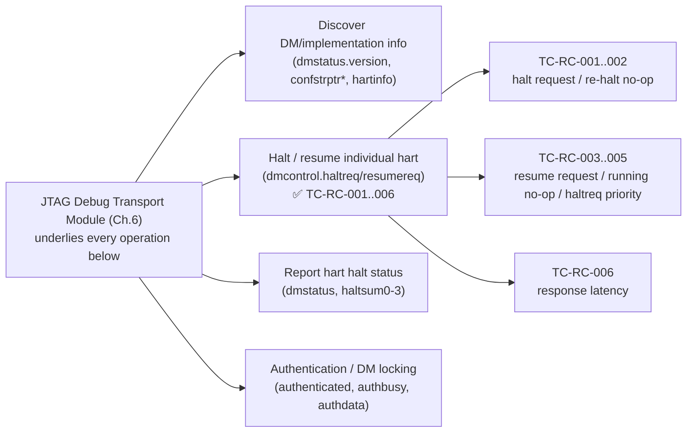
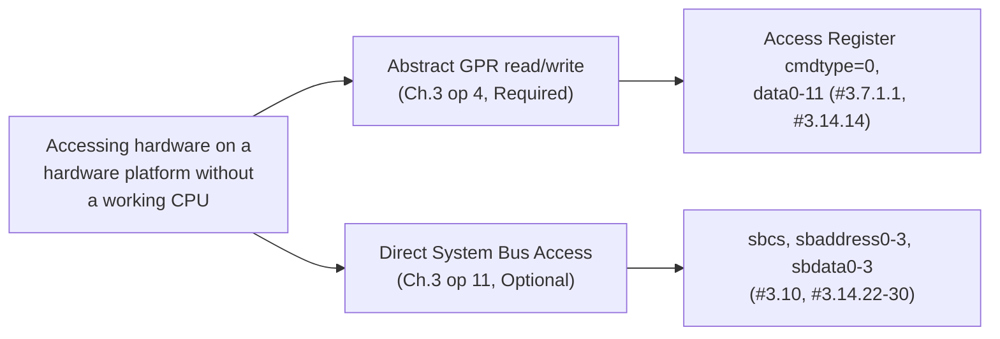
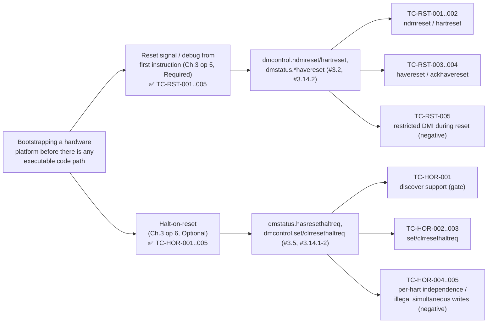
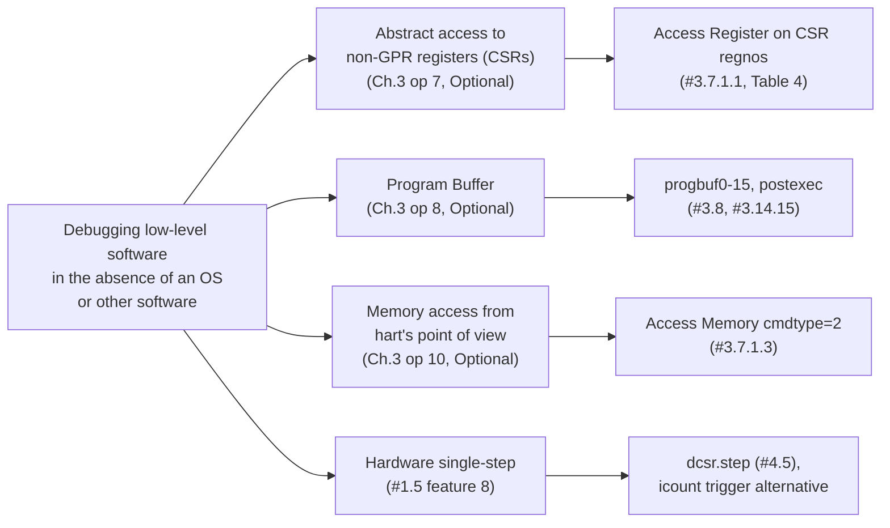
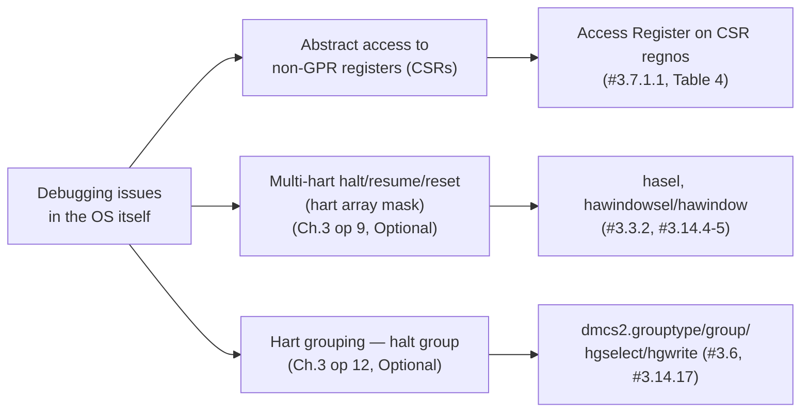
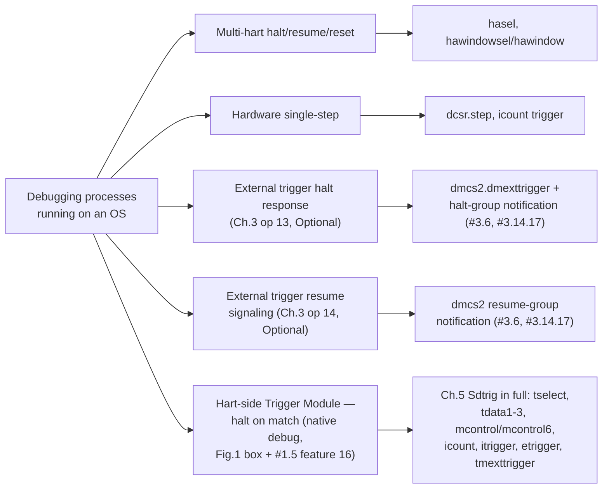
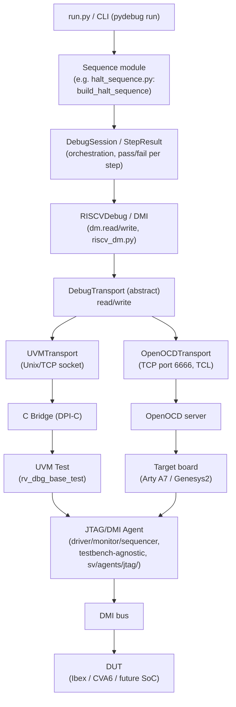

# RISC-V Debug — Flow Diagrams

Companion sketches to `riscv_debug_testplan.md` and `VERIFICATION_STRATEGY.md`. Kept as a living document — update alongside those two as TC-IDs and gap-matrix content get added, rather than treating this as a one-off snapshot.

## Foundational features (apply across all five use cases)

A handful of CAT2 features are foundational rather than tied to one specific use case — every debug session needs them regardless of *why* you're debugging. Shown once here rather than repeated in each use-case diagram below.



## Use case 1 — Accessing hardware with no working CPU (External debug)



## Use case 2 — Bootstrapping before any executable code path (External debug)



## Use case 3 — Debugging low-level software with no OS (External debug)



## Use case 4 — Debugging issues in the OS itself (External or native debug)



## Use case 5 — Debugging processes running on an OS (Native or external debug)



## Stimulus Architecture

The same stimulus code runs against two different backends — this is the mechanism behind the cross-platform verification level and the whole `pydebug` portability claim. Only the boxes below "Transport (abstract)" differ between simulation and emulation; everything above it is identical Python.



Simulation uses the left branch (`UVMTransport` → DPI-C bridge → UVM test); emulation uses the right branch (`OpenOCDTransport` → OpenOCD server → real board) — same `RISCVDebug`/`DMI` calls, same sequence module, same `DebugSession` orchestration above the transport line. Post-silicon bring-up is the same right branch again, just pointed at silicon instead of an FPGA.

## Verification levels pipeline

From `riscv-debug-verif-strategy`'s six levels, in dependency order, each annotated with which platforms apply. Cross-platform is a modifier that applies to every other level, not a separate stage in the pipeline — shown as a lane crossing the whole diagram rather than a box in the sequence.

```mermaid
flowchart LR
    subgraph Simulation only
        L1["1. Protocol/interface\n(JTAG DTM, IDCODE, TAP)"]
        L2["2. Register/DMI\n(field-level, model-checked)"]
        L3["3. Functional/scenario\n(halt, read, resume, step)"]
        L4["4. System/integration\n(real SW running, interrupts,\nmulti-hart)"]
    end
    subgraph Simulation + Emulation + Post-silicon
        L5["5. Cross-platform\n(same stimulus, transport swapped)"]
    end
    subgraph All platforms, lowest priority to start
        L6["6. Stress/negative/\ncompliance-edge"]
    end
    L1 --> L2 --> L3 --> L4 --> L5 --> L6
```

**CAT1 anchoring** (why each level exists, not just what it checks):

- Levels 1–2 (protocol, register) → anchor "Accessing hardware with no working CPU" and "Bootstrapping before any executable code path" — both use cases are unreachable if the transport/register layer doesn't work first.
- Level 3 (functional) → "Debugging low-level software with no OS" and "Debugging issues in the OS itself."
- Level 4 (system) → "Debugging issues in the OS itself" and "Debugging processes running on an OS."
- Level 5 (cross-platform) → orthogonal to CAT1; applies to every use case and every other level. This is this project's specific differentiator (see `INTEGRATION_GUIDE.md`'s three-level table) — a result proven only in simulation is not yet proven portable.
- Level 6 (stress/negative) → backs the Authentication/DM-locking CAT2 row specifically (#3.12's IP-protection intent), plus the general P0 "must-pass" claims across every other row.
